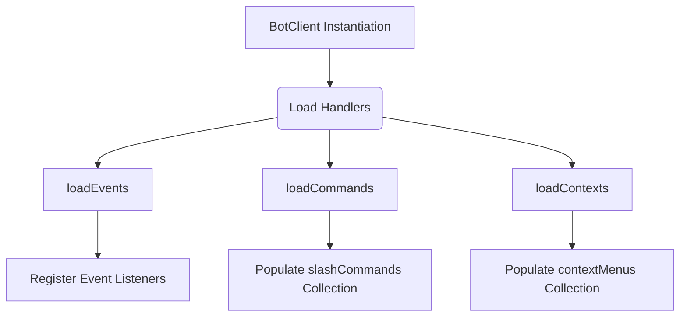
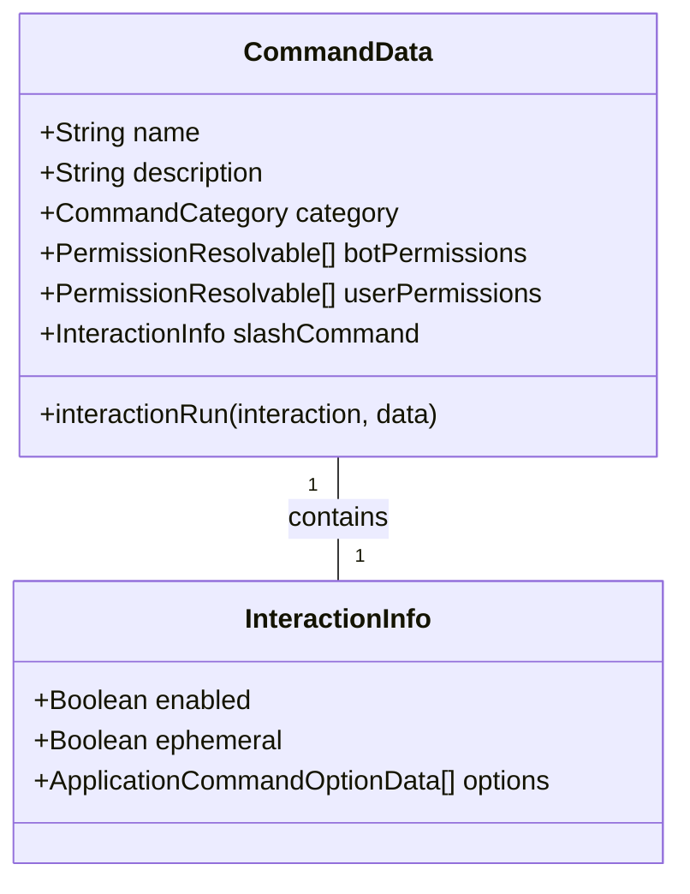
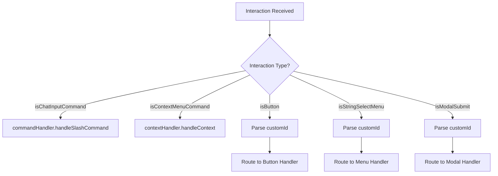
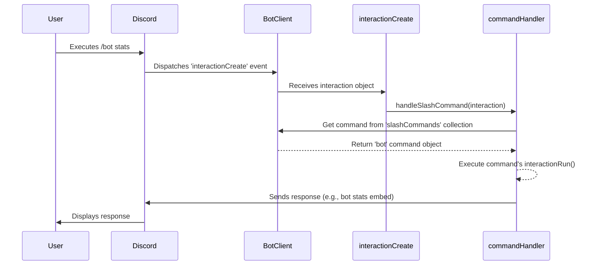

The command and event handling system is the core of Amina's interactivity. It provides a modular and extensible architecture for loading Discord events, processing application commands (slash commands and context menus), and routing component interactions like buttons and select menus. The system is designed to be file-based, where each command and event handler resides in its own file within a structured directory layout, allowing for easy management and hot-reloading capabilities.

At the center of this system is the `BotClient` class, which orchestrates the loading of all commands and events during startup. All interactions from Discord are funneled through a single `interactionCreate` event handler, which acts as a master router, delegating tasks to specialized sub-handlers based on the interaction type and its `customId`. This design ensures a centralized, organized, and efficient way to manage the bot's responses to user actions.

<details>
<summary><strong>Relevant source files</strong></summary>

- [src/events/interactions/interactionCreate.ts](https://github.com/iamvikshan/amina/blob/main/src/events/interactions/interactionCreate.ts)
- [src/structures/BotClient.ts](https://github.com/iamvikshan/amina/blob/main/src/structures/BotClient.ts)
- [types/commands.d.ts](https://github.com/iamvikshan/amina/blob/main/types/commands.d.ts)
- [src/structures/CommandCategory.ts](https://github.com/iamvikshan/amina/blob/main/src/structures/CommandCategory.ts)
- [src/commands/bot/bot.ts](https://github.com/iamvikshan/amina/blob/main/src/commands/bot/bot.ts)
- [src/commands/utility/help.ts](https://github.com/iamvikshan/amina/blob/main/src/commands/utility/help.ts)

</details>

## Core structures

The system is built upon several key structures that define how commands are created, categorized, and managed.

### Botclient class

The `BotClient` class, extending Discord.js's `Client`, is the main entry point for the application. It is responsible for initializing command collections, loading all handlers from the filesystem, and registering them with Discord.

Key properties and methods include:

- `slashCommands`: A `Collection` that stores all loaded slash commands, mapping command names to their data objects.
- `contextMenus`: A `Collection` for storing context menu commands.
- `loadEvents(directory)`: Recursively reads a directory to find and register event listeners (e.g., `interactionCreate`, `messageCreate`).
- `loadCommands(directory)`: Recursively reads a directory to find command files, validates them, and loads them into the `slashCommands` collection.
- `loadContexts(directory)`: Loads context menu command files into the `contextMenus` collection.

This diagram illustrates the startup and loading process orchestrated by the `BotClient`.



_Sources: [src/structures/BotClient.ts:71-263](https://github.com/iamvikshan/amina/blob/main/src/structures/BotClient.ts#L71-L263)_

### Commanddata interface

Every command in the application must conform to the `CommandData` interface. This structure defines all the necessary properties for a command, including its name, description, permissions, and execution logic.

The table below details the key properties of the `CommandData` interface.

| Property          | Type                                  | Description                                                                           |
| :---------------- | :------------------------------------ | :------------------------------------------------------------------------------------ |
| `name`            | `string`                              | The name of the command.                                                              |
| `description`     | `string`                              | A brief description of what the command does.                                         |
| `category`        | `CommandCategory`                     | The category the command belongs to (e.g., 'INFO', 'MODERATION').                     |
| `botPermissions`  | `PermissionResolvable[]`              | Permissions the bot requires to execute the command.                                  |
| `userPermissions` | `PermissionResolvable[]`              | Permissions the user requires to execute the command.                                 |
| `cooldown`        | `number`                              | Cooldown period in seconds between uses.                                              |
| `devOnly`         | `boolean`                             | If true, the command can only be used by developers.                                  |
| `dmCommand`       | `boolean`                             | If true, the command can be used in DMs.                                              |
| `slashCommand`    | `InteractionInfo`                     | Configuration for the slash command, including `enabled`, `ephemeral`, and `options`. |
| `interactionRun`  | `(interaction, data) => Promise<any>` | The function that executes when the command is invoked.                               |

_Sources: [types/commands.d.ts:39-61](https://github.com/iamvikshan/amina/blob/main/types/commands.d.ts#L39-L61)_

This class diagram shows the structure of a command.



_Sources: [types/commands.d.ts:32-61](https://github.com/iamvikshan/amina/blob/main/types/commands.d.ts#L32-L61)_

### Commandcategory

Commands are organized into categories defined in `src/structures/CommandCategory.ts`. This object maps category names to their properties, such as a display name, emoji, and an `enabled` flag that can be tied to the bot's configuration. This allows entire groups of commands to be toggled on or off from a central config file.

Example categories:

- `ADMIN`
- `MODERATION`
- `AUTOMOD`
- `GIVEAWAY`
- `TICKET`
- `ECONOMY`
- `MUSIC`
- `INFO`
- `UTILITY`
- `DEV`

_Sources: [src/structures/CommandCategory.ts:5-88](https://github.com/iamvikshan/amina/blob/main/src/structures/CommandCategory.ts#L5-L88), [types/commands.d.ts:10-29](https://github.com/iamvikshan/amina/blob/main/types/commands.d.ts#L10-L29)_

## Interaction handling

All interactions are processed through the `interactionCreate.ts` event handler, which acts as a central router.

### The `interactioncreate` router

This event handler is the single entry point for all user interactions with the bot, including commands, buttons, select menus, and modals. It inspects the interaction type and `customId` to delegate the request to the appropriate handler.

The general flow is that an interaction is received from discord. The handler checks the interaction type (`ischatinputcommand`, `isbutton`, `isstringselectmenu`, etc.). For component interactions, it parses the `customid` which follows a `domain:type:action` pattern (e.g., `admin:btn:back`, `ticket:menu:category`). Based on the type and `customid`, it dynamically imports and calls the specific handler function.

This diagram shows the routing logic within `interactionCreate.ts`.



_Sources: [src/events/interactions/interactionCreate.ts:14-490](https://github.com/iamvikshan/amina/blob/main/src/events/interactions/interactionCreate.ts#L14-L490)_

### Slash command execution

When a slash command is used, the `interactionCreate` handler passes it to `commandHandler.handleSlashCommand`.

This sequence diagram illustrates the full lifecycle of a slash command interaction.



_Sources: [src/events/interactions/interactionCreate.ts:32-35](https://github.com/iamvikshan/amina/blob/main/src/events/interactions/interactionCreate.ts#L32-L35), [src/commands/bot/bot.ts:25-70](https://github.com/iamvikshan/amina/blob/main/src/commands/bot/bot.ts#L25-L70)_

### Component interaction routing

A key architectural pattern is the use of prefixed `customId`s for components. This allows the `interactionCreate` router to delegate to modular handlers without a giant switch statement for every single button.

| `customId` Prefix                 | Handler Module     | Description                                     |
| :-------------------------------- | :----------------- | :---------------------------------------------- |
| `admin:btn:*`, `admin:menu:*`     | `adminHandler`     | Handles server administration settings.         |
| `dev:btn:*`, `dev:menu:*`         | `dev` handlers     | Routes to developer-specific tools.             |
| `minaai:btn:*`, `minaai:menu:*`   | `minaai` handlers  | Manages user-facing AI settings and memories.   |
| `profile:btn:*`, `profile:menu:*` | `profile` handlers | Manages user profiles.                          |
| `purge:btn:*`, `purge:modal:*`    | `purge` handlers   | Handles the multi-step message purge process.   |
| `roles:btn:*`, `roles:menu:*`     | `rolesHandler`     | Manages role cleanup, creation, and assignment. |
| `ticket:btn:*`, `ticket:menu:*`   | `ticket` handlers  | Manages the ticket system setup and operations. |

This routing is evident in the large `if/else if` blocks that check `interaction.customId.startsWith(...)`. Many handlers are loaded dynamically using `await import(...)` to improve startup time and memory usage.

_Sources: [src/events/interactions/interactionCreate.ts:59-490](https://github.com/iamvikshan/amina/blob/main/src/events/interactions/interactionCreate.ts#L59-L490)_

## Command definition example

The file `src/commands/bot/bot.ts` provides a clear example of how a command with multiple subcommands is defined.

```typescript
// src/commands/bot/bot.ts
const command: CommandData = {
  name: 'bot',
  description: 'bot related commands',
  category: 'INFO',
  botPermissions: ['EmbedLinks'],
  slashCommand: {
    enabled: true,
    options: [
      {
        name: 'invite',
        description: "get bot's invite",
        type: ApplicationCommandOptionType.Subcommand,
      },
      {
        name: 'stats',
        description: "get bot's statistics",
        type: ApplicationCommandOptionType.Subcommand,
      },
      // ... other subcommands
    ],
  },

  async interactionRun(interaction: ChatInputCommandInteraction) {
    const sub = interaction.options.getSubcommand();
    if (!sub) return interaction.followUp('Not a valid subcommand');

    // Invite
    if (sub === 'invite') {
      // ... handle invite
    }

    // Stats
    else if (sub === 'stats') {
      // ... handle stats
    }
    // ...
  },
};
```

In the `interactionRun` function, `interaction.options.getSubcommand()` is used to determine which subcommand was called, and the logic branches accordingly. This pattern is common for commands that group related functionality.

_Sources: [src/commands/bot/bot.ts:16-70](https://github.com/iamvikshan/amina/blob/main/src/commands/bot/bot.ts#L16-L70)_

## Conclusion

The command and event handling architecture in Amina is robust and scalable. By leveraging file-based modules for commands and events, a central `interactionCreate` router, and a `customId` prefixing convention, the system remains organized and easy to extend. The `BotClient` class effectively bootstraps the application by loading all necessary components, while the `CommandData` interface ensures consistency across all command definitions. This separation of concerns allows developers to add or modify functionality in a decoupled and maintainable way.
