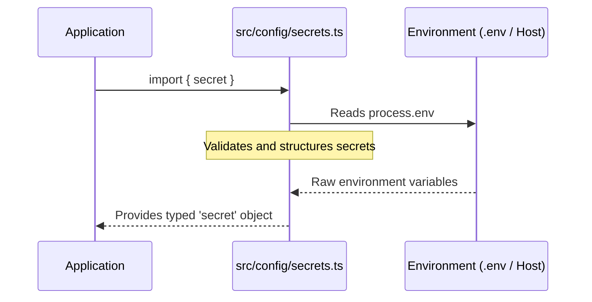
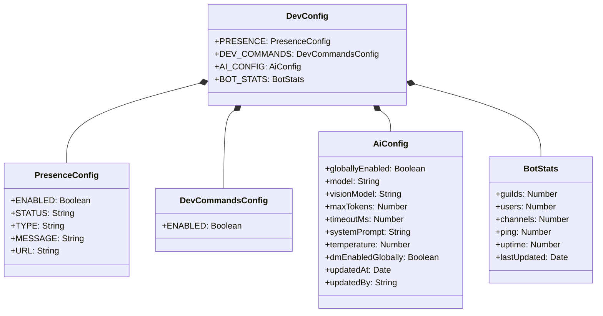

The configuration system for Amina is a multi-layered architecture designed for flexibility, security, and ease of management. It separates static application settings, sensitive secrets, dynamic runtime configurations, and external service settings. This approach allows developers to manage default behaviors, secure API keys, and adjust bot settings on-the-fly without requiring a full redeployment.

The core components of the configuration are the static `config.ts`, the environment-aware `secrets.ts`, the dynamic `dev-config` database schema, and service-specific files like `lavalink/application.yml`. TypeScript types defined in `types/config.d.ts` ensure type safety across the application when accessing these configuration values.

<details>
<summary><strong>Relevant source files</strong></summary>

- [src/config/config.ts](https://github.com/iamvikshan/amina/blob/main/src/config/config.ts)
- [src/config/secrets.ts](https://github.com/iamvikshan/amina/blob/main/src/config/secrets.ts)
- [types/config.d.ts](https://github.com/iamvikshan/amina/blob/main/types/config.d.ts)
- [lavalink/application.yml](https://github.com/iamvikshan/amina/blob/main/lavalink/application.yml)
- [src/database/schemas/Dev.ts](https://github.com/iamvikshan/amina/blob/main/src/database/schemas/Dev.ts)
- [app.json](https://github.com/iamvikshan/amina/blob/main/app.json)

</details>

_Sources: [src/config/config.ts](https://github.com/iamvikshan/amina/blob/main/src/config/config.ts), [src/config/secrets.ts](https://github.com/iamvikshan/amina/blob/main/src/config/secrets.ts), [src/database/schemas/Dev.ts](https://github.com/iamvikshan/amina/blob/main/src/database/schemas/Dev.ts), [lavalink/application.yml](https://github.com/iamvikshan/amina/blob/main/lavalink/application.yml), [app.json](https://github.com/iamvikshan/amina/blob/main/app.json)_

## Configuration loading architecture

Amina's configuration is sourced from multiple locations, which are then consolidated and made available to the application. The general flow is that environment variables populate the `secret` object, which is then used by the static `config` object. Dynamic configurations are fetched directly from the database.

The diagram below illustrates the flow of configuration data from its source to the application.

```mermaid
graph TD
    subgraph Environment
        A1[Heroku Config Vars (app.json)] --> A2[.env file]
    end

    subgraph "Application Code"
        A2 --> B[src/config/secrets.ts]
        B --> C[src/config/config.ts]
        D[src/database/schemas/Dev.ts]
        E[lavalink/application.yml]
    end

    subgraph Runtime
        C --> F[BotClient]
        D -.-> F
    end

    subgraph "External Services"
        E --> G[Lavalink Server]
    end
```

## Static configuration

Static configuration is managed in `src/config/config.ts`. This file contains non-sensitive, default values and feature flags that are consistent across all deployments. It defines the core behavior of various bot modules like AI, Music, Economy, and Moderation.

_Sources: [src/config/config.ts](https://github.com/iamvikshan/amina/blob/main/src/config/config.ts), [types/config.d.ts](https://github.com/iamvikshan/amina/blob/main/types/config.d.ts)_

### Key configuration objects

The `config.ts` file exports a main `config` object, which is broken down into several sub-objects for different modules.

| Object         | Description                                                                                         |
| :------------- | :-------------------------------------------------------------------------------------------------- |
| `BOT`          | Core bot information like developer IDs, support server link, and dashboard URL.                    |
| `AI`           | Default settings for the Gemini AI, including model names, token limits, and temperature.           |
| `SERVER`       | Server-related settings, such as the health check port.                                             |
| `INTERACTIONS` | Flags to enable or disable slash commands and context menus, and to control global registration.    |
| `MUSIC`        | Configuration for the music module, including Lavalink node details, idle time, and default volume. |
| `ECONOMY`      | Settings for the economy system, such as currency symbol and daily coin amounts.                    |
| `EMBED_COLORS` | A centralized theme palette for consistent embed colors across the bot.                             |
| `MODERATION`   | Feature flag and embed colors for moderation actions like ban, kick, and timeout.                   |
| `STATS`        | Settings for the user statistics and leveling system.                                               |

_Sources: [src/config/config.ts:4-168](https://github.com/iamvikshan/amina/blob/main/src/config/config.ts#L4-L168)_

### Example: `music` configuration

The `MUSIC` object configures the Lavalink client and music playback behavior. It notably processes Lavalink node information from the `secret` object.

```typescript
// src/config/config.ts:77-90
MUSIC: {
  ENABLED: true,
  IDLE_TIME: 60, // Time in seconds before the bot disconnects from an idle voice channel
  DEFAULT_VOLUME: 60, // Default player volume 1-100
  MAX_SEARCH_RESULTS: 5,
  DEFAULT_SOURCE: 'scsearch', // ytsearch = Youtube, ytmsearch = Youtube Music, scsearch = SoundCloud, spsearch = Spotify
  LAVALINK_RETRY_AMOUNT: 20,
  LAVALINK_RETRY_DELAY: 30000,
  LAVALINK_NODES: secret.LAVALINK_NODES.map(node => ({
    id: node.id,
    host: node.host,
    port: node.port || 2333,
    authorization: node.authorization,
    secure: node.secure || false,
    retryAmount: 20,
    retryDelay: 30000,
  })).filter(node => node.id && node.host), // Only include nodes that are defined
},
```

_Sources: [src/config/config.ts:77-90](https://github.com/iamvikshan/amina/blob/main/src/config/config.ts#L77-L90)_

## Secrets and environment variables

Sensitive information, such as API keys and tokens, is managed through environment variables. The `src/config/secrets.ts` file is responsible for loading these variables from the process environment, providing a typed and centralized `secret` object for the application to use. For Heroku deployments, the `app.json` file defines the expected environment variables.

_Sources: [src/config/secrets.ts](https://github.com/iamvikshan/amina/blob/main/src/config/secrets.ts), [app.json](https://github.com/iamvikshan/amina/blob/main/app.json), [types/config.d.ts](https://github.com/iamvikshan/amina/blob/main/types/config.d.ts)_

### Loading process

The following diagram shows how secrets are loaded from the environment and made available to the application.



_Sources: [src/config/secrets.ts:3-33](https://github.com/iamvikshan/amina/blob/main/src/config/secrets.ts#L3-L33)_

### Core secrets

The `Secrets` interface defines the structure for all sensitive data.

| Variable           | Description                                                       | Required | Source              |
| :----------------- | :---------------------------------------------------------------- | :------- | :------------------ |
| `BOT_TOKEN`        | The Discord bot token.                                            | Yes      | `app.json`          |
| `MONGO_CONNECTION` | The connection string for the MongoDB database.                   | Yes      | `app.json`          |
| `LOGS_WEBHOOK`     | A Discord webhook URL for sending error logs.                     | Yes      | `app.json`          |
| `GEMINI_KEY`       | API key for Google Gemini (for AI features).                      | No       | `types/config.d.ts` |
| `UPSTASH_VECTOR`   | API token for Upstash Vector database (for AI memory).            | No       | `types/config.d.ts` |
| `GH_TOKEN`         | GitHub token for accessing the GitHub API (e.g., for changelogs). | No       | `app.json`          |
| `LAVALINK_NODES`   | A JSON array of Lavalink node connection details.                 | Yes      | `secrets.ts`        |

_Sources: [app.json:5-40](https://github.com/iamvikshan/amina/blob/main/app.json#L5-L40), [types/config.d.ts:100-123](https://github.com/iamvikshan/amina/blob/main/types/config.d.ts#L100-L123), [src/config/secrets.ts:20-31](https://github.com/iamvikshan/amina/blob/main/src/config/secrets.ts#L20-L31)_

## Dynamic database configuration

For settings that need to be changed at runtime without a restart, Amina uses a `dev-config` collection in MongoDB. The schema for this is defined in `src/database/schemas/Dev.ts`. This allows developers to toggle features, update the bot's presence, and tune AI behavior dynamically.

_Sources: [src/database/schemas/Dev.ts](https://github.com/iamvikshan/amina/blob/main/src/database/schemas/Dev.ts)_

### `dev-config` schema

The `dev-config` schema contains configurations for the bot's presence, developer commands, and AI behavior.



This diagram shows the structure of the `dev-config` document in MongoDB.
_Sources: [src/database/schemas/Dev.ts:7-104](https://github.com/iamvikshan/amina/blob/main/src/database/schemas/Dev.ts#L7-L104)_

### AI configuration (`ai_config`)

The `AI_CONFIG` object within the `dev-config` schema is particularly important as it allows for live tuning of the AI's behavior.

| Field               | Type    | Default                | Description                                           |
| :------------------ | :------ | :--------------------- | :---------------------------------------------------- |
| `globallyEnabled`   | Boolean | `false`                | Master switch to enable or disable the AI feature.    |
| `model`             | String  | `gemini-flash-latest`  | The primary Gemini model for text generation.         |
| `visionModel`       | String  | `gemini-3-pro-preview` | The Gemini model used for analyzing images.           |
| `maxTokens`         | Number  | `1024`                 | The maximum number of tokens in a generated response. |
| `timeoutMs`         | Number  | `20000`                | The timeout for AI API requests in milliseconds.      |
| `systemPrompt`      | String  | (from `prompt.md`)     | The base instructions given to the AI model.          |
| `temperature`       | Number  | `0.7`                  | Controls the creativity of the AI's responses.        |
| `dmEnabledGlobally` | Boolean | `true`                 | Whether the AI can be used in DMs.                    |

_Sources: [src/database/schemas/Dev.ts:40-73](https://github.com/iamvikshan/amina/blob/main/src/database/schemas/Dev.ts#L40-L73)_

## Service-specific configuration

External services, like Lavalink for music playback, have their own configuration files.

### Lavalink (`application.yml`)

The Lavalink server is configured using `lavalink/application.yml`. This file sets the server port, password, and sources for audio streaming. The password set here must match the `authorization` value for the corresponding node in the bot's `.env` file.

```yaml
# Lavalink/application.yml
server: # REST and WS server
  port: 2333
  address: 0.0.0.0
lavalink:
  server:
    password: 'youshallnotpass' # Be sure to change this!
    sources:
      youtube: true
      bandcamp: true
      soundcloud: true
      twitch: true
      vimeo: true
      http: true
      local: false
    filters: # All filters are enabled by default
      volume: true
      equalizer: true
      karaoke: true
      timescale: true
      tremolo: true
      vibrato: true
      distortion: true
      rotation: true
      channelMix: true
      lowPass: true
```

_Sources: [lavalink/application.yml]_

The bot connects to this Lavalink instance using the node details provided in the environment variables, which are then processed in `config.ts`. This decouples the bot's configuration from the Lavalink server's configuration.

_Sources: [src/config/config.ts:83-89](https://github.com/iamvikshan/amina/blob/main/src/config/config.ts#L83-L89), [src/config/secrets.ts:20-27](https://github.com/iamvikshan/amina/blob/main/src/config/secrets.ts#L20-L27)_

## Summary

Amina's configuration is robust and layered, effectively separating concerns between static defaults, sensitive secrets, and dynamic runtime settings. Static configuration in `config.ts` provides a baseline, while environment variables loaded via `secrets.ts` ensure security. The use of a `dev-config` MongoDB collection for dynamic settings offers powerful runtime flexibility, especially for tuning AI behavior. Finally, service-specific files like `application.yml` allow independent configuration of external dependencies. This comprehensive system is a cornerstone of the bot's maintainability and operational flexibility.
