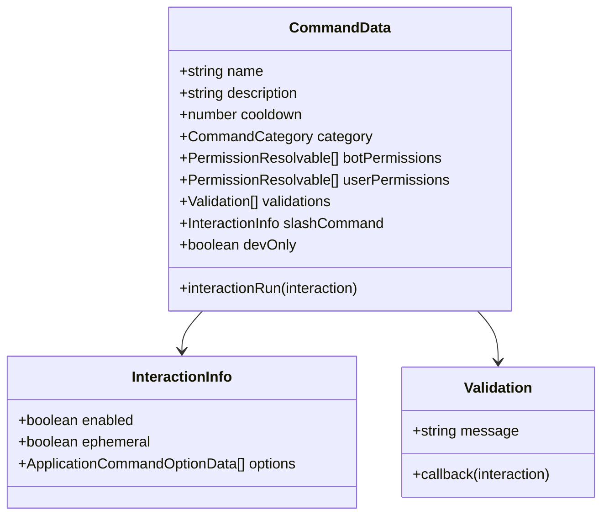
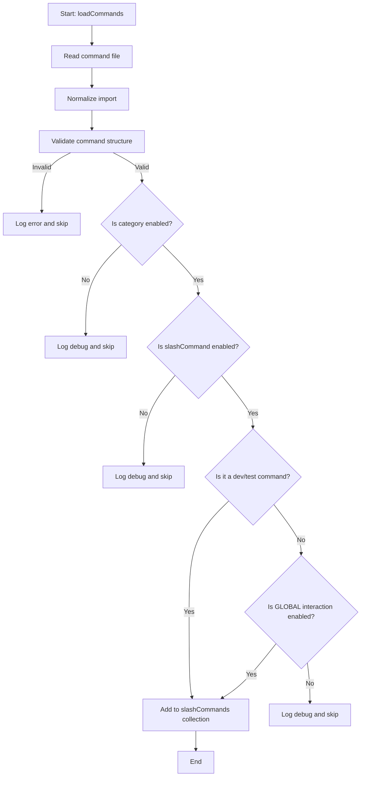
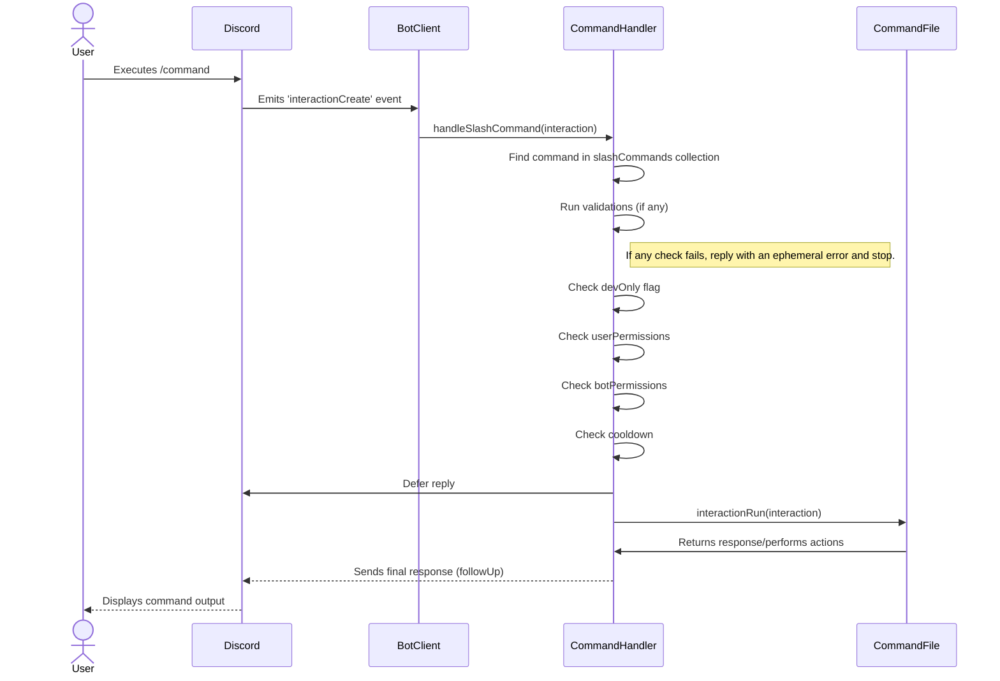

<details>
<summary><strong>Relevant source files</strong></summary>

- [types/commands.d.ts](https://github.com/iamvikshan/amina/blob/main/types/commands.d.ts)
- [src/handlers/command.ts](https://github.com/iamvikshan/amina/blob/main/src/handlers/command.ts)
- [src/structures/BotClient.ts](https://github.com/iamvikshan/amina/blob/main/src/structures/BotClient.ts)
- [src/commands/bot/bot.ts](https://github.com/iamvikshan/amina/blob/main/src/commands/bot/bot.ts)
- [src/commands/utility/help.ts](https://github.com/iamvikshan/amina/blob/main/src/commands/utility/help.ts)
- [src/commands/fun/hack.ts](https://github.com/iamvikshan/amina/blob/main/src/commands/fun/hack.ts)
</details>

This document provides a comprehensive guide to creating, structuring, and registering new commands within the Amina bot. The command system is designed to be modular, with each command defined in its own TypeScript file within the `src/commands` directory. This approach simplifies development, maintenance, and organization.

The system is built around a core `CommandData` interface, a central command handler that processes interactions, and a loading mechanism within the `BotClient` that discovers and registers all command files at startup. Understanding these components is key to effectively extending the bot's functionality.

## Command structure (`CommandData`)

Every command in the project must be an object that conforms to the `CommandData` interface. This interface defines the metadata, permissions, and execution logic for a command. Each command file exports a single `command` object of this type.

Sources: [`types/commands.d.ts`](https://github.com/iamvikshan/amina/blob/main/types/commands.d.ts), [`src/commands/bot/bot.ts:16-258`](https://github.com/iamvikshan/amina/blob/main/src/commands/bot/bot.ts:16-258)

### `CommandData` interface

The diagram below illustrates the structure of the `CommandData` interface and its related types.



### Key properties

The following table details the properties of the `CommandData` interface.

| Property          | Type                     | Description                                                      | Required |
| :---------------- | :----------------------- | :--------------------------------------------------------------- | :------- |
| `name`            | `string`                 | The name of the command (must be lowercase).                     | Yes      |
| `description`     | `string`                 | A brief description of what the command does.                    | Yes      |
| `cooldown`        | `number`                 | The cooldown period for the command in seconds.                  | No       |
| `category`        | `CommandCategory`        | The category the command belongs to (e.g., `FUN`, `MODERATION`). | Yes      |
| `botPermissions`  | `PermissionResolvable[]` | Permissions the bot requires to execute the command.             | No       |
| `userPermissions` | `PermissionResolvable[]` | Permissions the user requires to execute the command.            | No       |
| `validations`     | `Validation[]`           | Custom validation functions to run before command execution.     | No       |
| `slashCommand`    | `InteractionInfo`        | Configuration for the slash command interaction.                 | Yes      |
| `devOnly`         | `boolean`                | If true, only users listed in `DEV_IDS` can use the command.     | No       |
| `interactionRun`  | `function`               | The main function that executes when the command is invoked.     | Yes      |

Sources: [`types/commands.d.ts:39-68`](https://github.com/iamvikshan/amina/blob/main/types/commands.d.ts:39-68), [`src/handlers/command.ts:43-52`](https://github.com/iamvikshan/amina/blob/main/src/handlers/command.ts:43-52), [`src/handlers/command.ts:55-64`](https://github.com/iamvikshan/amina/blob/main/src/handlers/command.ts:55-64)

### Command categories

Commands are organized into categories, which are used by the `help` command and for conditional loading.

The available categories are defined by the `CommandCategory` type:
`ADMIN`, `ANIME`, `AUTOMOD`, `ECONOMY`, `FUN`, `GIVEAWAY`, `IMAGE`, `INFO`, `INFORMATION`, `INVITE`, `MODERATION`, `ERELA_JS`, `NONE`, `DEV`, `SOCIAL`, `SUGGESTION`, `TICKET`, `UTILITY`, `MUSIC`.

Sources: [`types/commands.d.ts:11-29`](https://github.com/iamvikshan/amina/blob/main/types/commands.d.ts:11-29), [`src/commands/utility/help.ts:68-96`](https://github.com/iamvikshan/amina/blob/main/src/commands/utility/help.ts:68-96)

## Command loading and registration

Commands are loaded and registered when the bot starts up. The `BotClient` class is responsible for this process.

Sources: [`src/structures/BotClient.ts:182-211`](https://github.com/iamvikshan/amina/blob/main/src/structures/BotClient.ts:182-211)

### Loading flow

The `loadCommands` method in `BotClient` recursively reads all `.ts` and `.js` files from the specified command directory. For each file, it performs validation and registers the command.

This flowchart illustrates the command loading process for a single command file.



Sources: [`src/structures/BotClient.ts:153-211`](https://github.com/iamvikshan/amina/blob/main/src/structures/BotClient.ts:153-211)

## Command execution

When a user invokes a slash command, Discord sends an `interactionCreate` event to the bot. The `handleSlashCommand` function in `src/handlers/command.ts` is responsible for processing this interaction.

### Execution sequence

The following sequence diagram shows the typical flow of a command execution from user input to the final response.



Sources: [`src/handlers/command.ts:22-139`](https://github.com/iamvikshan/amina/blob/main/src/handlers/command.ts:22-139)

### Core logic in `handleSlashCommand`

1.  **Command Retrieval**: The handler fetches the command definition from the `client.slashCommands` collection using the interaction's command name.
2.  **Validations**: It runs any custom `validations` defined in the command object.
3.  **Permission Checks**: It verifies that both the user and the bot have the required permissions specified in `userPermissions` and `botPermissions`.
4.  **Cooldown Management**: It checks if the user is on cooldown for that specific command. If not, it applies the cooldown after execution.
5.  **Execution**: If all checks pass, it defers the reply and calls the command's `interactionRun` method, passing the `interaction` object.
6.  **Error Handling**: The entire execution is wrapped in a `try...catch` block. If an error occurs, it is logged, reported to Honeybadger, and a generic error message is sent to the user.

Sources: [`src/handlers/command.ts:22-139`](https://github.com/iamvikshan/amina/blob/main/src/handlers/command.ts:22-139)

## Creating a new command: a practical example

To create a new command, you must create a new `.ts` file in a relevant sub-directory of `src/commands/`. The file must export a default object that implements the `CommandData` interface.

### Example: `hack.ts`

The `hack` command is a simple, fun command that demonstrates the basic structure.

```typescript
// src/commands/fun/hack.ts

import {
  EmbedBuilder,
  ApplicationCommandOptionType,
  ChatInputCommandInteraction,
} from 'discord.js';
import { EMBED_COLORS } from '@src/config';

const command: CommandData = {
  name: 'hack',
  description:
    "Let Amina 'hack' into someone's life with her chaotic energy~! ✨",
  cooldown: 10,
  category: 'FUN',
  botPermissions: ['SendMessages', 'EmbedLinks'],
  slashCommand: {
    enabled: true,
    options: [
      {
        name: 'target',
        description: 'Who should I unleash my chaotic hacking powers on? >:D',
        type: ApplicationCommandOptionType.User,
        required: true,
      },
    ],
  },

  async interactionRun(interaction: ChatInputCommandInteraction) {
    const target = interaction.options.getUser('target');
    // ... command logic ...
    await interaction.followUp({ embeds: [initialEmbed] });
    // ... more logic ...
  },
};

export default command;
```

Sources: [`src/commands/fun/hack.ts:10-99`](https://github.com/iamvikshan/amina/blob/main/src/commands/fun/hack.ts:10-99)

### Steps to create a command

1.  **Create the File**: Create a file like `my-command.ts` inside a category folder (e.g., `src/commands/utility/`).
2.  **Define `CommandData`**: Create a `const command: CommandData = { ... };` object.
3.  **Fill in Metadata**: Set the `name`, `description`, `category`, and any other relevant properties like `cooldown` or `userPermissions`.
4.  **Configure `slashCommand`**:
    - Set `enabled: true`.
    - Define any `options` (arguments) the command will take. the `bot` command shows an example of using subcommands.
    - Set `ephemeral: true` if the response should only be visible to the user.
5.  **Implement `interactionRun`**:
    - This is an `async` function that receives the `interaction` object.
    - Use `interaction.options` to get user input.
    - Perform your command's logic.
    - Use `interaction.followUp()` to send the response. if the command shows a modal or has a long-running task, you might interact differently.

Sources: [`types/commands.d.ts`](https://github.com/iamvikshan/amina/blob/main/types/commands.d.ts), [`src/commands/bot/bot.ts`](https://github.com/iamvikshan/amina/blob/main/src/commands/bot/bot.ts), [`src/handlers/command.ts`](https://github.com/iamvikshan/amina/blob/main/src/handlers/command.ts)

## Summary

The command framework in Amina is robust and developer-friendly. By adhering to the `CommandData` interface, developers can easily add new slash commands with rich features like permissions, cooldowns, and subcommands. The centralized loading and handling logic ensures consistency and simplifies the process of extending the bot's capabilities. Simply create a new file, define the command structure, write the execution logic, and the bot will handle the rest.
