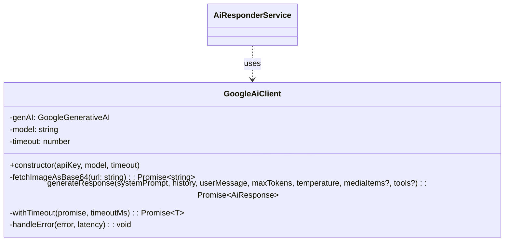
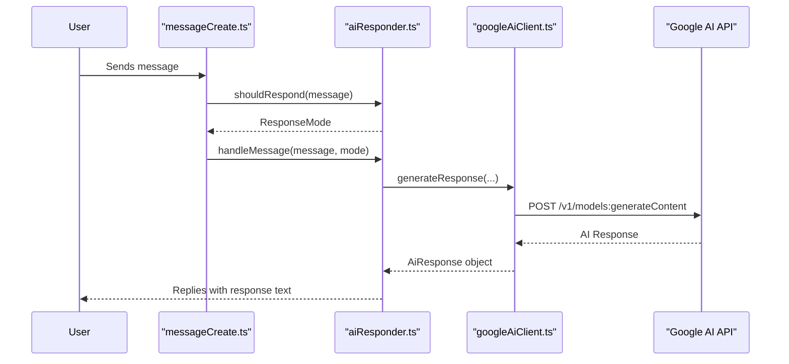
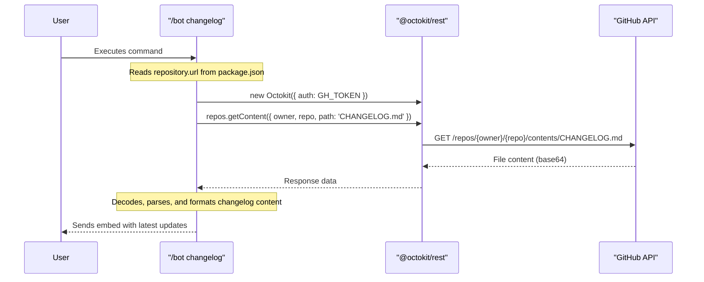
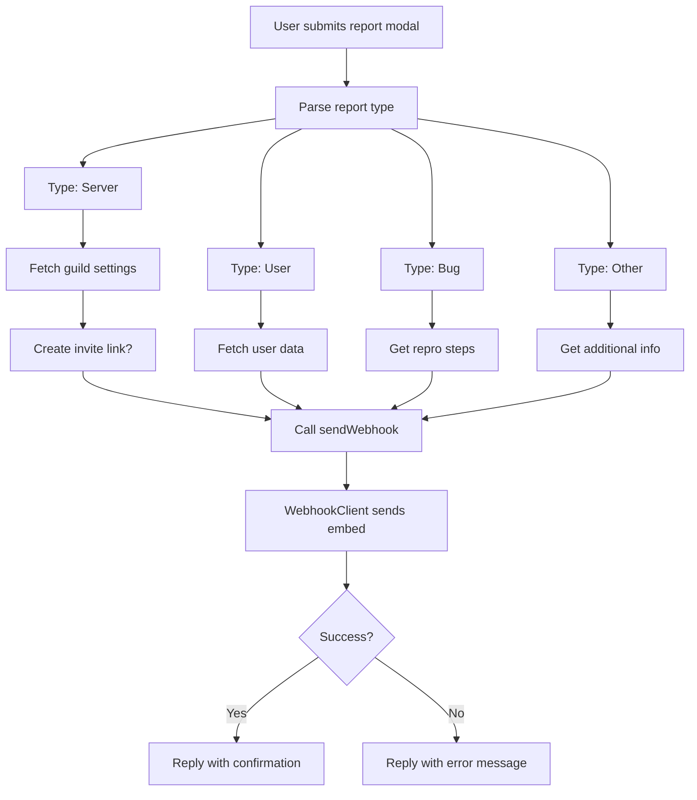
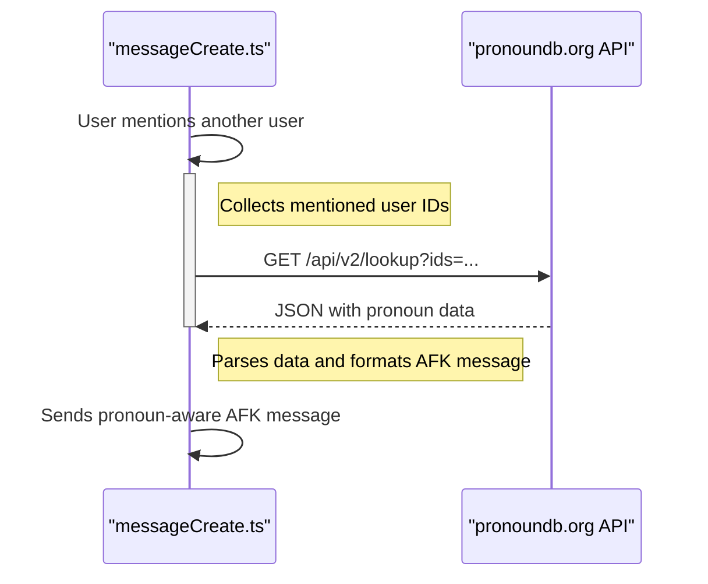

Amina leverages a variety of external APIs to provide its rich feature set, ranging from AI-powered conversations to utility commands and error reporting. These integrations are essential for functionalities like AI responses, fetching changelogs, providing user-specific context, and sending reports. Configuration for these services is managed through environment variables, which are defined in the project's type definitions.

The core of these integrations involves making HTTP requests to third-party services, processing the returned data, and presenting it to the user within Discord. The project uses packages like `@google/generative-ai`, `@octokit/rest`, and `axios` to facilitate these communications.

<strong>Relevant source files</strong>

- [src/helpers/googleAiClient.ts](https://github.com/iamvikshan/amina/blob/main/src/helpers/googleAiClient.ts)
- [src/commands/bot/bot.ts](https://github.com/iamvikshan/amina/blob/main/src/commands/bot/bot.ts)
- [src/events/message/messageCreate.ts](https://github.com/iamvikshan/amina/blob/main/src/events/message/messageCreate.ts)
- [src/handlers/report.ts](https://github.com/iamvikshan/amina/blob/main/src/handlers/report.ts)
- [package.json](https://github.com/iamvikshan/amina/blob/main/package.json)
- [src/services/aiResponder.ts](https://github.com/iamvikshan/amina/blob/main/src/services/aiResponder.ts)
- [app.json](https://github.com/iamvikshan/amina/blob/main/app.json)
- [types/config.d.ts](https://github.com/iamvikshan/amina/blob/main/types/config.d.ts)

## Google generative AI

The primary AI functionality is powered by Google's Generative AI. A dedicated client class, `GoogleAiClient`, encapsulates the logic for interacting with the Google AI API.

### Architecture

The `GoogleAiClient` is responsible for sending requests to the Google Generative AI models, including handling text, media, and function calls. It is instantiated and used by the `AiResponderService`, which determines when and how the bot should respond to user messages using AI.

The diagram below shows the structure of the `GoogleAiClient` class.

### AI response flow

When a user message triggers the AI responder, a sequence of actions is initiated to generate and deliver a response. This includes fetching configuration, building context with user memories and profiles, and calling the `GoogleAiClient`.

The following sequence diagram illustrates the flow of generating an AI response.

### Key components

| Component               | Description                                                                                                                        | Source File                            |
| :---------------------- | :--------------------------------------------------------------------------------------------------------------------------------- | :------------------------------------- |
| `GoogleAiClient`        | A client class to interact with the Google Generative AI API. It handles request generation, media processing, and error handling. | `src/helpers/googleAiClient.ts`        |
| `generateResponse()`    | The main method that constructs and sends the request to the AI model, including conversation history, media, and tools.           | `src/helpers/googleAiClient.ts:90-162` |
| `convertMediaToParts()` | A helper method that fetches images from URLs, converts them to base64, and formats them for the Gemini API.                       | `src/helpers/googleAiClient.ts:47-88`  |
| `AiResponderService`    | A service that orchestrates the AI response logic, including rate limiting, context building, and calling the `GoogleAiClient`.    | `src/services/aiResponder.ts`          |
| `GEMINI_KEY`            | The secret API key required to authenticate with the Google AI service.                                                            | `types/config.d.ts:107`                |

## Github API

The bot integrates with the GitHub API to fetch repository information, primarily for the `/bot changelog` command. This is achieved using the `@octokit/rest` library.

### Changelog fetching

The `/bot changelog` subcommand dynamically fetches the `CHANGELOG.md` file from the project's GitHub repository. It parses the repository URL from `package.json` to determine the owner and repo name.

This diagram shows the sequence for fetching the changelog.

### Configuration

| Key              | Description                                                                                                        | Source File                                             |
| :--------------- | :----------------------------------------------------------------------------------------------------------------- | :------------------------------------------------------ |
| `GH_TOKEN`       | A GitHub personal access token used to authenticate with the GitHub API, increasing rate limits. This is optional. | `app.json:68-72`, `types/config.d.ts:110`               |
| `repository.url` | The URL in `package.json` from which the owner and repository name are parsed.                                     | `package.json:19-22`, `src/commands/bot/bot.ts:192-194` |

## Discord webhooks

Discord Webhooks are used for sending reports and feedback from users to a designated channel for review by developers. The `report` handler utilizes the `WebhookClient` from `discord.js` to send formatted embeds.

### Report submission flow

When a user submits a report via the report modal, the system gathers the information, formats it into an embed, and sends it to a pre-configured webhook URL.

The flowchart below illustrates the report submission process.

The `sendWebhook` function is the final step, responsible for constructing the embed and sending it.

_Sources: [src/handlers/report.ts:292-334](https://github.com/iamvikshan/amina/blob/main/src/handlers/report.ts#L292-L334)_

## Pronoundb API

To create more personalized and inclusive interactions, the bot fetches user pronouns from the external service PronounDB. This is used in features like the AFK message system.

### Pronoun fetching

The `fetchPronounsBatch` function sends a GET request to the PronounDB API with a list of user IDs. The API returns pronoun information, which is then mapped to a more readable format.

This sequence diagram shows how pronouns are fetched for mentioned users.

_Sources: [src/events/message/messageCreate.ts:13-46](https://github.com/iamvikshan/amina/blob/main/src/events/message/messageCreate.ts#L13-L46), [src/events/message/messageCreate.ts:223-231](https://github.com/iamvikshan/amina/blob/main/src/events/message/messageCreate.ts#L223-L231)_

## Summary of integrations

Amina integrates with several other external services, configured via environment variables. The table below summarizes these integrations.

| Service                  | Purpose                                          | NPM Package             | Environment Variable                         | Source Files                                         |
| :----------------------- | :----------------------------------------------- | :---------------------- | :------------------------------------------- | :--------------------------------------------------- |
| **Google Generative AI** | Powers the AI chat functionality.                | `@google/generative-ai` | `GEMINI_KEY`                                 | `src/helpers/googleAiClient.ts`, `types/config.d.ts` |
| **GitHub**               | Fetches repository content like the changelog.   | `@octokit/rest`         | `GH_TOKEN` (optional)                        | `src/commands/bot/bot.ts`, `app.json`                |
| **Discord Webhooks**     | Sends reports, feedback, and logs.               | `discord.js`            | `LOGS_WEBHOOK`, `FEEDBACK.URL`               | `src/handlers/report.ts`, `types/config.d.ts`        |
| **Upstash Vector**       | Provides vector database for AI memory recall.   | `@upstash/vector`       | `UPSTASH_VECTOR`, `UPSTASH_URL`              | `package.json`, `types/config.d.ts`                  |
| **PronounDB**            | Fetches user pronouns for personalized messages. | `node-fetch` (built-in) | N/A                                          | `src/events/message/messageCreate.ts`                |
| **Honeybadger**          | Error and uptime monitoring.                     | `@honeybadger-io/js`    | `HONEYBADGER_API_KEY`                        | `package.json`, `types/config.d.ts`                  |
| **SourceBin**            | Pastes long text content for sharing.            | `sourcebin_js`          | N/A                                          | `package.json`, `src/handlers/minaai/memories.ts`    |
| **Weatherstack**         | Provides data for the weather command.           | `axios` (likely)        | `WEATHERSTACK_KEY`                           | `app.json`, `types/config.d.ts`                      |
| **Spotify**              | Used for music-related commands.                 | Not specified           | `SPOTIFY_CLIENT_ID`, `SPOTIFY_CLIENT_SECRET` | `app.json`, `types/config.d.ts`                      |
| **Strange API**          | Used for various utility/fun commands.           | `axios` (likely)        | `STRANGE_API_KEY`                            | `app.json`, `types/config.d.ts`                      |

## Conclusion

The external API integrations are a cornerstone of Amina's architecture, enabling a wide array of advanced and dynamic features. By offloading complex tasks like AI processing, data fetching, and error reporting to specialized third-party services, the bot can remain focused on its core logic of command handling and user interaction within Discord. Proper configuration of API keys through environment variables is critical for the successful operation of these features.
