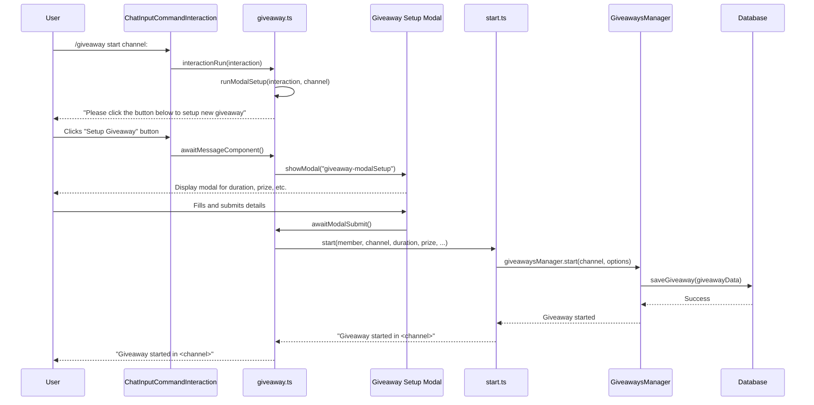
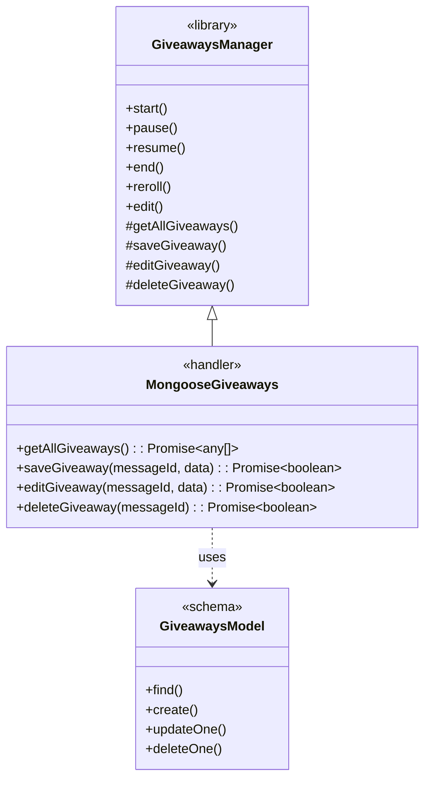
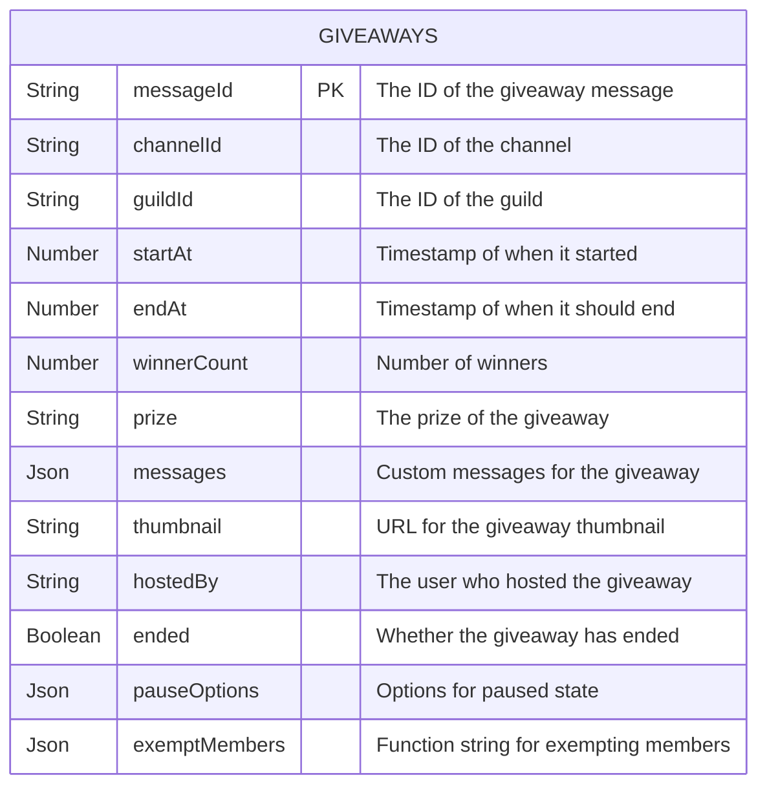

<details>
<summary><strong>Relevant source files</strong></summary>

- [src/commands/giveaways/giveaway.ts](https://github.com/iamvikshan/amina/blob/main/src/commands/giveaways/giveaway.ts)
- [src/handlers/giveaway.ts](https://github.com/iamvikshan/amina/blob/main/src/handlers/giveaway.ts)
- [src/database/schemas/Giveaways.ts](https://github.com/iamvikshan/amina/blob/main/src/database/schemas/Giveaways.ts)
- [src/config/config.ts](https://github.com/iamvikshan/amina/blob/main/src/config/config.ts)
- [src/commands/giveaways/sub/start.ts](https://github.com/iamvikshan/amina/blob/main/src/commands/giveaways/sub/start.ts)
- [src/commands/admin/settings/status.ts](https://github.com/iamvikshan/amina/blob/main/src/commands/admin/settings/status.ts)

</details>

The Giveaway System is a comprehensive feature within Amina that allows server administrators to create, manage, and track giveaways. It is built upon the `discord-giveaways` library but extends its functionality to use a MongoDB database for persistent storage, ensuring that giveaways are not lost on bot restarts.

The system is primarily controlled through the `/giveaway` slash command, which provides a suite of subcommands for all giveaway-related operations. It features a user-friendly modal-based setup for creating new giveaways and integrates with other parts of the bot, such as the server status display.

## Core architecture

The system is composed of three main components: the command handler, a custom giveaway manager for database interaction, and a Mongoose schema for data persistence.



_This diagram illustrates the architectural flow from user command to database interaction._

_Sources: [src/commands/giveaways/giveaway.ts](https://github.com/iamvikshan/amina/blob/main/src/commands/giveaways/giveaway.ts), [src/handlers/giveaway.ts](https://github.com/iamvikshan/amina/blob/main/src/handlers/giveaway.ts), [src/database/schemas/Giveaways.ts](https://github.com/iamvikshan/amina/blob/main/src/database/schemas/Giveaways.ts)_

### Giveaway manager (`MongooseGiveaways`)

The core of the persistence layer is the `MongooseGiveaways` class, which extends the `GiveawaysManager` from the `discord-giveaways` library. This class overrides the default data handling methods to use Mongoose for database operations.

Key overridden methods:

- `getAllGiveaways()`: Fetches all giveaway documents from the database.
- `saveGiveaway()`: Creates a new giveaway document in the database.
- `editGiveaway()`: Updates an existing giveaway document.
- `deleteGiveaway()`: Deletes a giveaway document from the database.

This ensures that all state changes are immediately reflected in the MongoDB collection.



_This class diagram shows how `MongooseGiveaways` extends the base `GiveawaysManager` and utilizes the Mongoose model for data operations._

_Sources: [src/handlers/giveaway.ts:4-38](https://github.com/iamvikshan/amina/blob/main/src/handlers/giveaway.ts#L4-L38)_

### Configuration

The Giveaway System's behavior can be configured in `src/config/config.ts`.

| Option        | Type              | Description                                    |
| ------------- | ----------------- | ---------------------------------------------- |
| `ENABLED`     | `boolean`         | Toggles the entire giveaway feature on or off. |
| `REACTION`    | `string`          | The emoji used for entering giveaways.         |
| `START_EMBED` | `ColorResolvable` | The embed color for new and running giveaways. |
| `END_EMBED`   | `ColorResolvable` | The embed color for ended giveaways.           |

_Sources: [src/config/config.ts:103-108](https://github.com/iamvikshan/amina/blob/main/src/config/config.ts#L103-L108)_

## Database schema

Giveaway data is stored in a MongoDB collection defined by the `Giveaways.ts` schema. This schema is based on the structure required by the `discord-giveaways` library.



_This ER diagram outlines the structure of the giveaway documents stored in the database._

_Sources: [src/database/schemas/Giveaways.ts](https://github.com/iamvikshan/amina/blob/main/src/database/schemas/Giveaways.ts)_

### Schema fields

| Field           | Type      | Description                                                                  |
| --------------- | --------- | ---------------------------------------------------------------------------- |
| `messageId`     | `String`  | The Discord message ID of the giveaway. Serves as the primary key.           |
| `channelId`     | `String`  | The ID of the channel where the giveaway is running.                         |
| `guildId`       | `String`  | The ID of the guild where the giveaway is running.                           |
| `startAt`       | `Number`  | The timestamp (in milliseconds) when the giveaway started.                   |
| `endAt`         | `Number`  | The timestamp (in milliseconds) when the giveaway is scheduled to end.       |
| `winnerCount`   | `Number`  | The number of winners to be chosen.                                          |
| `prize`         | `String`  | The description of the prize.                                                |
| `messages`      | `Object`  | An object containing custom messages for different giveaway states.          |
| `thumbnail`     | `String`  | A URL for the thumbnail image on the giveaway embed.                         |
| `hostedBy`      | `String`  | The user tag of the host.                                                    |
| `ended`         | `Boolean` | A flag indicating if the giveaway has ended.                                 |
| `pauseOptions`  | `Object`  | Stores state information when a giveaway is paused.                          |
| `exemptMembers` | `String`  | A stringified function used to determine if a member is exempt from winning. |

_Sources: [src/database/schemas/Giveaways.ts:3-100](https://github.com/iamvikshan/amina/blob/main/src/database/schemas/Giveaways.ts#L3-L100)_

## Command reference

All giveaway functionality is exposed through the `/giveaway` slash command and its subcommands.

| Subcommand | Description                | Options                                                                                                                                                                    |
| ---------- | -------------------------- | -------------------------------------------------------------------------------------------------------------------------------------------------------------------------- |
| `start`    | Start a giveaway.          | `channel`: The channel to start the giveaway in.                                                                                                                           |
| `pause`    | Pause a giveaway.          | `message_id`: The message ID of the giveaway to pause.                                                                                                                     |
| `resume`   | Resume a paused giveaway.  | `message_id`: The message ID of the giveaway to resume.                                                                                                                    |
| `end`      | End a giveaway.            | `message_id`: The message ID of the giveaway to end.                                                                                                                       |
| `reroll`   | Reroll a giveaway.         | `message_id`: The message ID of the giveaway to reroll.                                                                                                                    |
| `list`     | List all active giveaways. | (No options)                                                                                                                                                               |
| `edit`     | Edit a giveaway.           | `message_id`: The message ID of the giveaway to edit.<br>`add_duration`: Time to add (e.g., "10m").<br>`new_prize`: The new prize.<br>`new_winners`: The new winner count. |

_Sources: [src/commands/giveaways/giveaway.ts:30-165](https://github.com/iamvikshan/amina/blob/main/src/commands/giveaways/giveaway.ts#L30-L165)_

## Workflows

### Starting a giveaway

Creating a giveaway is an interactive process involving a modal to gather all necessary details from the user.

_This sequence diagram shows the step-by-step process of a user starting a new giveaway._

_Sources: [src/commands/giveaways/giveaway.ts:285-447](https://github.com/iamvikshan/amina/blob/main/src/commands/giveaways/giveaway.ts#L285-L447), [src/commands/giveaways/sub/start.ts](https://github.com/iamvikshan/amina/blob/main/src/commands/giveaways/sub/start.ts)_

The `runModalSetup` function in `giveaway.ts` orchestrates this flow. It first validates permissions, then presents a button to the user. Clicking the button opens a modal with fields for:

- Duration (`1h / 1d / 1w`)
- Prize
- Number of winners
- Allowed role ids (optional)
- Host user ID (optional)

Once submitted, the inputs are parsed, and the `start` subcommand is invoked to officially begin the giveaway via the `giveawaysManager`.

_Sources: [src/commands/giveaways/giveaway.ts:285-447](https://github.com/iamvikshan/amina/blob/main/src/commands/giveaways/giveaway.ts#L285-L447)_

### System integration

The Giveaway System is also queried by other parts of the application to provide a cohesive user experience. For example, the `/settings status` command lists all active giveaways in the server.

```typescript
// From src/commands/admin/settings/status.ts
const giveawaysManager = (interaction.client as any).giveawaysManager;
if (giveawaysManager) {
  const activeGiveaways = giveawaysManager.giveaways.filter(
    (g: any) => g.guildId === interaction.guild?.id && !g.ended
  );
  // ... logic to format and display giveaway info
}
```

This snippet shows how the `status` command accesses the `giveawaysManager` to fetch and display currently running giveaways for the guild.

_Sources: [src/commands/admin/settings/status.ts:167-172](https://github.com/iamvikshan/amina/blob/main/src/commands/admin/settings/status.ts#L167-L172)_

## Conclusion

The Giveaway System in Amina is a robust and user-friendly feature that leverages the `discord-giveaways` library and enhances it with persistent storage through a custom MongoDB-backed manager. Its modular design, with separate command handlers, a central manager, and subcommand logic, makes it maintainable and extensible. The interactive modal-based setup simplifies the process for server administrators, while comprehensive management commands provide full control over the giveaway lifecycle.
