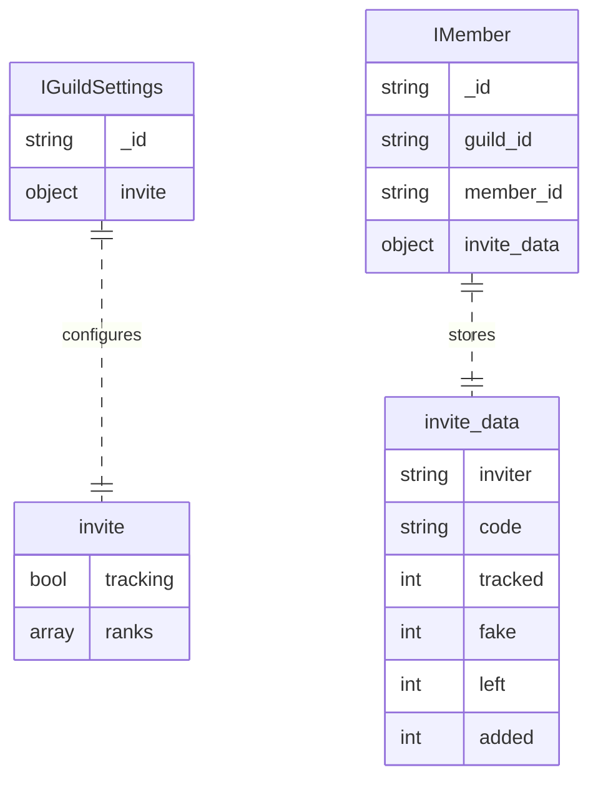
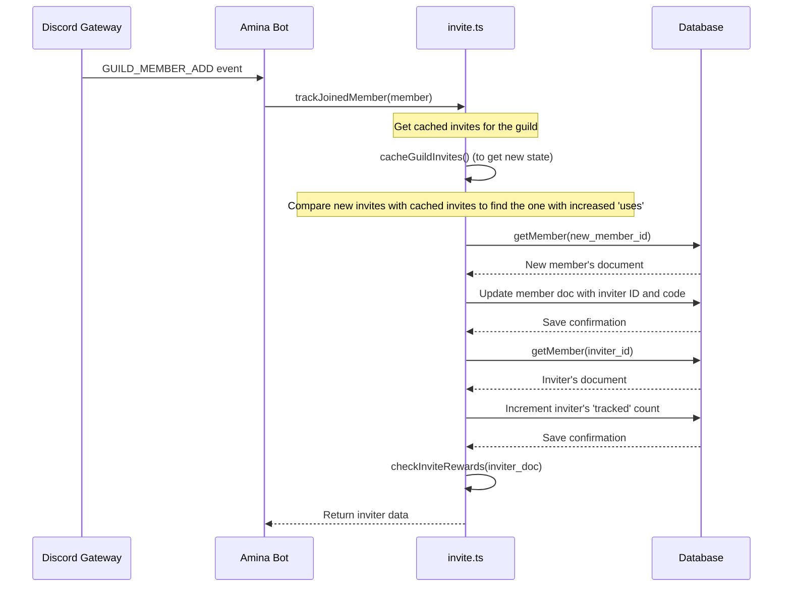

The Invite Tracking system is a comprehensive feature designed to monitor member invitations within a Discord guild. It allows server administrators to track who invites new members, view invite statistics, and automatically assign roles based on the number of successful invites. This system encourages community growth by rewarding members who actively bring new people to the server.

The core functionality is managed through the `/invite` slash command, which provides tools for both regular users and administrators. The system relies on caching guild invites, tracking member join/leave events, and persisting invite data in the database to maintain accurate counts and manage rewards. The feature requires the `ManageGuild` and `ManageChannels` permissions to function correctly.

<strong>Relevant source files</strong>

- [src/commands/social/invites.ts](https://github.com/iamvikshan/amina/blob/main/src/commands/social/invites.ts)
- [src/handlers/invite.ts](https://github.com/iamvikshan/amina/blob/main/src/handlers/invite.ts)
- [types/schemas.d.ts](https://github.com/iamvikshan/amina/blob/main/types/schemas.d.ts)
- [src/handlers/greeting.ts](https://github.com/iamvikshan/amina/blob/main/src/handlers/greeting.ts)
- [src/structures/BotClient.ts](https://github.com/iamvikshan/amina/blob/main/src/structures/BotClient.ts)
- [src/events/invite/inviteCreate.ts](https://github.com/iamvikshan/amina/blob/main/src/events/invite/inviteCreate.ts)

_Sources: [src/commands/social/invites.ts](https://github.com/iamvikshan/amina/blob/main/src/commands/social/invites.ts), [src/handlers/invite.ts](https://github.com/iamvikshan/amina/blob/main/src/handlers/invite.ts), [src/commands/social/invites.ts:660-663](https://github.com/iamvikshan/amina/blob/main/src/commands/social/invites.ts#L660-L663)_

## Architecture overview

The invite tracking system is composed of several key components that work together: event handlers, an in-memory cache, database models, and slash command handlers. The `BotClient` is configured with `GatewayIntentBits.GuildInvites` to receive the necessary invite-related events from Discord.

- **Invite Handler (`invite.ts`)**: The central module containing the business logic for caching invites, tracking member joins and leaves, and checking for rewards.
- **Invite Commands (`invites.ts`)**: Provides the user-facing `/invite` slash command for interacting with the system.
- **Event Listeners**:
  - `guildMemberAdd`: Triggers `trackJoinedMember` to identify the inviter.
  - `guildMemberRemove`: Triggers `trackLeftMember` to update the inviter's statistics.
  - `inviteCreate`: Updates the invite cache when a new invite is created.
- **Database Schemas (`schemas.d.ts`)**: Defines the data structures for storing guild-specific settings and member-specific invite data.

_Sources: [src/structures/BotClient.ts:48](https://github.com/iamvikshan/amina/blob/main/src/structures/BotClient.ts:48), [src/handlers/invite.ts](https://github.com/iamvikshan/amina/blob/main/src/handlers/invite.ts), [src/commands/social/invites.ts](https://github.com/iamvikshan/amina/blob/main/src/commands/social/invites.ts)_

### Data model

The system uses two main data structures stored in the database: `IGuildSettings` for server-wide configuration and `IMember` for individual member statistics.

The diagram below illustrates the relationship between Guild settings and Member invite data.

This ER diagram shows that each `IGuildSettings` document contains an `invite` configuration object, and each `IMember` document stores an `invite_data` object with detailed statistics.

_Sources: [types/schemas.d.ts:49-55, 168-177](https://github.com/iamvikshan/amina/blob/main/types/schemas.d.ts#L49-L55)_

#### `imember.invite_data`

This object stores the invite statistics for a specific member within a guild.

| Field     | Type   | Description                                                                  |
| :-------- | :----- | :--------------------------------------------------------------------------- |
| `inviter` | string | The ID of the user who invited this member. Can be 'VANITY' or an ID.        |
| `code`    | string | The invite code used by this member to join.                                 |
| `tracked` | number | The number of members invited by this user that are currently in the server. |
| `added`   | number | The number of invites manually added by an admin.                            |
| `fake`    | number | The number of "fake" invites (not currently implemented or used).            |
| `left`    | number | The number of members invited by this user who have left the server.         |

The effective number of invites is calculated as: `(tracked + added) - (fake + left)`.

_Sources: [types/schemas.d.ts:170-177](https://github.com/iamvikshan/amina/blob/main/types/schemas.d.ts#L170-L177), [src/handlers/invite.ts:25-28](https://github.com/iamvikshan/amina/blob/main/src/handlers/invite.ts#L25-L28)_

#### `iguildsettings.invite`

This object stores the guild-wide settings for the invite tracking system.

| Field      | Type    | Description                                                                                                                               |
| :--------- | :------ | :---------------------------------------------------------------------------------------------------------------------------------------- |
| `tracking` | boolean | Whether invite tracking is enabled or disabled.                                                                                           |
| `ranks`    | array   | An array of objects defining roles and the required number of invites to obtain them. Each object contains `_id` (role ID) and `invites`. |

_Sources: [types/schemas.d.ts:50-55](https://github.com/iamvikshan/amina/blob/main/types/schemas.d.ts#L50-L55)_

## Core logic

### Invite caching

To accurately determine which invite was used by a new member, the system maintains an in-memory cache of all invites for a guild. This cache is populated when the feature is enabled and updated as invites are created or used.

The caching process uses `cacheGuildInvites(guild)` to fetch all standard invites and the vanity invite (if available) from the Discord API. The `inviteCache` is a Collection that maps a guild ID to another Collection of invite codes and their data (`code`, `uses`, `inviterId`). `resetInviteCache(guild)` clears the cache for a guild, typically when tracking is disabled.

_Sources: [src/handlers/invite.ts:19, 41-59](https://github.com/iamvikshan/amina/blob/main/src/handlers/invite.ts#L19), [src/commands/social/invites.ts:660-679](https://github.com/iamvikshan/amina/blob/main/src/commands/social/invites.ts#L660-L679)_

### Tracking member joins

When a new member joins a guild, the `trackJoinedMember` function is executed to identify the inviter and update statistics.

The sequence diagram below details this process:

This diagram shows how a new member joining triggers a series of actions to find the used invite, update database records for both the new member and the inviter, and check for any rank rewards.

_Sources: [src/handlers/invite.ts:100-136](https://github.com/iamvikshan/amina/blob/main/src/handlers/invite.ts#L100-L136)_

### Tracking member leaves

When a member leaves, `trackLeftMember` is called. It retrieves the member's data from the database to find who invited them. It then fetches the inviter's record and increments their `left` count. Finally, it calls `checkInviteRewards` to potentially remove a rank role if the inviter's effective count drops below a threshold.

_Sources: [src/handlers/invite.ts:141-160](https://github.com/iamvikshan/amina/blob/main/src/handlers/invite.ts#L141-L160)_

### Invite ranks and rewards

The system can automatically grant roles to members when they reach a certain number of effective invites. This is configured using the `/invite rank add` command.

The `checkInviteRewards` function determines if roles should be added or removed based on whether the member's invite count has increased (`isAdded: true`) or decreased (`isAdded: false`).

_Sources: [src/handlers/invite.ts:64-95](https://github.com/iamvikshan/amina/blob/main/src/handlers/invite.ts#L64-L95), [src/commands/social/invites.ts:566-591](https://github.com/iamvikshan/amina/blob/main/src/commands/social/invites.ts#L566-L591)_

## `/invite` slash command

The `/invite` command is the primary interface for users and administrators to manage and view invite data.

_Sources: [src/commands/social/invites.ts:20-205](https://github.com/iamvikshan/amina/blob/main/src/commands/social/invites.ts#L20-L205)_

### User commands

| Subcommand | Description                             | Options                                                            |
| :--------- | :-------------------------------------- | :----------------------------------------------------------------- |
| `view`     | Shows the number of invites for a user. | `user` (optional): The user to view invites for. Defaults to self. |
| `codes`    | Lists all of your active invite codes.  | `user` (optional): The user to list codes for. Defaults to self.   |
| `inviter`  | Shows who invited a specific user.      | `user` (optional): The user to check. Defaults to self.            |
| `ranks`    | Displays the configured invite ranks.   | None.                                                              |

### Admin commands (requires `manageguild` permission)

| Subcommand Group | Subcommand | Description                               | Options                                               |
| :--------------- | :--------- | :---------------------------------------- | :---------------------------------------------------- |
| -                | `add`      | Manually adds invites to a member.        | `user` (required), `invites` (required)               |
| -                | `reset`    | Resets a member's manually added invites. | `user` (required)                                     |
| -                | `import`   | Imports invites from existing guild data. | `user` (optional): Import for a specific user or all. |
| -                | `tracking` | Enables or disables invite tracking.      | `status` (required): ON or OFF                        |
| `rank`           | `add`      | Adds a new invite rank (role reward).     | `role` (required), `invites` (required)               |
| `rank`           | `remove`   | Removes an existing invite rank.          | `role` (required)                                     |

## Integrations

The invite tracking data is also used in other parts of the bot, such as the greeting system. When a new member joins, the welcome message can be configured to display the inviter's name and their total number of effective invites.

The `greeting.ts` handler uses placeholders like `{inviter:name}` and `{invites}` which are parsed and replaced with data from the invite tracking system.

_Sources: [src/handlers/greeting.ts:21-55](https://github.com/iamvikshan/amina/blob/main/src/handlers/greeting.ts#L21-L55)_
