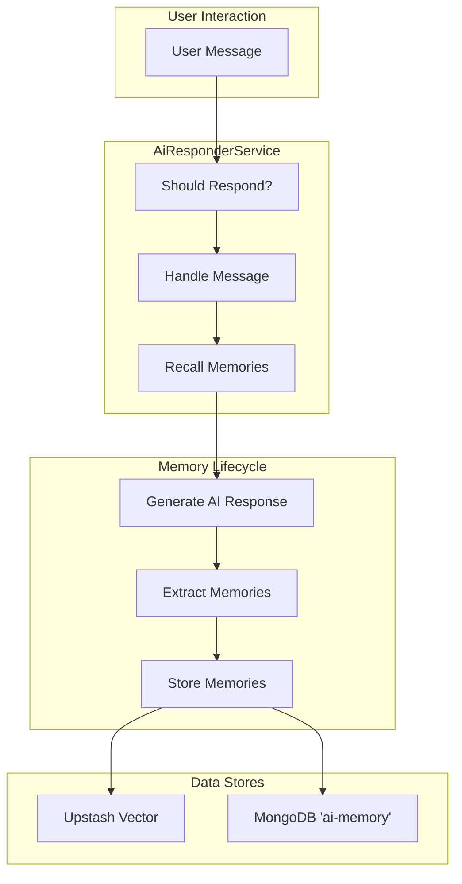
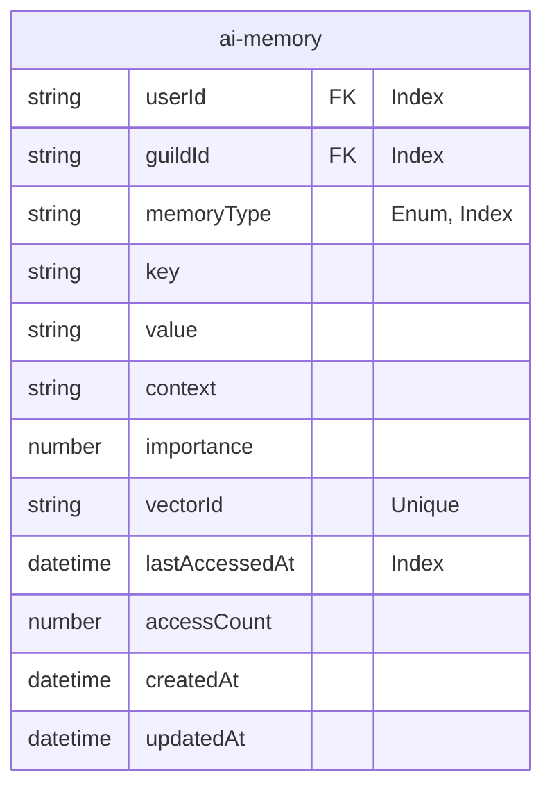

The Mina AI Memory System provides the AI with long-term conversational memory, enabling it to recall user preferences, facts, and past interactions to create a more personalized and context-aware experience. The system is designed to automatically extract salient information from conversations, store it efficiently, and retrieve it semantically when relevant to a new conversation.

This system utilizes a hybrid storage approach: metadata and conversational context are stored in a MongoDB collection, while semantic vectors for fast retrieval are stored in an Upstash Vector database. User-facing commands allow for viewing and deleting personal memories, ensuring user privacy and control.

<strong>Relevant source files</strong>

- [src/services/memoryService.ts](https://github.com/iamvikshan/amina/blob/main/src/services/memoryService.ts)
- [src/database/schemas/AiMemory.ts](https://github.com/iamvikshan/amina/blob/main/src/database/schemas/AiMemory.ts)
- [src/handlers/minaai/memories.ts](https://github.com/iamvikshan/amina/blob/main/src/handlers/minaai/memories.ts)
- [src/services/aiResponder.ts](https://github.com/iamvikshan/amina/blob/main/src/services/aiResponder.ts)
- [src/handlers/minaai/forget-me.ts](https://github.com/iamvikshan/amina/blob/main/src/handlers/minaai/forget-me.ts)
- [src/commands/dev/sub/minaAi.ts](https://github.com/iamvikshan/amina/blob/main/src/commands/dev/sub/minaAi.ts)
- [src/handlers/dev/minaai/handlers.ts](https://github.com/iamvikshan/amina/blob/main/src/handlers/dev/minaai/handlers.ts)
- [src/handlers/minaai/main-hub.ts](https://github.com/iamvikshan/amina/blob/main/src/handlers/minaai/main-hub.ts)

## Architecture overview

The memory system is primarily driven by the `MemoryService`, which orchestrates the extraction, storage, and recall processes. It integrates with the `AiResponderService` to analyze conversations and inject recalled memories back into the AI's prompt context.

The following diagram illustrates the high-level data flow of the memory system.

## Memory storage

The system uses two data stores: MongoDB for persistent metadata and Upstash Vector for semantic search.

### Mongodb schema (`aimemory`)

All memory metadata is stored in the `ai-memory` collection in MongoDB. This schema defines the structure of a single memory entry.

_Sources: [src/database/schemas/AiMemory.ts:5-24](https://github.com/iamvikshan/amina/blob/main/src/database/schemas/AiMemory.ts#L5-L24)_

The diagram below shows the entity relationship for the `ai-memory` schema.

The table below details the fields in the `ai-memory` schema.

| Field            | Type    | Description                                                        | Constraints                                               |
| :--------------- | :------ | :----------------------------------------------------------------- | :-------------------------------------------------------- |
| `userId`         | String  | The Discord user ID this memory belongs to.                        | Required, Indexed                                         |
| `guildId`        | String  | The Discord guild ID where the memory was created. `null` for DMs. | Indexed                                                   |
| `memoryType`     | String  | The category of the memory.                                        | Enum: `user`, `guild`, `topic`. Default: `user`. Indexed. |
| `key`            | String  | A short, descriptive key for the memory (e.g., "Favorite Color").  | Required                                                  |
| `value`          | String  | The value of the memory (e.g., "Blue").                            | Required                                                  |
| `context`        | String  | A snippet of the conversation that led to this memory's creation.  | Default: ''                                               |
| `importance`     | Number  | A score from 1-10 indicating the memory's importance.              | Default: 5, Min: 1, Max: 10                               |
| `vectorId`       | String  | The unique identifier for the corresponding vector in Upstash.     | Required, Unique                                          |
| `lastAccessedAt` | Date    | Timestamp of the last time this memory was recalled.               | Default: `Date.now()`                                     |
| `accessCount`    | Number  | How many times this memory has been recalled.                      | Default: 0                                                |
| `timestamps`     | Boolean | Automatically adds `createdAt` and `updatedAt` fields.             | Mongoose option                                           |

_Sources: [src/database/schemas/AiMemory.ts:5-24](https://github.com/iamvikshan/amina/blob/main/src/database/schemas/AiMemory.ts#L5-L24)_

### Vector database (upstash)

The `MemoryService` uses Upstash Vector for fast, semantic searching of memories.

- When a memory is stored, its content (`key` and `value`) is converted into a numerical vector (embedding) using google's `embedding-001` model.
- This vector is stored in Upstash, indexed by a unique `vectorId`.
- When recalling memories, the user's current message is also converted into a vector, which is then used to query upstash for the most semantically similar (i.e., relevant) memory vectors.

_Sources: [src/services/memoryService.ts:18-32](https://github.com/iamvikshan/amina/blob/main/src/services/memoryService.ts#L18-L32), [src/services/memoryService.ts:133-149](https://github.com/iamvikshan/amina/blob/main/src/services/memoryService.ts#L133-L149), [src/services/memoryService.ts:192-201](https://github.com/iamvikshan/amina/blob/main/src/services/memoryService.ts#L192-L201)_

## Memory lifecycle

### 1\. Extraction

Memories are automatically extracted from conversations that are sufficiently long (at least 5 messages). The `AiResponderService` triggers this process after generating a response.

This diagram shows the sequence of events for extracting memories from a conversation.
_Sources: [src/services/aiResponder.ts:680-708](https://github.com/iamvikshan/amina/blob/main/src/services/aiResponder.ts#L680-L708), [src/services/memoryService.ts:49-110](https://github.com/iamvikshan/amina/blob/main/src/services/memoryService.ts#L49-L110)_

The `extractMemories` function in `MemoryService` uses the `gemini-flash-latest` model with a specific prompt to analyze the last 10 messages of a conversation and return a JSON array of `MemoryFact` objects.

### 2\. Storage

Once a fact is extracted, the `storeMemory` function handles saving it to both databases.

1.  **Generate Embedding**: An embedding is created from the fact's `key` and `value` using the `embedding-001` model.
2.  **Generate Vector ID**: A unique ID is created (e.g., `mem_<userId>_<guildId>_<timestamp>`).
3.  **Upsert to Upstash**: The vector and associated metadata are saved to the Upstash Vector index.
4.  **Save to MongoDB**: The full memory object, including the `vectorId`, is saved to the `ai-memory` collection.
5.  **Enforce Limits**: The system checks if the user has exceeded the `MAX_MEMORIES_PER_USER` (50) limit for the given context (guild or DM). If so, the oldest, least important memories are deleted from both MongoDB and Upstash.

_Sources: [src/services/memoryService.ts:115-184](https://github.com/iamvikshan/amina/blob/main/src/services/memoryService.ts#L115-L184), [src/database/schemas/AiMemory.ts:103-124](https://github.com/iamvikshan/amina/blob/main/src/database/schemas/AiMemory.ts#L103-L124)_

### 3\. Recall

When a user sends a message, `AiResponderService` calls `memoryService.recallMemories` to find relevant information before generating a response.

This flowchart outlines the process of recalling memories to add context to an AI response.
_Sources: [src/services/aiResponder.ts:488-531](https://github.com/iamvikshan/amina/blob/main/src/services/aiResponder.ts#L488-L531), [src/services/memoryService.ts:189-282](https://github.com/iamvikshan/amina/blob/main/src/services/memoryService.ts#L189-L282)_

The filtering logic is crucial and respects user privacy settings:

- **`combineDmWithServer`**: If true, memories from both DMs and servers can be recalled together. If false, they are kept separate.
- **`globalServerMemories`**: If true (default), memories from any server are recalled. If false, only memories from the current server are considered.

_Sources: [src/services/memoryService.ts:211-257](https://github.com/iamvikshan/amina/blob/main/src/services/memoryService.ts#L211-L257)_

### 4\. Deletion and pruning

The system provides several ways to delete memories:

- **User-Initiated Deletion**: The `forgetUser` function is called by the `/mina-ai forget-me` command handler. It fetches all of a user's memories for a given context, gets their `vectorId`s, and deletes them from both Upstash and MongoDB.
- **Limit-Based Pruning**: The `deleteOldestMemories` function is triggered during storage if a user exceeds the `MAX_MEMORIES_PER_USER` limit. It deletes the oldest memories, preserving the most important ones.
- **Automatic Pruning**: The `pruneOldMemories` function is designed to periodically clean up old, unimportant, and rarely accessed memories (older than 90 days, importance \<= 3, access count \<= 2).

_Sources: [src/services/memoryService.ts:287-310](https://github.com/iamvikshan/amina/blob/main/src/services/memoryService.ts#L287-L310), [src/handlers/minaai/forget-me.ts:51-54](https://github.com/iamvikshan/amina/blob/main/src/handlers/minaai/forget-me.ts#L51-L54), [src/services/memoryService.ts:402-419](https://github.com/iamvikshan/amina/blob/main/src/services/memoryService.ts#L402-L419)_

## User-facing features

Users interact with the memory system primarily through the `/mina-ai` command and its sub-handlers.

_Sources: [src/handlers/minaai/main-hub.ts](https://github.com/iamvikshan/amina/blob/main/src/handlers/minaai/main-hub.ts)_

### View memories

The `memories` command, handled by `src/handlers/minaai/memories.ts`, provides a detailed interface for users to view what Mina remembers about them.

- **Main View (`showMemoriesView`)**:
  - Displays memories grouped by type (e.g., `preference`, `fact`, `opinion`).
  - Shows a preview of the top 2 memories per type.
  - Provides statistics like total memories, total access count, and average importance.
  - Includes buttons to navigate to a detailed category view.
- **Category Detail View (`showCategoryDetailView`)**:
  - Lists all memories for a selected type.
  - Supports pagination (up to 2 pages, 5 memories per page).
- **DM Me (`handleDmMe`)**:
  - If a user has a large number of memories, they can use this button.
  - It generates a full, detailed list of all their memories, posts it to a pastebin service (`postTobin`), and dms the user a link.

_Sources: [src/handlers/minaai/memories.ts:30-496](https://github.com/iamvikshan/amina/blob/main/src/handlers/minaai/memories.ts#L30-L496)_

### Forget me

The `forget-me` option in the settings menu allows a user to permanently delete all memories Mina has about them in the current context (server or DM).

1.  A confirmation screen is shown to prevent accidental deletion (`showForgetMeConfirmation`).
2.  If confirmed, `handleForgetMeConfirm` calls `memoryService.forgetUser`.
3.  It also automatically enables the `ignoreMe` setting for the user, so the AI will stop interacting with them until they re-enable it.

_Sources: [src/handlers/minaai/forget-me.ts:17-101](https://github.com/iamvikshan/amina/blob/main/src/handlers/minaai/forget-me.ts#L17-L101)_

## Developer & admin features

Developers have access to tools for monitoring and managing the AI's memory system.

### Memory statistics

The `/dev mina-ai memory-stats` command provides a comprehensive overview of the memory database.

- **Total Memories**: Total count of documents in the `ai-memory` collection.
- **Unique Users/Guilds**: Count of distinct users and guilds with stored memories.
- **Breakdown by Type**: A count of memories for each `memoryType`.
- **Top Users**: A list of users with the most memories.
- **Average Importance**: The average importance score across all memories.
- **Total Access Count**: The sum of `accessCount` for all memories.

This data is retrieved by the `getStats` method in `MemoryService`, which aggregates data from the MongoDB collection.

_Sources: [src/commands/dev/sub/minaAi.ts:284-345](https://github.com/iamvikshan/amina/blob/main/src/commands/dev/sub/minaAi.ts#L284-L345), [src/services/memoryService.ts:315-381](https://github.com/iamvikshan/amina/blob/main/src/services/memoryService.ts#L315-L381), [src/handlers/dev/minaai/handlers.ts:200-230](https://github.com/iamvikshan/amina/blob/main/src/handlers/dev/minaai/handlers.ts#L200-L230)_

## Conclusion

The Mina AI Memory System is a sophisticated feature that significantly enhances the bot's conversational abilities. By combining the structured storage of MongoDB with the semantic search power of Upstash Vector, it can maintain long-term, contextually relevant memory. The system is built with user privacy in mind, offering clear interfaces for viewing and deleting personal data. Automated extraction and pruning ensure the memory remains relevant and manageable over time, making Mina a more intelligent and engaging companion.
