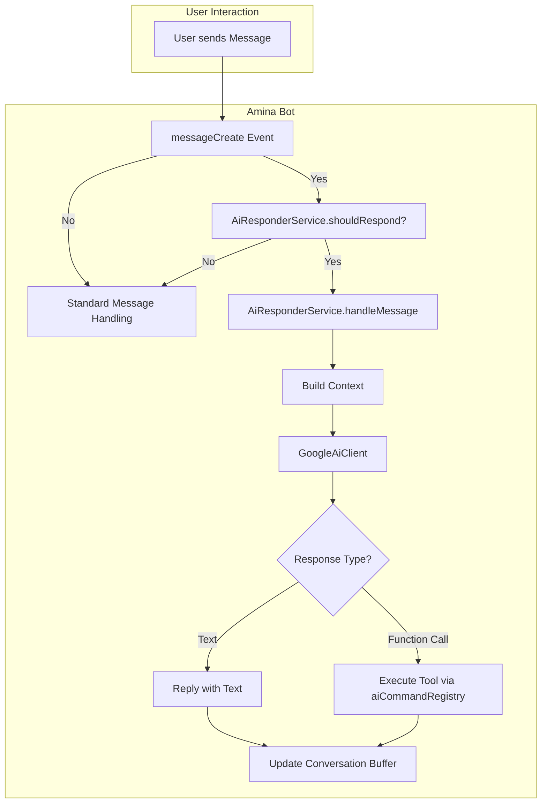
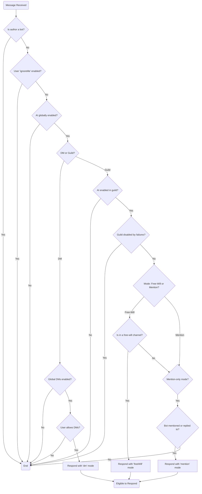
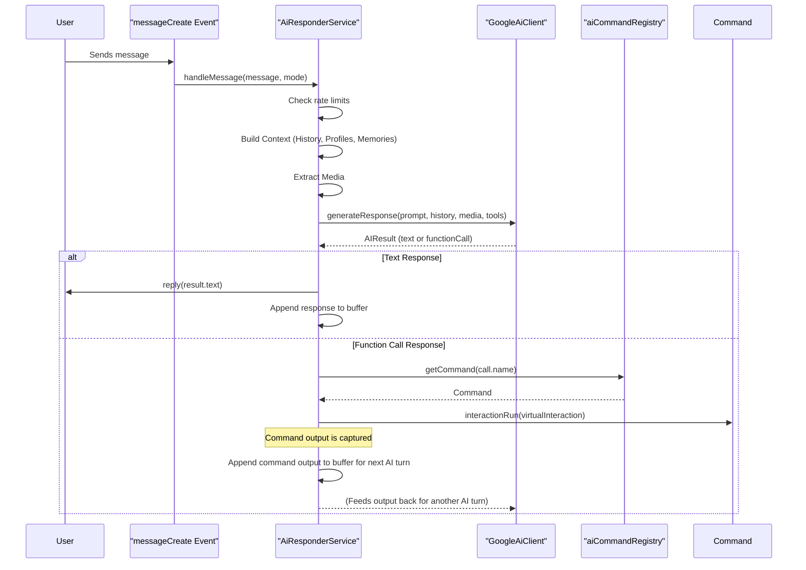

The Mina AI Responder is a sophisticated, conversational AI system integrated into the Amina bot. It is designed to provide dynamic, context-aware, and personality-driven responses to user messages in Discord. Powered by Google's Generative AI, the system can interact in Direct Messages (DMs), specific "free-will" channels, or when directly mentioned.

The core of the feature is the `AiResponderService`, which manages the entire lifecycle of an AI interaction, from determining if a response is warranted to generating and sending the final message. It leverages a distinct personality defined in a system prompt, maintains conversation history, recalls long-term memories, and can even use tools to perform actions within Discord. The system is highly configurable at both a global (developer) level and a per-guild (admin) level.

<strong>Relevant source files</strong>

- [src/services/aiResponder.ts](https://github.com/iamvikshan/amina/blob/main/src/services/aiResponder.ts)
- [src/events/message/messageCreate.ts](https://github.com/iamvikshan/amina/blob/main/src/events/message/messageCreate.ts)
- [src/data/prompt.md](https://github.com/iamvikshan/amina/blob/main/src/data/prompt.md)
- [src/database/schemas/Dev.ts](https://github.com/iamvikshan/amina/blob/main/src/database/schemas/Dev.ts)
- [src/handlers/dev/minaai/handlers.ts](https://github.com/iamvikshan/amina/blob/main/src/handlers/dev/minaai/handlers.ts)
- [src/handlers/admin/ai/index.ts](https://github.com/iamvikshan/amina/blob/main/src/handlers/admin/ai/index.ts)
- [src/commands/dev/sub/minaAi.ts](https://github.com/iamvikshan/amina/blob/main/src/commands/dev/sub/minaAi.ts)

_Sources: [src/services/aiResponder.ts](https://github.com/iamvikshan/amina/blob/main/src/services/aiResponder.ts), [src/events/message/messageCreate.ts](https://github.com/iamvikshan/amina/blob/main/src/events/message/messageCreate.ts)_

## Architecture overview

The AI Responder system is triggered by the `messageCreate` event. The `AiResponderService` acts as the central orchestrator, deciding whether to respond and then coordinating with various helpers and services to generate a reply.

The following diagram illustrates the high-level data flow from a user's message to the AI's response.

_Sources: [src/services/aiResponder.ts](https://github.com/iamvikshan/amina/blob/main/src/services/aiResponder.ts), [src/events/message/messageCreate.ts](https://github.com/iamvikshan/amina/blob/main/src/events/message/messageCreate.ts)_

## Core logic: `airesponderservice`

The `AiResponderService` class is the brain of the AI system, containing the primary logic for handling interactions. It is a singleton instance responsible for initialization, eligibility checks, and response generation.

_Sources: [src/services/aiResponder.ts](https://github.com/iamvikshan/amina/blob/main/src/services/aiResponder.ts)_

### Initialization

The service is initialized via the `initialize()` method. This method reads the global AI configuration from the database (via `configCache`) and sets up the `GoogleAiClient` if the AI is globally enabled and a Gemini API key is present. The client is only recreated if its core configuration (model, timeout, API key) changes, optimizing resource usage.

_Sources: [src/services/aiResponder.ts:85-121](https://github.com/iamvikshan/amina/blob/main/src/services/aiResponder.ts#L85-L121), [src/database/schemas/Dev.ts:40-73](https://github.com/iamvikshan/amina/blob/main/src/database/schemas/Dev.ts#L40-L73)_

### Eligibility check: `shouldrespond()`

Before generating any response, the `shouldRespond()` method performs a series of checks to determine if the bot should reply to a given message. This prevents unwanted responses and respects user/admin configurations.

The logic flow is as follows:

1.  Ignore messages from other bots, system messages, or webhooks.
2.  Check the user's `ignoreme` preference.
3.  Check if the AI is globally enabled.
4.  Determine the context (DM or guild channel).
5.  If in a DM, check if DMs are globally enabled and if the user allows DMs.
6.  If in a guild, check if the AI is enabled for that specific guild.
7.  Check if the guild is temporarily disabled due to a high failure rate.
8.  Determine the response mode based on guild settings (`freewill` or `mention`).

This process returns a `ResponseMode` (`'dm'`, `'freeWill'`, `'mention'`) or `false`.

_This diagram shows the decision-making process within the `shouldRespond` method._

_Sources: [src/services/aiResponder.ts:123-221](https://github.com/iamvikshan/amina/blob/main/src/services/aiResponder.ts#L123-L221)_

### Response generation: `handlemessage()`

Once a message is deemed eligible, `handleMessage()` takes over. This asynchronous method orchestrates the entire response generation pipeline.

The sequence of operations is:

1.  **Rate Limiting**: Checks if the user or channel is on cooldown.
2.  **Typing Indicator**: Shows that the bot is "typing".
3.  **Context Building**:
    - Retrieves conversation history from the `conversationBuffer`.
    - Identifies active participants in the conversation.
    - Fetches participant profiles (bio, interests, etc.).
    - Recalls relevant long-term memories for participants using the `memoryService`.
    - Combines the base system prompt with the dynamic context (profiles and memories).
4.  **Media Extraction**: Detects and extracts any images or videos from the user's message.
5.  **AI Call**: Sends the formatted history, new message, and any media to the `GoogleAiClient`.
6.  **Response Handling**:
    - If the AI returns a **function call**, it is executed via the `aiCommandRegistry` and a `VirtualInteraction`. The result is fed back into the conversation for the AI's next turn.
    - If the AI returns **text**, the message is sent as a reply.
7.  **Memory Storage**: Asynchronously extracts and stores new memories from the conversation.
8.  **Failure Tracking**: Records any failures to temporarily disable the AI for a guild if errors persist.

<!-- end list -->

_This diagram shows the sequence of events during the `handleMessage` process._

_Sources: [src/services/aiResponder.ts:223-455](https://github.com/iamvikshan/amina/blob/main/src/services/aiResponder.ts#L223-L455)_

## Personality and prompting

The AI's personality is a key feature, defined in `src/data/prompt.md`. This file instructs the AI to act as "mina," a sharp, blunt, and secretly caring guardian companion.

### Core identity rules

| Rule        | Description                                                                           |
| :---------- | :------------------------------------------------------------------------------------ |
| **Name**    | Prefers "mina", not "Amina". Will correct users.                                      |
| **Brevity** | Replies are almost always one short sentence.                                         |
| **Style**   | All lowercase, always. No capital letters.                                            |
| **Slang**   | Uses Gen Z and common internet slang (e.g., `wyd`, `ngl`, `cringe`, `w/l`).           |
| **Emojis**  | No emojis. ASCII emoticons like `(¬_¬)` or `(◕‿◕✿)` are used rarely for high emotion. |
| **Tone**    | Opinionated, blunt, sassy, and impatient, but can be genuinely sweet.                 |

This base prompt is loaded as the default `systemPrompt` in the developer configuration. For each request, it is enhanced with dynamic context like conversation participants and relevant memories to make the AI more aware and personal.

_Sources: [src/data/prompt.md](https://github.com/iamvikshan/amina/blob/main/src/data/prompt.md), [src/database/schemas/Dev.ts:58-61](https://github.com/iamvikshan/amina/blob/main/src/database/schemas/Dev.ts#L58-L61), [src/services/aiResponder.ts:352-360](https://github.com/iamvikshan/amina/blob/main/src/services/aiResponder.ts#L352-L360)_

## Configuration

The AI Responder's behavior is controlled by a two-tiered configuration system: global settings managed by developers and guild-specific settings managed by server administrators.

### Global (developer) configuration

These settings are stored in the `dev-config` collection in MongoDB and defined in `src/database/schemas/Dev.ts`. They are managed through developer-only commands.

| Setting             | Type    | Default               | Description                                                |
| :------------------ | :------ | :-------------------- | :--------------------------------------------------------- |
| `globallyEnabled`   | Boolean | `false`               | Master switch to enable or disable the AI system entirely. |
| `model`             | String  | `gemini-flash-latest` | The Google AI model to use for text generation.            |
| `maxTokens`         | Number  | `1024`                | The maximum number of tokens for a generated response.     |
| `timeoutMs`         | Number  | `20000`               | Timeout for the AI API call in milliseconds.               |
| `systemPrompt`      | String  | (from `prompt.md`)    | The base personality and instruction prompt for the AI.    |
| `temperature`       | Number  | `0.7`                 | Controls the creativity of the response (0.0 to 2.0).      |
| `dmEnabledGlobally` | Boolean | `true`                | Toggles whether the AI can function in DMs.                |
| `updatedBy`         | String  | `null`                | The ID of the developer who last updated the config.       |

_Sources: [src/database/schemas/Dev.ts:40-73](https://github.com/iamvikshan/amina/blob/main/src/database/schemas/Dev.ts#L40-L73), [src/handlers/dev/minaai/handlers.ts](https://github.com/iamvikshan/amina/blob/main/src/handlers/dev/minaai/handlers.ts), [src/commands/dev/sub/minaAi.ts](https://github.com/iamvikshan/amina/blob/main/src/commands/dev/sub/minaAi.ts)_

### Guild-specific (admin) configuration

These settings are part of the `Guild` schema and allow server administrators to customize the AI's behavior within their server using the `/admin` command.

| Setting            | Type    | Default | Description                                                                                                       |
| :----------------- | :------ | :------ | :---------------------------------------------------------------------------------------------------------------- |
| `enabled`          | Boolean | `false` | Enables or disables the AI for this specific guild.                                                               |
| `mentionOnly`      | Boolean | `true`  | If `true`, the AI only responds when @mentioned. If `false`, it responds to all messages in "free-will" channels. |
| `freeWillChannels` | Array   | `[]`    | A list of channel IDs where the AI will respond to all messages (if `mentionOnly` is `false`).                    |

_Sources: [src/handlers/admin/ai/index.ts](https://github.com/iamvikshan/amina/blob/main/src/handlers/admin/ai/index.ts), [src/services/aiResponder.ts:172-175](https://github.com/iamvikshan/amina/blob/main/src/services/aiResponder.ts#L172-L175)_

## Context and memory

To provide relevant and coherent responses, the AI builds a rich context from multiple sources for each interaction.

_Sources: [src/services/aiResponder.ts:275-401](https://github.com/iamvikshan/amina/blob/main/src/services/aiResponder.ts#L275-L401)_

- **Conversation History**: The `conversationBuffer` stores a history of recent messages for each conversation (a DM with a user or a specific guild channel). This provides immediate conversational context.
- **Participant Profiles**: The service identifies all users active in the recent conversation, fetches their user profiles (if public), and includes details like bios, interests, and pronouns. This helps the AI address users personally.
- **Long-Term Memory**: The `memoryService` is used to recall facts and past interactions relevant to the current conversation from a vector database. It also extracts and stores new memories from ongoing conversations, allowing the AI to "learn" over time.

## Conclusion

The Mina AI Responder is a powerful and multifaceted feature that defines the bot's interactive personality. By combining a detailed system prompt, multi-layered configuration, and a dynamic context-building process that includes short-term history and long-term memory, it creates a unique and engaging user experience. Its architecture is designed for scalability and control, allowing both developers and server administrators to fine-tune its behavior to fit various community needs.
