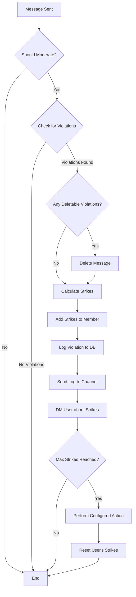
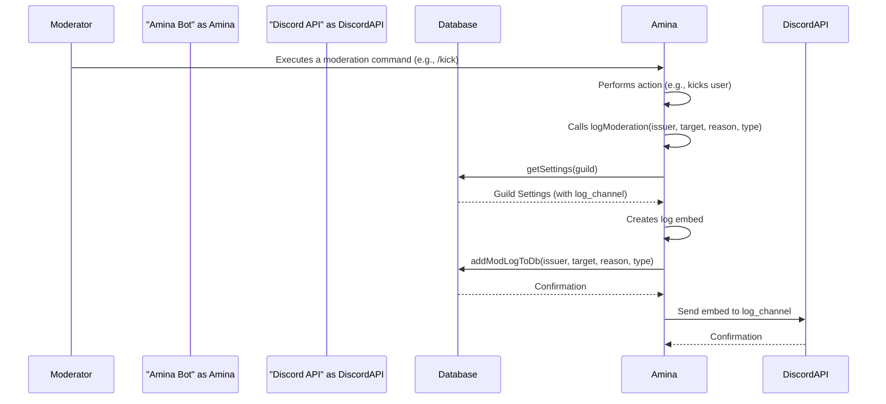
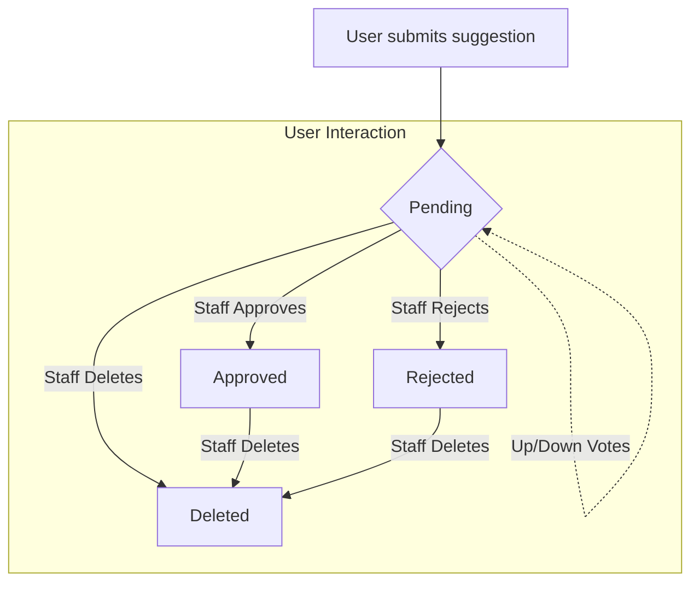

<strong>Relevant source files</strong>

- [src/handlers/automod.ts](https://github.com/iamvikshan/amina/blob/main/src/handlers/automod.ts)
- [src/helpers/ModUtils/core.ts](https://github.com/iamvikshan/amina/blob/main/src/helpers/ModUtils/core.ts)
- [src/commands/moderation/warnings.ts](https://github.com/iamvikshan/amina/blob/main/src/commands/moderation/warnings.ts)
- [types/schemas.d.ts](https://github.com/iamvikshan/amina/blob/main/types/schemas.d.ts)
- [src/events/interactions/interactionCreate.ts](https://github.com/iamvikshan/amina/blob/main/src/events/interactions/interactionCreate.ts)
- [src/handlers/suggestion.ts](https://github.com/iamvikshan/amina/blob/main/src/handlers/suggestion.ts)
- [src/handlers/roles/cleanup/preview.ts](https://github.com/iamvikshan/amina/blob/main/src/handlers/roles/cleanup/preview.ts)

The Moderation Suite is a comprehensive set of features within Amina designed to help server administrators and moderators maintain a safe and orderly community. It combines automated content filtering with a robust set of manual moderation commands and logging utilities. The suite is highly configurable, allowing each guild to tailor the moderation rules to its specific needs.

Key components include the automated moderation system (Automod), manual action commands (warnings, purge, ban, etc.), a detailed logging system, and community-driven features like the suggestion system. These tools work together to reduce moderator workload and ensure consistent enforcement of server rules.

## Automated moderation (automod)

The Automod system proactively scans messages to detect and act upon content that violates configured rules. It operates based on a configurable strike system, where violations accumulate strikes against a user, potentially leading to an automated administrative action.

_Sources: [src/handlers/automod.ts](https://github.com/iamvikshan/amina/blob/main/src/handlers/automod.ts), [types/schemas.d.ts](https://github.com/iamvikshan/amina/blob/main/types/schemas.d.ts)_

### Moderation flow

When a message is created, the Automod handler first checks if the message should be moderated. It ignores messages from members with moderation permissions to prevent accidental punishment of staff. If the message is from a regular user, it is scanned against a series of checks.

This diagram illustrates the high-level logic of the Automod system for each message.

_This diagram shows the sequence of events for message moderation in the Automod system._

_Sources: [src/handlers/automod.ts:55-274](https://github.com/iamvikshan/amina/blob/main/src/handlers/automod.ts#L55-L274)_

### Moderation checks

The Automod system performs several checks on each message. If a check is triggered, it may result in the message being deleted and/or strikes being issued to the author.

| Check                 | Description                                                                                              | Adds Strike | Deletes Message |
| --------------------- | -------------------------------------------------------------------------------------------------------- | ----------- | --------------- |
| **Max Mentions**      | Exceeds the configured number of user/member mentions.                                                   | ✅          | ❌              |
| **Max Role Mentions** | Exceeds the configured number of role mentions.                                                          | ✅          | ❌              |
| **Anti-Massmention**  | Mentions `@everyone`/`@here` or exceeds the combined user/role mention limit.                            | ✅          | ❌              |
| **Max Lines**         | Message content contains more newline characters than allowed.                                           | ✅          | ✅              |
| **Anti-Attachments**  | Message contains one or more attachments.                                                                | ✅          | ✅              |
| **Anti-Links**        | Message content contains a URL.                                                                          | ✅          | ✅              |
| **Anti-Spam**         | Detects repeated messages containing links across different channels within a short time frame.          | ✅          | ✅              |
| **Anti-Invites**      | Message content contains a Discord server invite link. This is only checked if `anti_links` is disabled. | ✅          | ✅              |

_Sources: [src/handlers/automod.ts:86-193](https://github.com/iamvikshan/amina/blob/main/src/handlers/automod.ts#L86-L193)_

### Strike and action system

When a user accumulates strikes, the system takes several actions:

1. **Database Update**: The user's strike count is incremented in the `Member` schema.
2. **Violation Logging**: A record of the violation, including the reason and content, is stored in the `AutomodLogs` collection.
3. **Log Channel Notification**: An embed detailing the violation is sent to the configured moderation log channel.
4. **User Notification**: The user receives a Direct Message informing them of the strikes they received, their new total, and the server's strike limit.

If a user's total strikes meet or exceed the configured limit (`automod.strikes`), the system performs the configured action (`automod.action`, e.g., `TIMEOUT`, `KICK`, `BAN`) and resets their strike count to zero.

_Sources: [src/handlers/automod.ts:201-272](https://github.com/iamvikshan/amina/blob/main/src/handlers/automod.ts#L201-L272)_

### Configuration

Automod settings are stored within the `Guild` schema and can be configured on a per-server basis.

| Setting            | Type       | Description                                                                 |
| ------------------ | ---------- | --------------------------------------------------------------------------- |
| `debug`            | `boolean`  | Toggles Automod functionality on or off.                                    |
| `strikes`          | `number`   | The number of strikes a user can receive before an action is taken.         |
| `action`           | `string`   | The action to take when max strikes are reached (`TIMEOUT`, `KICK`, `BAN`). |
| `wh_channels`      | `string[]` | An array of channel IDs to be ignored by Automod.                           |
| `anti_attachments` | `boolean`  | Enables/disables the anti-attachment check.                                 |
| `anti_invites`     | `boolean`  | Enables/disables the anti-invite check.                                     |
| `anti_links`       | `boolean`  | Enables/disables the anti-link check.                                       |
| `anti_spam`        | `boolean`  | Enables/disables the anti-spam check.                                       |
| `anti_ghostping`   | `boolean`  | Enables/disables anti-ghostping.                                            |
| `anti_massmention` | `number`   | The maximum number of combined user/role mentions allowed.                  |
| `max_lines`        | `number`   | The maximum number of lines allowed in a message.                           |

_Sources: [types/schemas.d.ts:41-53](https://github.com/iamvikshan/amina/blob/main/types/schemas.d.ts#L41-L53)_

## Manual moderation

In addition to automated systems, Amina provides moderators with a suite of commands and tools for manual intervention.

### Core moderation utilities

A central utility file, `ModUtils/core.ts`, provides helper functions for moderation tasks, ensuring consistency in logging and permission checks.

_Sources: [src/helpers/ModUtils/core.ts](https://github.com/iamvikshan/amina/blob/main/src/helpers/ModUtils/core.ts)_

#### Hierarchy check

The `memberInteract` function is a critical utility used before performing a moderation action. It checks if the moderator (issuer) has a higher role position than the target member. The server owner can always interact with any member.

_Sources: [src/helpers/ModUtils/core.ts:9-17](https://github.com/iamvikshan/amina/blob/main/src/helpers/ModUtils/core.ts#L9-L17)_

#### Moderation logging

The `logModeration` function centralizes the logging process for all manual moderation actions. It sends a formatted embed to the guild's log channel and saves a record to the database.

This sequence diagram shows the flow when a moderator uses a command that calls `logModeration`.

_This sequence shows how moderation actions are logged through the `logModeration` function._

_Sources: [src/helpers/ModUtils/core.ts:22-148](https://github.com/iamvikshan/amina/blob/main/src/helpers/ModUtils/core.ts#L22-L148)_

The function supports a wide variety of action types:

| Action Type  | Embed Color                          |
| ------------ | ------------------------------------ |
| `PURGE`      | Default                              |
| `TIMEOUT`    | `MODERATION.EMBED_COLORS.TIMEOUT`    |
| `UNTIMEOUT`  | `MODERATION.EMBED_COLORS.UNTIMEOUT`  |
| `KICK`       | `MODERATION.EMBED_COLORS.KICK`       |
| `SOFTBAN`    | `MODERATION.EMBED_COLORS.SOFTBAN`    |
| `BAN`        | `MODERATION.EMBED_COLORS.BAN`        |
| `UNBAN`      | `MODERATION.EMBED_COLORS.UNBAN`      |
| `VMUTE`      | `MODERATION.EMBED_COLORS.VMUTE`      |
| `VUNMUTE`    | `MODERATION.EMBED_COLORS.VUNMUTE`    |
| `DEAFEN`     | `MODERATION.EMBED_COLORS.DEAFEN`     |
| `UNDEAFEN`   | `MODERATION.EMBED_COLORS.UNDEAFEN`   |
| `DISCONNECT` | `MODERATION.EMBED_COLORS.DISCONNECT` |
| `MOVE`       | `MODERATION.EMBED_COLORS.MOVE`       |

_Sources: [src/helpers/ModUtils/core.ts:41-105](https://github.com/iamvikshan/amina/blob/main/src/helpers/ModUtils/core.ts#L41-L105)_

### Warnings command

The `/warnings` command allows moderators to manage warnings for a user.

- `/warnings list <user>`: Lists all active warnings for the specified user. It retrieves logs from the `ModLog` schema and displays them in an embed.
- `/warnings clear <user>`: Clears all warnings for a user. This action removes the warning logs from the database and resets the `warnings` count on the user's `Member` document.

_Sources: [src/commands/moderation/warnings.ts](https://github.com/iamvikshan/amina/blob/main/src/commands/moderation/warnings.ts)_

### Purge command

The purge functionality is handled through an interactive flow, guided by buttons and modals, rather than a single command with many options. The main interaction router dispatches events starting with `purge:btn:` and `purge:modal:`.

The typical flow is:

1. User initiates the purge command.
2. A menu prompts for the type of purge (`all`, `attachments`, `bots`, `links`, `token`, `user`).
3. The user is prompted for the number of messages to purge.
4. The user selects the channel for the purge.
5. A final confirmation screen is shown with a preview of the action.
6. Upon confirmation, the messages are deleted, and a log is sent via `logmoderation`.

_Sources: [src/events/interactions/interactionCreate.ts:211-274](https://github.com/iamvikshan/amina/blob/main/src/events/interactions/interactionCreate.ts#L211-L274), [types/handlers.d.ts:12-12](https://github.com/iamvikshan/amina/blob/main/types/handlers.d.ts#L12-L12)_

### Role cleanup

The role management system includes a powerful cleanup tool that allows moderators to bulk-delete roles based on specific criteria. This is an interactive process to prevent accidental deletion.

The cleanup methods include:

- **Empty**: Deletes roles with zero members.
- **Prefix**: Deletes roles whose names start with a given prefix.
- **Below**: Deletes roles below a certain position in the role hierarchy.
- **Older**: Deletes roles created more than a specified number of days ago.

Before deletion, a preview is shown listing all roles that will be deleted and any that will be skipped (e.g., managed roles, roles above the bot).

_Sources: [src/handlers/roles/cleanup/preview.ts:19-69](https://github.com/iamvikshan/amina/blob/main/src/handlers/roles/cleanup/preview.ts#L19-L69), [src/events/interactions/interactionCreate.ts:178-191](https://github.com/iamvikshan/amina/blob/main/src/events/interactions/interactionCreate.ts#L178-L191)_

## Suggestion system

The suggestion system is a form of community moderation where users can submit ideas and vote on them. Staff members with `ManageGuild` permission or a configured staff role can then approve, reject, or delete these suggestions.

This diagram shows the lifecycle of a suggestion.

_This flowchart shows the suggestion lifecycle and possible state transitions._

_Sources: [src/handlers/suggestion.ts](https://github.com/iamvikshan/amina/blob/main/src/handlers/suggestion.ts)_

- **Approval**: When approved, the suggestion embed is updated, and the message is either edited in place or moved to a dedicated "approved suggestions" channel if one is configured.
- **Rejection**: When rejected, the embed is updated, and the message is either edited or moved to a "rejected suggestions" channel.
- **Deletion**: The suggestion message and its corresponding database entry are permanently removed.

All moderation actions on suggestions (approve, reject, delete) require a reason and are logged in the suggestion's database document.

_Sources: [src/handlers/suggestion.ts:59-258](https://github.com/iamvikshan/amina/blob/main/src/handlers/suggestion.ts#L59-L258)_
