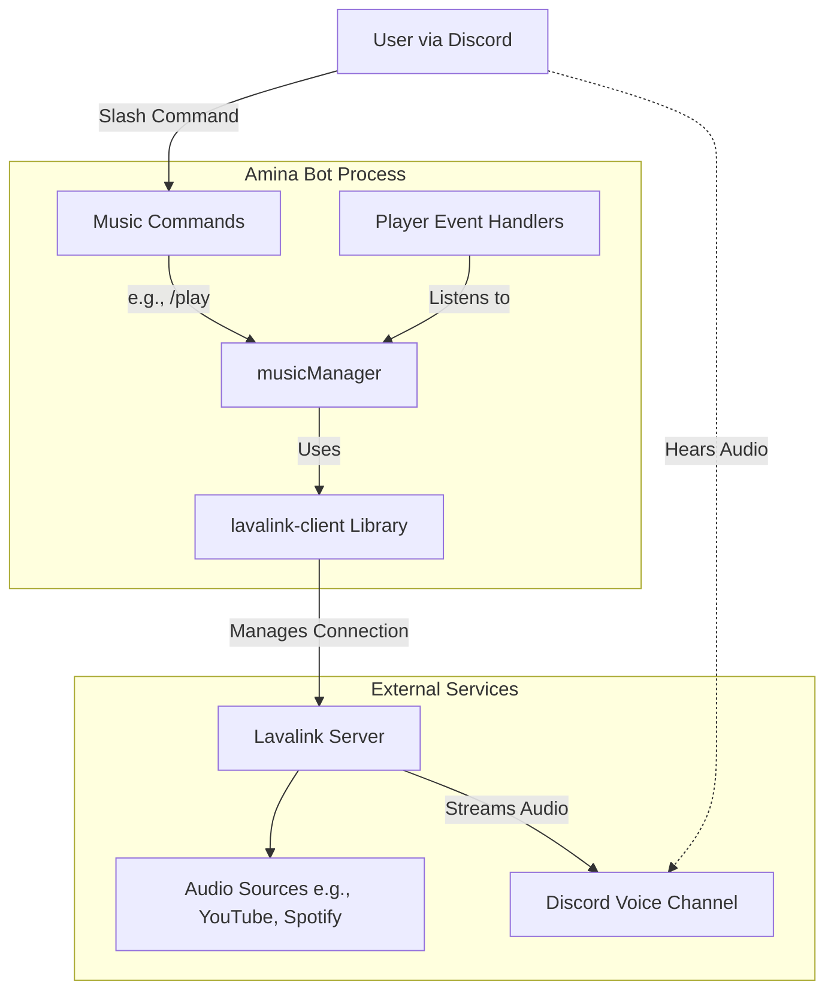

Relevant source files 

- [src/commands/music/ ](https://github.com/iamvikshan/amina/blob/main/src/commands/music/)
- [src/handlers/player.ts ](https://github.com/iamvikshan/amina/blob/main/src/handlers/player.ts)
- [src/events/player/trackStart.ts ](https://github.com/iamvikshan/amina/blob/main/src/events/player/trackStart.ts)
- [lavalink/application.yml ](https://github.com/iamvikshan/amina/blob/main/lavalink/application.yml)
- [src/config/config.ts ](https://github.com/iamvikshan/amina/blob/main/src/config/config.ts)
- [src/structures/BotClient.ts ](https://github.com/iamvikshan/amina/blob/main/src/structures/BotClient.ts)
- [src/helpers/BotUtils.ts ](https://github.com/iamvikshan/amina/blob/main/src/helpers/BotUtils.ts)
- [types/config.d.ts ](https://github.com/iamvikshan/amina/blob/main/types/config.d.ts)
- [package.json ](https://github.com/iamvikshan/amina/blob/main/package.json)

The Music System in Amina provides high-quality audio playback in Discord voice channels. It is architected to be robust and extensible, leveraging the external Lavalink server for audio processing and streaming. This decouples the audio workload from the main bot process, ensuring better performance and stability. The system supports various sources like YouTube, SoundCloud, and Spotify through Lavalink plugins.

Interaction with the music system is primarily through a set of slash commands. The system is event-driven, with the `musicManager` handling player states and emitting events for actions like a track starting, ending, or encountering an error.

## Architecture overview

The music system consists of several key components that work together: the main bot client, the music manager, the `lavalink-client`library, and the external Lavalink server. User commands trigger actions in the `musicManager`, which communicates with the Lavalink server to control audio playback. The Lavalink server then streams the audio directly to the Discord voice channel.

The following diagram illustrates the high-level architecture of the music system.

Sources: [src/structures/BotClient.ts:102 ](https://github.com/iamvikshan/amina/blob/main/src/structures/BotClient.ts:102), [package.json:30 ](https://github.com/iamvikshan/amina/blob/main/package.json:30), [lavalink/application.yml ](https://github.com/iamvikshan/amina/blob/main/lavalink/application.yml)

## Core components

### Botclient

The `BotClient`class is the entry point for the music system. During its initialization, it checks if the music feature is enabled in the configuration. If it is, it instantiates the `musicManager`, making it available throughout the application.

Sources: [src/structures/BotClient.ts:102 ](https://github.com/iamvikshan/amina/blob/main/src/structures/BotClient.ts:102)

### Music manager

The `musicManager`is the central controller for all music-related functionality. It is an instance of the `Manager`class from the `lavalink-client`library, initialized within the `BotClient`. Its primary responsibilities include:

- Managing connections to one or more lavalink nodes defined in the configuration.
- Creating, retrieving, and destroying player instances for each guild.
- Handling events from the lavalink server (e.g., `trackstart`, `trackend`, `queueend`) and emitting them for the bot's event handlers to process.
- Searching for tracks and queuing them for playback.

The manager is accessed via `client.musicManager`and is used by music commands to interact with the player.

Sources: [src/structures/BotClient.ts:102 ](https://github.com/iamvikshan/amina/blob/main/src/structures/BotClient.ts:102), [src/helpers/BotUtils.ts:118-132 ](https://github.com/iamvikshan/amina/blob/main/src/helpers/BotUtils.ts#L118-L132)

### Lavalink server

Lavalink is a standalone audio server that handles all audio fetching, processing, and streaming. Amina's bot process communicates with it to offload the heavy lifting of music playback. The configuration for the Lavalink server is defined in `lavalink/application.yml`.

Key features configured in this file include:

- Plugins: The system uses several plugins to extend Lavalink's functionality.
- Sources: Enabled sources for audio streaming.
- Filters: A variety of audio filters like volume, equalizer, and karaoke are enabled.

#### Lavalink plugins

The following plugins are configured to enhance Lavalink's capabilities:
| Plugin | Version | Repository | Purpose |
|---|---|---|---|
| `youtube-plugin` | `1.16.0` | `https://maven.lavalink.dev/releases` | Provides YouTube source support. |
| `lavasrc-plugin` | `4.2.0` | `https://maven.lavalink.dev/releases` | Adds support for Spotify, Apple Music, and Deezer. |
| `lavasearch-plugin` | `1.0.0` | `https://maven.lavalink.dev/releases` | Implements advanced search functionality. |
| `sponsorblock-plugin` | `3.0.1` | `https://maven.lavalink.dev/releases` | Skips sponsored segments in YouTube videos. |
| `LavaDSPX-Plugin` | `0.0.5` | `https://jitpack.io` | Adds extra DSP filters like high-pass and echo. |
| `lavalyrics-plugin` | `1.1.0` | `https://maven.topi.wtf/releases` | Provides a lyrics API base. |

Sources: [lavalink/application.yml:6-27 ](https://github.com/iamvikshan/amina/blob/main/lavalink/application.yml#L6-L27)

## Configuration

The music system's behavior is controlled by configurations in two separate files: one for the bot and one for the Lavalink server.

### Bot configuration

Bot-side settings are located in the `MUSIC`object within `src/config/config.ts`.
| Key | Type | Default Value | Description |
|---|---|---|---|
| `ENABLED` | `boolean` | `true` | Toggles the entire music system. |
| `IDLE_TIME` | `number` | `60` | Time in seconds before the bot disconnects from an idle voice channel. |
| `DEFAULT_VOLUME` | `number` | `60` | The default player volume (1-100). |
| `MAX_SEARCH_RESULTS` | `number` | `5` | The maximum number of search results to display. |
| `DEFAULT_SOURCE` | `string` | `scsearch` | The default search provider (e.g., `ytsearch`, `scsearch`). |
| `LAVALINK_RETRY_AMOUNT` | `number` | `20` | Number of times to retry connecting to a Lavalink node. |
| `LAVALINK_RETRY_DELAY` | `number` | `30000` | Delay in milliseconds between retry attempts. |
| `LAVALINK_NODES` | `LavalinkNode[]` | `secret.LAVALINK_NODES` | An array of Lavalink node connection details. |

Sources: [src/config/config.ts:79-93 ](https://github.com/iamvikshan/amina/blob/main/src/config/config.ts#L79-L93), [types/config.d.ts:60-68 ](https://github.com/iamvikshan/amina/blob/main/types/config.d.ts#L60-L68)

### Lavalink configuration

The `lavalink/application.yml`file configures the Lavalink server itself, including which audio sources are enabled.
| Source | Enabled | Notes |
|---|---|---|
| `youtube` | `false` | The built-in source is disabled in favor of the `youtube-plugin`. |
| `bandcamp` | `true` | |
| `soundcloud` | `true` | |
| `twitch` | `true` | |
| `vimeo` | `true` | |
| `http` | `true` | |
| `local` | `false` | |
| `spotify` | `true` | Requires `SPOTIFY_CLIENT_ID`and `SPOTIFY_CLIENT_SECRET`. Handled by `lavasrc-plugin`. |
| `applemusic` | `false` | Disabled by default. Handled by `lavasrc-plugin`. |
| `deezer` | `false` | Disabled by default. Handled by `lavasrc-plugin`. |

Sources: [lavalink/application.yml:32-93](https://github.com/iamvikshan/amina/blob/main/lavalink/application.yml#L32-L93)

## Command and event flow

### Command execution flow

When a user executes a music command like `/play`, a series of validations and actions occur. Before executing the command's main logic, a set of predefined `musicValidations`are checked to ensure the command can be run successfully.

This sequence diagram shows the typical flow for a `/play`command.

### Command validations

To prevent errors and provide clear feedback to the user, music commands are protected by a set of validation checks. These checks are defined in `src/helpers/BotUtils.ts`and are executed before the command's logic runs.
| Validation | Error Message | Purpose |
|---|---|---|
| `client.musicManager.getPlayer(guildId)` | "🚫 I'm not in a voice channel." | Checks if a music player already exists for the guild. |
| `member.voice?.channelId` | "🚫 You need to join my voice channel." | Ensures the user executing the command is in a voice channel. |
| `member.voice?.channelId === client.musicManager.getPlayer(guildId)?.voiceChannelId` | "🚫 You're not in the same voice channel." | Verifies the user is in the same voice channel as the bot. |

Sources: [src/helpers/BotUtils.ts:116-133 ](https://github.com/iamvikshan/amina/blob/main/src/helpers/BotUtils.ts#L116-L133)

### Event handling: `trackstart`

The music system is event-driven. The `musicManager`emits events based on the player's status. The `trackStart`event is a key example, fired whenever a new song begins to play. A dedicated event listener, presumably located at `src/events/player/trackStart.ts`, captures this event to perform actions like sending a "Now Playing" notification to the channel.

Sources: [src/events/player/trackStart.ts:12-25 ](https://github.com/iamvikshan/amina/blob/main/src/events/player/trackStart.ts#L12-L25)
