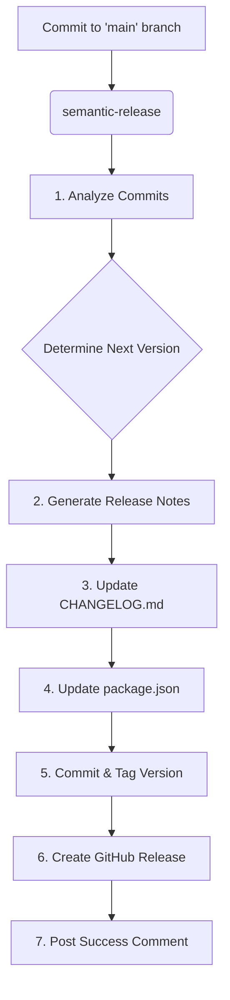
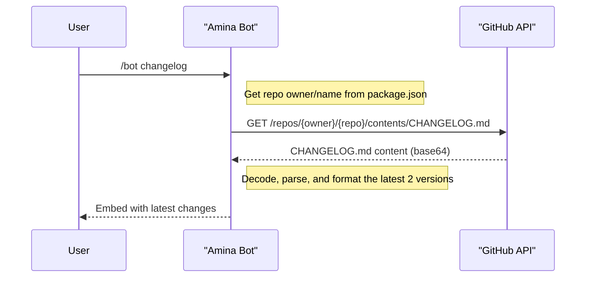
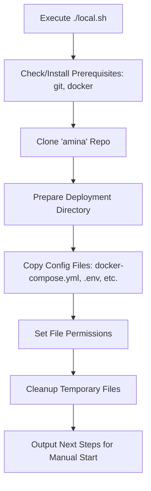

The `amina` project employs a fully automated release workflow powered by `semantic-release`. This process standardizes versioning, generates changelogs, and publishes releases to GitHub based on commit message conventions. By automating these tasks, the project ensures consistent, predictable, and reliable releases.

The core of this process is driven by commit messages that follow the Gitmoji and Conventional Commits specifications. Each commit to the `main` branch triggers the release pipeline, which analyzes the commits, determines the next semantic version, updates project files, and creates a corresponding GitHub release.

<details>
<summary><strong>Relevant source files</strong></summary>

- [release.config.js](https://github.com/iamvikshan/amina/blob/main/release.config.js)
- [CHANGELOG.md](https://github.com/iamvikshan/amina/blob/main/CHANGELOG.md)
- [package.json](https://github.com/iamvikshan/amina/blob/main/package.json)
- [src/commands/bot/bot.ts](https://github.com/iamvikshan/amina/blob/main/src/commands/bot/bot.ts)
- [app.json](https://github.com/iamvikshan/amina/blob/main/app.json)

</details>

## Automated release workflow with `semantic-release`

The entire release process is orchestrated by `semantic-release`, configured in `release.config.js`. It executes a series of plugins in a specific order to perform analysis, versioning, and publishing tasks. The process is configured to run only on the `main` branch.

_Sources: [release.config.js:2](https://github.com/iamvikshan/amina/blob/main/release.config.js#L2)_

The following diagram illustrates the high-level flow of the automated release process.



_Sources: [release.config.js](https://github.com/iamvikshan/amina/blob/main/release.config.js)_

### `semantic-release` plugins

The automation is made possible by a chain of plugins, each responsible for a specific stage of the release.

| Plugin                                      | Role                                                                                        |
| :------------------------------------------ | :------------------------------------------------------------------------------------------ |
| `semantic-release-gitmoji`                  | Analyzes commit messages with Gitmojis to determine the release type (major, minor, patch). |
| `@semantic-release/commit-analyzer`         | A secondary analyzer that follows conventional commit standards.                            |
| `@semantic-release/release-notes-generator` | Generates release notes based on conventional commit types.                                 |
| `@semantic-release/changelog`               | Updates the `CHANGELOG.md` file with the newly generated release notes.                     |
| `@semantic-release/exec`                    | Executes a shell command to update the `version` field in `package.json`.                   |
| `@semantic-release/github`                  | Creates a GitHub release, uploads assets, and comments on related issues/PRs.               |
| `@semantic-release/git`                     | Commits the updated `package.json` and `CHANGELOG.md` files and creates a version tag.      |

_Sources: [release.config.js:3-80](https://github.com/iamvikshan/amina/blob/main/release.config.js#L3-L80), [package.json:42-48](https://github.com/iamvikshan/amina/blob/main/package.json#L42-L48)_

## Commit conventions and versioning

The version number is determined automatically based on the types of commits made since the last release. The project uses `semantic-release-gitmoji` to map specific Gitmojis to semantic versioning rules.

_Sources: [release.config.js:5-23](https://github.com/iamvikshan/amina/blob/main/release.config.js#L5-L23)_

### Gitmoji release rules

The following Gitmojis trigger a version bump:

| Release Type        | Gitmojis                                                  | Description                                         |
| :------------------ | :-------------------------------------------------------- | :-------------------------------------------------- |
| **Major** (`x.0.0`) | `:boom:`, `:warning:`                                     | Indicates a breaking change.                        |
| **Minor** (`x.y.0`) | `:sparkles:`, `:rocket:`, `:boom:`, `:lipstick:`, `:zap:` | Indicates a new feature or significant improvement. |
| **Patch** (`x.y.z`) | `:bug:`, `:ambulance:`, `:lock:`, `:adhesive_bandage:`    | Indicates a bug fix or security patch.              |

_Sources: [release.config.js:8-22](https://github.com/iamvikshan/amina/blob/main/release.config.js#L8-L22)_

### Conventional commits for release notes

In addition to Gitmojis, the process uses conventional commit types to organize the generated release notes in `CHANGELOG.md`.

```javascript
// release.config.js:31-45
writerOpts: {
  types: [
    { type: 'feat', section: '✨ Features' },
    { type: 'fix', section: '🐛 Bug Fixes' },
    { type: 'perf', section: '⚡ Performance Improvements' },
    { type: 'revert', section: '⏪ Reverts' },
    { type: 'docs', section: '📚 Documentation' },
    { type: 'style', section: '💄 Styles' },
    { type: 'chore', section: '🔧 Miscellaneous' },
    { type: 'refactor', section: '♻️ Code Refactoring' },
    { type: 'test', section: '✅ Tests' },
    { type: 'build', section: '👷 Build System' },
    { type: 'ci', section: '🔄 CI/CD' },
  ],
},
```

_Sources: [release.config.js:31-45](https://github.com/iamvikshan/amina/blob/main/release.config.js#L31-L45)_

## Release artifacts

During the release process, several files are automatically generated or modified.

### `changelog.md`

The `@semantic-release/changelog` plugin updates `CHANGELOG.md` at the root of the repository. This file contains a chronological list of all versions and the changes included in each.

An example entry from the changelog:

```markdown
# [v2.2.0](https://github.com/iamvikshan/amina/compare/v2.1.3...v2.2.0) (2025-11-22)

### Features

- Implement AI command registry and media extraction, and optimize AI responder initialization and data fetching. ([ee45d95](https://github.com/iamvikshan/amina/commit/ee45d95157e70c5aa3e686d39807db0831758d81))
```

_Sources: [CHANGELOG.md:1-9](https://github.com/iamvikshan/amina/blob/main/CHANGELOG.md#L1-L9), [release.config.js:48-53](https://github.com/iamvikshan/amina/blob/main/release.config.js#L48-L53)_

### `package.json` version update

The `@semantic-release/exec` plugin is configured to run a Node.js script that updates the `version` field in `package.json` to match the new release version.

```javascript
// release.config.js:55-60
prepareCmd:
  "node -e \"const fs=require('fs');const pkg=JSON.parse(fs.readFileSync('package.json','utf8'));pkg.version='${nextRelease.version}';fs.writeFileSync('package.json',JSON.stringify(pkg,null,2)+'\\n')\"",
```

_Sources: [release.config.js:55-60](https://github.com/iamvikshan/amina/blob/main/release.config.js#L55-L60)_

### Git commit and tag

After the files are updated, the `@semantic-release/git` plugin commits them with a standardized message and creates a Git tag for the new version.

- **Assets Committed:** `package.json`, `CHANGELOG.md`
- **Commit Message Format:** `chore(release): ${nextRelease.version} [skip ci]\n\n${nextRelease.notes}`

_Sources: [release.config.js:75-79](https://github.com/iamvikshan/amina/blob/main/release.config.js#L75-L79)_

## Github integration

The release process is tightly integrated with GitHub.

### Github releases

The `@semantic-release/github` plugin creates a new release on the project's GitHub page. It uses the generated release notes as the release description and attaches a `released` label to associated issues and pull requests.

_Sources: [release.config.js:62-73](https://github.com/iamvikshan/amina/blob/main/release.config.js#L62-L73)_

### In-bot changelog command

The bot provides a `/bot changelog` command that allows users to view the most recent updates directly within Discord. This command fetches the `CHANGELOG.md` file from the GitHub repository, parses it, and displays the top two recent versions.

The following sequence diagram shows how the `/bot changelog` command works.



_Sources: [src/commands/bot/bot.ts:153-210](https://github.com/iamvikshan/amina/blob/main/src/commands/bot/bot.ts#L153-L210)_

## Deployment

While `semantic-release` handles versioning and packaging, deployment scripts and configurations are in place to deploy the application to various environments.

### Local/VPS deployment

The `scripts/local.sh` script is designed to deploy the Amina bot and its dependencies (Lavalink, Uptime Kuma) to a local machine or Virtual Private Server (VPS) using Docker Compose. It automates installing prerequisites (Git, Docker), cloning the repository, setting up the directory structure, and copying necessary configuration files like `docker-compose.prod.yml` and `.env`.

The script's workflow is as follows:



_Sources: [scripts/local.sh](https://github.com/iamvikshan/amina/blob/main/scripts/local.sh)_

### Heroku deployment

The project also includes an `app.json` file, indicating support for deployment on Heroku. This file defines environment variables, buildpacks (using `bun`), and formation settings for running the application on the Heroku platform. The `CHANGELOG.md` also mentions that "Amina now runs on Heroku".

_Sources: [app.json](https://github.com/iamvikshan/amina/blob/main/app.json), [CHANGELOG.md:200](https://github.com/iamvikshan/amina/blob/main/CHANGELOG.md#L200)_

## Summary

The release process for `amina` is a robust, automated system built on `semantic-release`. It leverages commit message conventions to handle versioning, changelog generation, and GitHub releases, minimizing manual intervention and ensuring a consistent release cycle. This automation is complemented by user-facing features like the `/bot changelog` command and deployment scripts for various hosting environments, creating a comprehensive end-to-end release and deployment strategy.
