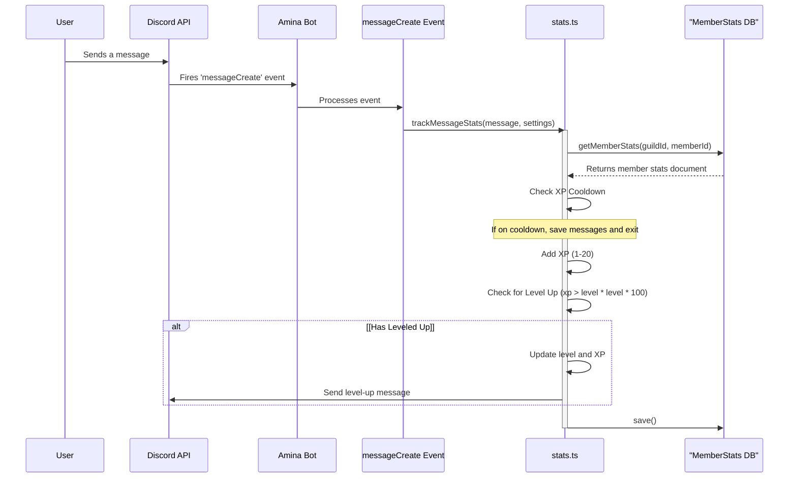

<details>
<summary><strong>Relevant source files</strong></summary>

- [src/handlers/stats.ts](https://github.com/iamvikshan/amina/blob/main/src/handlers/stats.ts)
- [src/commands/stats/xp.ts](https://github.com/iamvikshan/amina/blob/main/src/commands/stats/xp.ts)
- [src/config/config.ts](https://github.com/iamvikshan/amina/blob/main/src/config/config.ts)
- [src/events/message/messageCreate.ts](https://github.com/iamvikshan/amina/blob/main/src/events/message/messageCreate.ts)
- [types/schemas.d.ts](https://github.com/iamvikshan/amina/blob/main/types/schemas.d.ts)
- [src/database/schemas/MemberStats.ts](https://github.com/iamvikshan/amina/blob/main/src/database/schemas/MemberStats.ts)

</details>

The Statistics and Leveling System is a core feature of Amina designed to foster user engagement by tracking various forms of activity within a Discord server. It monitors user contributions such as messages sent, voice channel participation, and command usage. This data is aggregated to provide server statistics and power a leveling system where members gain experience points (XP) and levels for their activity.

The system is highly configurable on a per-guild basis, allowing administrators to enable or disable it, customize level-up notifications, and designate specific channels for these announcements. The primary goal is to reward active members and create a more interactive community environment.

## System architecture

The system is primarily driven by event handlers that listen for user actions. The `statsHandler` is the central component that processes these actions, updates the database, and manages the leveling logic.

### Data flow

The following diagram illustrates the general data flow when a user sends a message, leading to potential XP gain and a level-up.



_This sequence shows how a simple user action triggers a chain of events that results in their statistics being updated in the database._

_Sources: [src/events/message/messageCreate.ts:182-184](https://github.com/iamvikshan/amina/blob/main/src/events/message/messageCreate.ts#L182-L184), [src/handlers/stats.ts:33-80](https://github.com/iamvikshan/amina/blob/main/src/handlers/stats.ts#L33-L80)_

## Core components

The system is composed of a database schema for data persistence, a handler for business logic, and commands for user interaction and configuration.

### Memberstats data model

All member-specific statistics are stored in the `MemberStats` collection in MongoDB. Each document corresponds to a unique member within a specific guild.

The structure of the `MemberStats` document is inferred from its usage in `stats.ts`.

| Field               | Type   | Description                                              |
| ------------------- | ------ | -------------------------------------------------------- |
| `guild_id`          | String | The ID of the guild the member belongs to.               |
| `member_id`         | String | The ID of the member.                                    |
| `messages`          | Number | Total number of messages sent.                           |
| `xp`                | Number | Current experience points.                               |
| `level`             | Number | Current level.                                           |
| `voice.connections` | Number | Total number of times the member joined a voice channel. |
| `voice.time`        | Number | Total time in seconds spent in voice channels.           |
| `commands.slash`    | Number | Total number of slash commands used.                     |
| `contexts.user`     | Number | Total number of user context menu commands used.         |
| `contexts.message`  | Number | Total number of message context menu commands used.      |

_Sources: [src/handlers/stats.ts:36](https://github.com/iamvikshan/amina/blob/main/src/handlers/stats.ts#L36), [src/handlers/stats.ts:88](https://github.com/iamvikshan/amina/blob/main/src/handlers/stats.ts#L88), [src/handlers/stats.ts:110](https://github.com/iamvikshan/amina/blob/main/src/handlers/stats.ts#L110), [src/handlers/stats.ts:121](https://github.com/iamvikshan/amina/blob/main/src/handlers/stats.ts#L121)_

### Statistics handler (`stats.ts`)

The `stats.ts` handler contains the core logic for tracking all user activities.

#### Message tracking (`trackMessageStats`)

This function is called for each message created in a guild where stats are enabled.

- **XP Gain**: A random amount of XP between 1 and 20 is added.
- **Cooldown**: To prevent spam, XP is only granted for messages sent after a cooldown period, defined by `STATS.XP_COOLDOWN` (5 seconds).
- **Level-Up Formula**: A user levels up when their `xp` exceeds `level * level * 100`.

_Sources: [src/handlers/stats.ts:33-80](https://github.com/iamvikshan/amina/blob/main/src/handlers/stats.ts#L33-L80), [src/config/config.ts:133](https://github.com/iamvikshan/amina/blob/main/src/config/config.ts#L133)_

#### Interaction tracking (`trackInteractionStats`)

This function increments counters for specific interaction types:

- Slash commands (`commands.slash`)
- User context menus (`contexts.user`)
- Message context menus (`contexts.message`)

_Sources: [src/handlers/stats.ts:85-95](https://github.com/iamvikshan/amina/blob/main/src/handlers/stats.ts#L85-L95)_

#### Voice tracking (`trackVoiceStats`)

This function tracks voice channel activity by listening to `voiceStateUpdate` events.

- **Connections**: When a user joins a voice channel (`!oldChannel && newChannel`), the `voice.connections` counter is incremented.
- **Time**: The function records the timestamp when a user joins a voice channel. When they leave (`oldChannel && !newChannel`), the duration is calculated and added to `voice.time` in seconds.

_Sources: [src/handlers/stats.ts:100-128](https://github.com/iamvikshan/amina/blob/main/src/handlers/stats.ts#L100-L128)_

## Configuration

The statistics and leveling system can be configured globally and on a per-guild basis.

### Global configuration

These settings are defined in `src/config/config.ts` and apply to the entire bot.

| Setting                    | Value                                                                  | Description                                                          |
| -------------------------- | ---------------------------------------------------------------------- | -------------------------------------------------------------------- |
| `STATS.ENABLED`            | `true`                                                                 | A boolean that globally enables or disables the entire stats module. |
| `STATS.XP_COOLDOWN`        | `5`                                                                    | The cooldown in seconds between messages that can grant XP.          |
| `STATS.DEFAULT_LVL_UP_MSG` | `'{member:tag}, Yay! 🎉 You just leveled up to **Level {level}**! 🌟'` | The default message sent when a user levels up.                      |

_Sources: [src/config/config.ts:132-135](https://github.com/iamvikshan/amina/blob/main/src/config/config.ts#L132-L135)_

### Guild configuration (`/levelup` command)

Administrators can customize the leveling system for their server using the `/levelup` command. These settings are stored in the `Guild` schema.

| Subcommand         | Option                  | Description                                          | Schema Path        |
| ------------------ | ----------------------- | ---------------------------------------------------- | ------------------ |
| `/levelup message` | `message` (String)      | Sets a custom level-up message for the server.       | `stats.xp.message` |
| `/levelup channel` | `channel` (TextChannel) | Sets a dedicated channel for level-up announcements. | `stats.xp.channel` |

_Sources: [src/commands/stats/xp.ts:10-36](https://github.com/iamvikshan/amina/blob/main/src/commands/stats/xp.ts#L10-L36), [types/schemas.d.ts:16-20](https://github.com/iamvikshan/amina/blob/main/types/schemas.d.ts#L16-L20)_

The level-up message supports several placeholders that are replaced with dynamic content when a message is sent.

```typescript
// src/handlers/stats.ts:20-29
const parse = (content: string, member: GuildMember, level: number): string => {
  return content
    .replaceAll(/\\n/g, '\n')
    .replaceAll(/{server}/g, member.guild.name)
    .replaceAll(/{count}/g, member.guild.memberCount.toString())
    .replaceAll(/{member:id}/g, member.id)
    .replaceAll(/{member:name}/g, member.displayName)
    .replaceAll(/{member:mention}/g, member.toString())
    .replaceAll(/{member:tag}/g, member.user.tag)
    .replaceAll(/{level}/g, level.toString());
};
```

_Sources: [src/handlers/stats.ts:20-29](https://github.com/iamvikshan/amina/blob/main/src/handlers/stats.ts#L20-L29)_

## Summary

The Statistics & Leveling System is an integral part of Amina that enhances user interaction by rewarding activity. It effectively tracks messages, voice time, and command usage, converting this activity into XP and levels. With its flexible configuration options, server administrators can tailor the experience to fit their community's culture, making it a powerful tool for building and maintaining an active user base.
