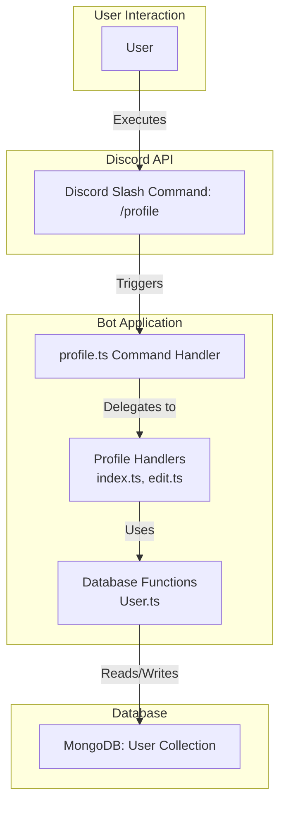
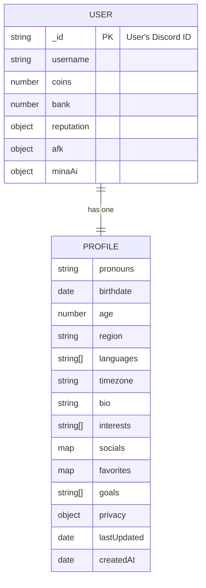
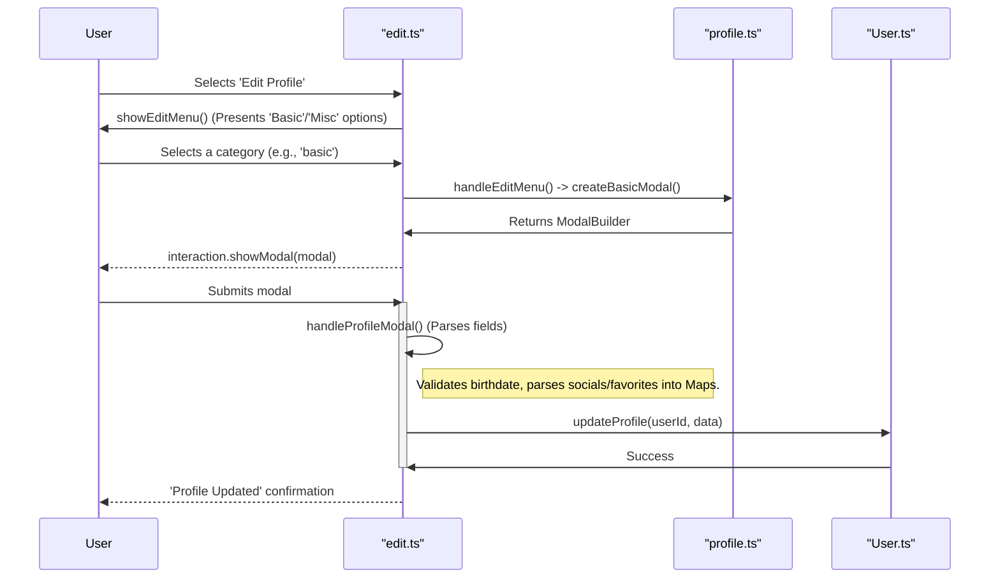

The User Profile system allows users to "express yourself and share your story with the world." It provides a structured way for users to share personal information, interests, and social links within the bot's ecosystem. This information is primarily managed through the `/profile` command and its associated handlers.

[Image of User Profile UI]

Profiles are not just for display; they are integrated with other parts of the application, such as the [AI Responder](#ai-responder-integration) to create more personalized and context-aware interactions. The system includes privacy controls, allowing users to manage the visibility of sensitive information like age and region.

<strong>Relevant source files</strong>

- [src/commands/utility/profile.ts](https://github.com/iamvikshan/amina/blob/main/src/commands/utility/profile.ts)
- [src/handlers/profile/edit.ts](https://github.com/iamvikshan/amina/blob/main/src/handlers/profile/edit.ts)
- [src/database/schemas/User.ts](https://github.com/iamvikshan/amina/blob/main/src/database/schemas/User.ts)
- [types/schemas.d.ts](https://github.com/iamvikshan/amina/blob/main/types/schemas.d.ts)
- [src/services/aiResponder.ts](https://github.com/iamvikshan/amina/blob/main/src/services/aiResponder.ts)
- [src/handlers/profile/index.ts](https://github.com/iamvikshan/amina/blob/main/src/handlers/profile/index.ts)

_Sources: [src/commands/utility/profile.ts:11](https://github.com/iamvikshan/amina/blob/main/src/commands/utility/profile.ts#L11), [src/services/aiResponder.ts:211-215](https://github.com/iamvikshan/amina/blob/main/src/services/aiResponder.ts#L211-L215), [src/database/schemas/User.ts:31-37](https://github.com/iamvikshan/amina/blob/main/src/database/schemas/User.ts#L31-L37)_

## Architecture overview

The User Profile feature is centered around the `/profile` slash command, which acts as the main entry point. The command's logic is distributed between the command file itself and dedicated handlers. All profile data is stored within the `User` collection in the database, under a nested `profile` object.

This diagram illustrates the high-level flow of a user interacting with the profile system.

_Sources: [src/commands/utility/profile.ts](https://github.com/iamvikshan/amina/blob/main/src/commands/utility/profile.ts), [src/handlers/profile/edit.ts](https://github.com/iamvikshan/amina/blob/main/src/handlers/profile/edit.ts), [src/database/schemas/User.ts](https://github.com/iamvikshan/amina/blob/main/src/database/schemas/User.ts)_

## Data model

User profile data is stored as a sub-document within the main `User` schema. This design keeps all user-related information, including their profile, consolidated in a single document.

_Sources: [src/database/schemas/User.ts:18-39](https://github.com/iamvikshan/amina/blob/main/src/database/schemas/User.ts#L18-L39), [types/schemas.d.ts:107-127](https://github.com/iamvikshan/amina/blob/main/types/schemas.d.ts#L107-L127)_

### ER diagram

The following diagram shows the relationship between a `User` and their `Profile`.

_Sources: [src/database/schemas/User.ts:18-70](https://github.com/iamvikshan/amina/blob/main/src/database/schemas/User.ts#L18-L70)_

### Profile schema fields

The `ProfileSchema` defines the structure for all user-submitted profile information.

| Field                   | Type     | Description                                                |
| :---------------------- | :------- | :--------------------------------------------------------- |
| `pronouns`              | String   | The user's preferred pronouns.                             |
| `birthdate`             | Date     | The user's date of birth.                                  |
| `age`                   | Number   | The user's age, calculated from `birthdate`.               |
| `region`                | String   | The user's geographical region.                            |
| `languages`             | [String] | A list of languages the user speaks.                       |
| `timezone`              | String   | The user's timezone (e.g., UTC+1, EST).                    |
| `bio`                   | String   | A short biography (max 1000 characters).                   |
| `interests`             | [String] | A list of the user's interests.                            |
| `socials`               | Map      | A map of social media platforms to usernames.              |
| `favorites`             | Map      | A map of categories to favorite items (e.g., color: blue). |
| `goals`                 | [String] | A list of the user's personal goals.                       |
| `privacy`               | Object   | An object containing boolean flags for field visibility.   |
| `privacy.showAge`       | Boolean  | Controls visibility of `age`. Default: `true`.             |
| `privacy.showRegion`    | Boolean  | Controls visibility of `region`. Default: `true`.          |
| `privacy.showBirthdate` | Boolean  | Controls visibility of `birthdate`. Default: `false`.      |
| `privacy.showPronouns`  | Boolean  | Controls visibility of `pronouns`. Default: `true`.        |
| `lastUpdated`           | Date     | Timestamp of the last profile update.                      |
| `createdAt`             | Date     | Timestamp of the profile's creation.                       |

_Sources: [src/database/schemas/User.ts:18-39](https://github.com/iamvikshan/amina/blob/main/src/database/schemas/User.ts#L18-L39), [types/schemas.d.ts:107-127](https://github.com/iamvikshan/amina/blob/main/types/schemas.d.ts#L107-L127)_

## Core command: `/profile`

The main entry point for all profile-related actions is the `/profile` slash command. It serves as a router, directing users to different functionalities based on the chosen subcommand.

_Sources: [src/commands/utility/profile.ts:10-53](https://github.com/iamvikshan/amina/blob/main/src/commands/utility/profile.ts#L10-L53)_

### Subcommands

| Subcommand | Description                             | Handler                                             |
| :--------- | :-------------------------------------- | :-------------------------------------------------- |
| `hub`      | Opens the profile management hub.       | `showProfileHub` in `src/handlers/profile/index.ts` |
| `view`     | Views a user's profile (self or other). | `handleView` in `src/commands/utility/profile.ts`   |

_Sources: [src/commands/utility/profile.ts:15-38](https://github.com/iamvikshan/amina/blob/main/src/commands/utility/profile.ts#L15-L38)_

### Command flow

The `interactionRun` method of the command determines which handler to execute based on the subcommand.

_Sources: [src/commands/utility/profile.ts:40-53](https://github.com/iamvikshan/amina/blob/main/src/commands/utility/profile.ts#L40-L53)_

## Profile management

### Profile hub

The Profile Hub is the central interface for managing a user's profile. It is accessed via the `/profile hub` command. From the hub, users can navigate to view their own profile, edit it, manage privacy settings, or clear their data.

_Sources: [src/commands/utility/profile.ts:43-46](https://github.com/iamvikshan/amina/blob/main/src/commands/utility/profile.ts#L43-L46), [src/handlers/profile/index.ts:12-39](https://github.com/iamvikshan/amina/blob/main/src/handlers/profile/index.ts#L12-L39)_

### Editing a profile

Editing is a two-step process initiated from the Profile Hub. First, the user selects a category of information to edit, which then opens a corresponding modal for data entry.

_Sources: [src/handlers/profile/edit.ts:20-80](https://github.com/iamvikshan/amina/blob/main/src/handlers/profile/edit.ts#L20-L80)_

#### Edit flow sequence

This diagram shows the sequence of events when a user edits their profile.

_Sources: [src/handlers/profile/edit.ts](https://github.com/iamvikshan/amina/blob/main/src/handlers/profile/edit.ts), [src/commands/utility/profile.ts:60-205](https://github.com/iamvikshan/amina/blob/main/src/commands/utility/profile.ts#L60-L205), [src/database/schemas/User.ts:221-235](https://github.com/iamvikshan/amina/blob/main/src/database/schemas/User.ts#L221-L235)_

#### Edit modals

Two modals are used to collect profile information:

1.  **Basic Info Modal (`createBasicModal`)**:
    - Birthdate
    - Pronouns
    - Region
    - Languages
    - Timezone
2.  **Misc Info Modal (`createMiscModal`)**:
    - Bio
    - Interests
    - Socials
    - Favorites
    - Goals

_Sources: [src/commands/utility/profile.ts:60-205](https://github.com/iamvikshan/amina/blob/main/src/commands/utility/profile.ts#L60-L205)_

### Viewing a profile

The `handleView` function is responsible for generating and displaying a user's profile embed. It respects the user's privacy settings, conditionally showing or hiding fields. When viewing one's own profile, private fields are indicated with a 🔒 emoji.

_Sources: [src/commands/utility/profile.ts:276-434](https://github.com/iamvikshan/amina/blob/main/src/commands/utility/profile.ts#L276-L434)_

#### View logic flow

_Sources: [src/commands/utility/profile.ts:276-434](https://github.com/iamvikshan/amina/blob/main/src/commands/utility/profile.ts#L276-L434)_

#### Data formatting

Special helper functions are used to format complex data types for display in the embed:

- `formatSocialLinks`: Converts the `socials` map into a string of formatted hyperlinks.
- `formatFavorites`: Converts the `favorites` map into a formatted multi-line string.

_Sources: [src/commands/utility/profile.ts:221-259](https://github.com/iamvikshan/amina/blob/main/src/commands/utility/profile.ts#L221-L259)_

## AI responder integration

The User Profile system significantly enhances the AI Responder by providing rich, contextual information about users in a conversation.

When generating a response, the `aiResponderService` fetches the profiles of all active participants in the conversation. This data is then used to construct a `participantContext` block that is prepended to the AI's system prompt. This allows the AI to have a better understanding of who it is talking to, referencing their bio, interests, and other profile details to generate more relevant and personalized replies.

_Sources: [src/services/aiResponder.ts:211-262](https://github.com/iamvikshan/amina/blob/main/src/services/aiResponder.ts#L211-L262)_

### Data flow to AI

_Sources: [src/services/aiResponder.ts:211-262, 335-340](https://github.com/iamvikshan/amina/blob/main/src/services/aiResponder.ts#L211-L262)_

## Conclusion

The User Profile feature is a cornerstone of user personalization within the `amina` bot. It provides a robust mechanism for users to define their identity, with clear command-driven interfaces for management and viewing. The integration with the AI Responder demonstrates the feature's value beyond simple display, using profile data to enrich bot interactions and make them more intelligent and engaging. The inclusion of privacy controls ensures that users retain authority over their personal information.
