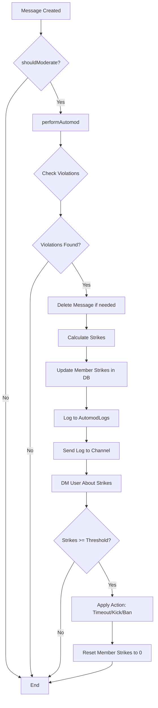
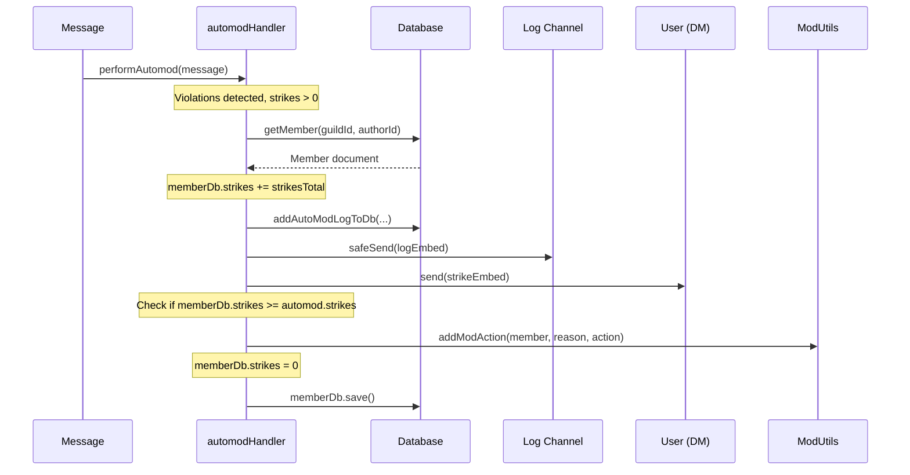
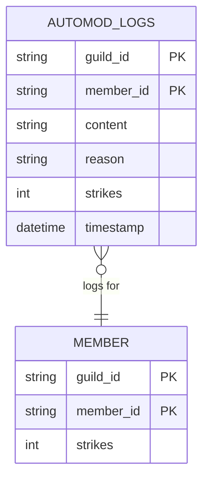

<details>
<summary><strong>Relevant source files</strong></summary>

- [src/handlers/automod.ts](https://github.com/iamvikshan/amina/blob/main/src/handlers/automod.ts)
- [src/commands/admin/automod/automod.ts](https://github.com/iamvikshan/amina/blob/main/src/commands/admin/automod/automod.ts)
- [src/commands/admin/automod/autodelete.ts](https://github.com/iamvikshan/amina/blob/main/src/commands/admin/automod/autodelete.ts)
- [src/commands/admin/automod/anti.ts](https://github.com/iamvikshan/amina/blob/main/src/commands/admin/automod/anti.ts)
- [src/events/message/messageCreate.ts](https://github.com/iamvikshan/amina/blob/main/src/events/message/messageCreate.ts)
- [types/schemas.d.ts](https://github.com/iamvikshan/amina/blob/main/types/schemas.d.ts)
- [src/database/schemas/AutomodLogs.ts](https://github.com/iamvikshan/amina/blob/main/src/database/schemas/AutomodLogs.ts)

</details>

The Automod System is a core feature of Amina designed to automatically moderate messages in a server based on a set of configurable rules. It processes incoming messages, checks for violations such as spam, excessive mentions, or disallowed content, and takes predefined actions. These actions can range from deleting the offending message to issuing strikes to the user.

When a user accumulates a certain number of strikes, the system can automatically apply a more severe punishment, such as a timeout, kick, or ban. All infractions are logged for moderator review. The system is highly configurable through a suite of slash commands, allowing administrators to tailor its behavior to their community's specific needs.

## System architecture and flow

The Automod system is triggered for every new message created in a guild. The core logic resides within the `automod` handler, which is invoked by the `messageCreate` event listener.

_Sources: [src/events/message/messageCreate.ts:248-249](https://github.com/iamvikshan/amina/blob/main/src/events/message/messageCreate.ts#L248-L249)_

### Message processing flow

The following diagram illustrates the step-by-step process the system follows when a new message is received.



This diagram shows the automoderation process from message creation to final action.

_Sources: [src/handlers/automod.ts](https://github.com/iamvikshan/amina/blob/main/src/handlers/automod.ts), [src/events/message/messageCreate.ts](https://github.com/iamvikshan/amina/blob/main/src/events/message/messageCreate.ts)_

### Core functions

#### `shouldModerate(message)`

Before any checks are performed, this function determines if a message is eligible for moderation. It returns `false` (and thus skips moderation) if any of the following conditions are met:

- The message author is a bot.
- The bot lacks the `ManageMessages` permission in the channel.
- The author has administrative or moderation permissions (`KickMembers`, `BanMembers`, `ManageGuild`, `ManageMessages`).

_Sources: [src/handlers/automod.ts:31-50](https://github.com/iamvikshan/amina/blob/main/src/handlers/automod.ts#L31-L50)_

#### `performAutomod(message, settings)`

This is the main function that executes all configured checks on a message. It accumulates strikes for each violation, deletes the message if necessary, logs infractions, and applies punishment if the strike threshold is met.

_Sources: [src/handlers/automod.ts:55-244](https://github.com/iamvikshan/amina/blob/main/src/handlers/automod.ts#L55-L244)_

## Automod checks

The system can be configured to check for various types of rule violations. Each detected violation adds one or more strikes to the user.

| Check                 | Description                                                                                                                    | Configuration                   | Source File                                |
| --------------------- | ------------------------------------------------------------------------------------------------------------------------------ | ------------------------------- | ------------------------------------------ |
| **Max Mentions**      | Checks if a message exceeds the allowed number of user mentions.                                                               | `/automod strikes` (indirectly) | `src/handlers/automod.ts:80-86`            |
| **Max Role Mentions** | Checks if a message exceeds the allowed number of role mentions.                                                               | `/automod strikes` (indirectly) | `src/handlers/automod.ts:89-95`            |
| **Anti-Massmention**  | Checks for `@everyone` mentions or if the total user/role mentions exceed a threshold.                                         | `/anti massmention`             | `src/handlers/automod.ts:97-112`           |
| **Max Lines**         | Deletes messages that exceed a specified number of lines.                                                                      | `/autodelete maxlines`          | `src/handlers/automod.ts:115-125`          |
| **Anti-Attachments**  | Deletes messages containing file attachments.                                                                                  | `/autodelete attachments`       | `src/handlers/automod.ts:128-134`          |
| **Anti-Links**        | Deletes messages containing any URL/link.                                                                                      | `/autodelete links`             | `src/handlers/automod.ts:137-143`          |
| **Anti-Invites**      | Deletes messages containing Discord server invites. This is disabled if `anti_links` is on.                                    | `/autodelete invites`           | `src/handlers/automod.ts:171-177`          |
| **Anti-Spam**         | Detects if a user posts the same link in different channels within a short time frame. This is disabled if `anti_links` is on. | `/anti spam`                    | `src/handlers/automod.ts:146-168`          |
| **Anti-Ghostping**    | Logs when a user pings someone and then deletes the message.                                                                   | `/anti ghostping`               | `src/commands/admin/automod/anti.ts:49-55` |

## Configuration commands

Server administrators can configure the Automod system using a set of slash commands. All commands require the `ManageGuild` permission.

### Command structure

```mermaid
flowchart LR
    subgraph Commands
        A[/automod]
        B[/autodelete]
        C[/anti]
    end

    subgraph "/anti Subcommands"
        C1[ghostping]
        C2[spam]
        C3[massmention]
    end

    subgraph "/autodelete Subcommands"
        B1[attachments]
        B2[invites]
        B3[links]
        B4[maxlines]
    end

    subgraph "/automod Subcommands"
        A1[status]
        A2[strikes]
        A3[action]
        A4[debug]
        A5[whitelist]
        A6[whitelistadd]
        A7[whitelistremove]
    end

    A --> A1
    A --> A2
    A --> A3
    A --> A4
    A --> A5
    A --> A6
    A --> A7

    B --> B1
    B --> B2
    B --> B3
    B --> B4

    C --> C1
    C --> C2
    C --> C3
```

This diagram shows the available slash commands and their subcommands for configuring the Automod system.

_Sources: [src/commands/admin/automod/automod.ts](https://github.com/iamvikshan/amina/blob/main/src/commands/admin/automod/automod.ts), [src/commands/admin/automod/autodelete.ts](https://github.com/iamvikshan/amina/blob/main/src/commands/admin/automod/autodelete.ts), [src/commands/admin/automod/anti.ts](https://github.com/iamvikshan/amina/blob/main/src/commands/admin/automod/anti.ts)_

### Command details

- **`/automod`**: Manages core settings.
  - `status`: Displays the current automod configuration.
  - `strikes <amount>`: Sets the number of strikes a user can receive before an action is taken.
  - `action <action>`: Sets the action to perform (`TIMEOUT`, `KICK`, `BAN`) upon reaching max strikes.
  - `debug <ON|OFF>`: Toggles whether automod applies to admins and moderators.
  - `whitelist...`: Manages channels where automod checks are disabled.

- **`/autodelete`**: Manages rules that cause automatic message deletion.
  - `attachments <ON|OFF>`: Toggles auto-deletion of messages with attachments.
  - `invites <ON|OFF>`: Toggles auto-deletion of messages with Discord invites.
  - `links <ON|OFF>`: Toggles auto-deletion of messages with links.
  - `maxlines <amount>`: Sets the maximum number of lines allowed in a message.

- **`/anti`**: Manages detection-based rules.
  - `ghostping <ON|OFF>`: Toggles logging of ghost pings.
  - `spam <ON|OFF>`: Toggles anti-spam detection for links.
  - `massmention <ON|OFF> threshold <amount>`: Configures mass mention detection.

_Sources: [src/commands/admin/automod/automod.ts:10-128](https://github.com/iamvikshan/amina/blob/main/src/commands/admin/automod/automod.ts#L10-L128), [src/commands/admin/automod/autodelete.ts:10-84](https://github.com/iamvikshan/amina/blob/main/src/commands/admin/automod/autodelete.ts#L10-L84), [src/commands/admin/automod/anti.ts:10-72](https://github.com/iamvikshan/amina/blob/main/src/commands/admin/automod/anti.ts#L10-L72)_

## Strike & action system

When a message violates one or more rules, the system assigns strikes to the user. This process involves database updates, logging, and user notifications.

### Sequence diagram

The following diagram shows the sequence of events when a violation is detected.



This diagram details the interactions between the handler, database, and Discord channels when a user receives strikes.

_Sources: [src/handlers/automod.ts:181-243](https://github.com/iamvikshan/amina/blob/main/src/handlers/automod.ts#L181-L243)_

## Data structures

The Automod system relies on two main data structures: the configuration object stored within the guild settings and the log entries for each infraction.

### Automod configuration schema

The configuration is part of the `IGuildSettings` schema.

| Field              | Type       | Description                                          |
| ------------------ | ---------- | ---------------------------------------------------- |
| `debug`            | `boolean`  | If true, automod also applies to admins/mods.        |
| `strikes`          | `number`   | Number of strikes before an action is taken.         |
| `action`           | `string`   | Action to take: `TIMEOUT`, `KICK`, or `BAN`.         |
| `wh_channels`      | `string[]` | Array of channel IDs to ignore.                      |
| `anti_attachments` | `boolean`  | Enable/disable attachment deletion.                  |
| `anti_invites`     | `boolean`  | Enable/disable Discord invite deletion.              |
| `anti_links`       | `boolean`  | Enable/disable link deletion.                        |
| `anti_spam`        | `boolean`  | Enable/disable cross-channel link spam detection.    |
| `anti_ghostping`   | `boolean`  | Enable/disable ghost ping logging.                   |
| `anti_massmention` | `number`   | Threshold for mass mention detection (0 to disable). |
| `max_lines`        | `number`   | Maximum allowed lines per message (0 to disable).    |

_Sources: [types/schemas.d.ts:33-46](https://github.com/iamvikshan/amina/blob/main/types/schemas.d.ts#L33-L46)_

### Automod log schema

When an infraction occurs, a log is created. While the schema file `AutomodLogs.ts` is not fully detailed in the provided context, its structure can be inferred from its usage.



This ER diagram shows the likely structure of the `AUTOMOD_LOGS` collection and its relationship to a `MEMBER`.

_Sources: [src/handlers/automod.ts:192](https://github.com/iamvikshan/amina/blob/main/src/handlers/automod.ts#L192)_
