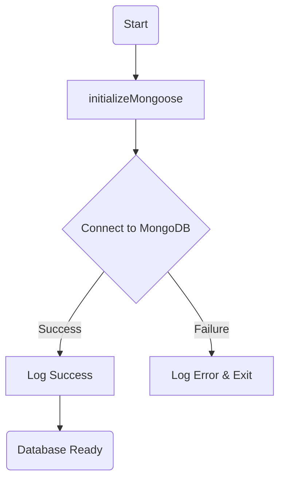
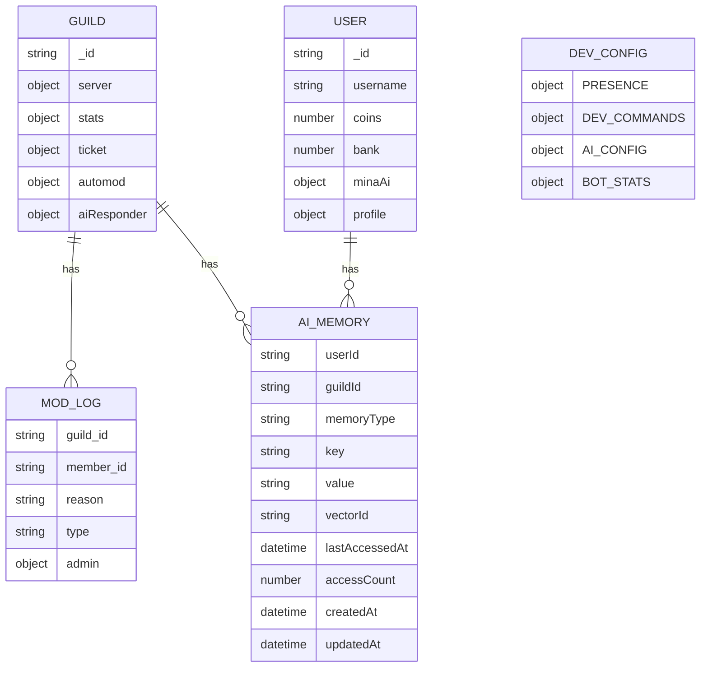
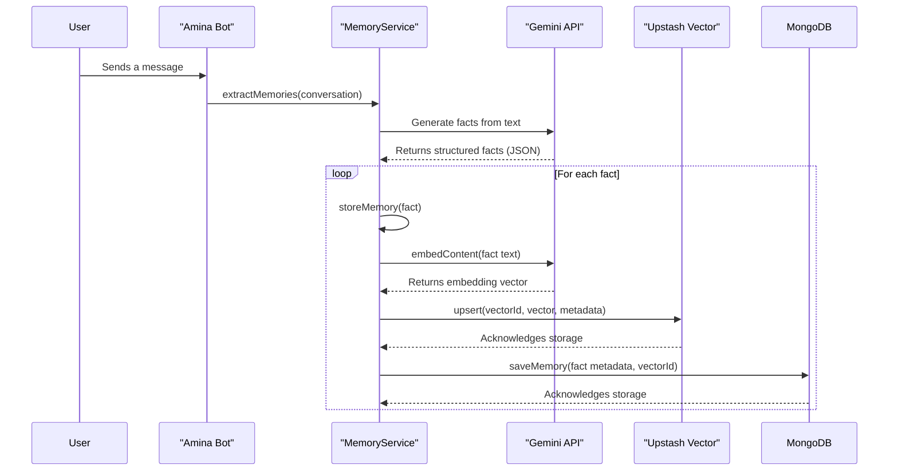

The Amina bot utilizes MongoDB as its primary data store, with Mongoose serving as the Object Data Modeling (ODM) library to manage relationships between data, provide schema validation, and translate between objects in code and their representation in MongoDB. The database is responsible for persisting all guild-specific configurations, global user data, AI memories, moderation logs, and other feature-specific information.

The database connection is established at startup via the `initializeMongoose` function, which connects to the MongoDB instance specified in the environment configuration. This centralizes data management and ensures consistent data access patterns across the application. The system is designed around several core collections, each with a defined schema to maintain data integrity.

<strong>Relevant source files</strong>

- [src/database/mongoose.ts](https://github.com/iamvikshan/amina/blob/main/src/database/mongoose.ts)
- [types/schemas.d.ts](https://github.com/iamvikshan/amina/blob/main/types/schemas.d.ts)
- [src/database/schemas/AiMemory.ts](https://github.com/iamvikshan/amina/blob/main/src/database/schemas/AiMemory.ts)
- [src/database/schemas/ModLog.ts](https://github.com/iamvikshan/amina/blob/main/src/database/schemas/ModLog.ts)
- [src/database/schemas/Dev.ts](https://github.com/iamvikshan/amina/blob/main/src/database/schemas/Dev.ts)
- [src/database/schemas/Suggestions.ts](https://github.com/iamvikshan/amina/blob/main/src/database/schemas/Suggestions.ts)
- [src/database/schemas/TruthOrDare.ts](https://github.com/iamvikshan/amina/blob/main/src/database/schemas/TruthOrDare.ts)
- [src/services/memoryService.ts](https://github.com/iamvikshan/amina/blob/main/src/services/memoryService.ts)

## Database initialization

The connection to MongoDB is handled by the `initializeMongoose` function. This asynchronous function attempts to connect to the database using the `MONGO_CONNECTION` string from the application's secrets. If the connection is successful, a success message is logged; otherwise, the process exits with an error, preventing the bot from running without a database.

_Sources: [src/database/mongoose.ts:7-20](https://github.com/iamvikshan/amina/blob/main/src/database/mongoose.ts#L7-L20)_

This diagram illustrates the database connection flow.

## Entity relationship diagram

The following diagram provides a high-level overview of the main entities and their relationships within the Amina database.

This diagram shows that `GUILD`s can have multiple `MOD_LOG` and `AI_MEMORY` entries. `USER`s also have `AI_MEMORY` entries. `DEV_CONFIG` is a singleton collection for global bot configuration.

_Sources: [types/schemas.d.ts](https://github.com/iamvikshan/amina/blob/main/types/schemas.d.ts), [src/database/schemas/AiMemory.ts](https://github.com/iamvikshan/amina/blob/main/src/database/schemas/AiMemory.ts), [src/database/schemas/ModLog.ts](https://github.com/iamvikshan/amina/blob/main/src/database/schemas/ModLog.ts), [src/database/schemas/Dev.ts](https://github.com/iamvikshan/amina/blob/main/src/database/schemas/Dev.ts)_

## Core schemas

### Guild schema

The `Guild` schema (represented by the `IGuildSettings` interface) stores all settings and configurations specific to a Discord server (guild). This is the most complex schema, containing nested objects for various bot features. The `_id` of a document in this collection corresponds to the Discord Guild ID.

_Sources: [types/schemas.d.ts:6-105](https://github.com/iamvikshan/amina/blob/main/types/schemas.d.ts#L6-L105)_

| Key                     | Type            | Description                                                                                         |
| :---------------------- | :-------------- | :-------------------------------------------------------------------------------------------------- |
| `_id`                   | `string`        | The Discord Guild ID.                                                                               |
| `server`                | `object`        | Core server information like name, region, owner, and setup status.                                 |
| `stats`                 | `object`        | Configuration for the server statistics and XP system.                                              |
| `ticket`                | `object`        | Settings for the ticket system, including log channel, limit, and topics.                           |
| `automod`               | `object`        | Automoderation rules, such as anti-spam, anti-links, and strike limits.                             |
| `invite`                | `object`        | Settings for invite tracking and invite-based ranks.                                                |
| `logs_channel`          | `string`        | A general-purpose logging channel ID.                                                               |
| `logs`                  | `object`        | Granular settings for logging specific events (e.g., message edits, role changes).                  |
| `max_warn`              | `object`        | Configuration for action to be taken when a user reaches the maximum warning limit.                 |
| `suggestions`           | `object`        | Settings for the suggestions system, including channels and staff roles.                            |
| `aiResponder`           | `object`        | Configuration for the AI, such as whether it's enabled and in which channels it can operate freely. |
| `autorole`              | `string`        | A role ID to automatically assign to new members.                                                   |
| `reaction_roles`        | `Array<object>` | An array of reaction role configurations.                                                           |
| `greeting` / `farewell` | `object`        | Settings for welcome and goodbye messages.                                                          |

### User schema

The `User` schema (represented by the `IUser` interface) stores global data for a Discord user, independent of any specific guild. This includes economy data, reputation, and profile information. The `_id` of a document is the Discord User ID.

_Sources: [types/schemas.d.ts:107-175](https://github.com/iamvikshan/amina/blob/main/types/schemas.d.ts#L107-L175)_

| Key             | Type            | Description                                                                  |
| :-------------- | :-------------- | :--------------------------------------------------------------------------- |
| `_id`           | `string`        | The Discord User ID.                                                         |
| `username`      | `string`        | The user's Discord username.                                                 |
| `discriminator` | `string`        | The user's Discord discriminator.                                            |
| `coins`         | `number`        | The number of coins the user has on hand (economy).                          |
| `bank`          | `number`        | The number of coins the user has in the bank.                                |
| `minaAi`        | `object`        | User-specific settings for the AI, like opting out or allowing DMs.          |
| `reputation`    | `object`        | Tracks reputation points given and received.                                 |
| `daily`         | `object`        | Information about the user's daily reward streak and timestamp.              |
| `profile`       | `object`        | User-customizable profile information like bio, interests, and social links. |
| `afk`           | `object`        | AFK status and reason.                                                       |
| `flags`         | `Array<object>` | An array of flags/reports made against the user.                             |

### AI memory schema

The `ai-memory` collection is crucial for the AI's long-term memory capabilities. It stores facts, preferences, and other pieces of information extracted from conversations. Each memory is associated with a user and optionally a guild. It also links to a vector in Upstash for similarity searches.

_Sources: [src/database/schemas/AiMemory.ts:6-23](https://github.com/iamvikshan/amina/blob/main/src/database/schemas/AiMemory.ts#L6-L23)_

| Field            | Type     | Description                                                      |
| :--------------- | :------- | :--------------------------------------------------------------- |
| `userId`         | `string` | The ID of the user the memory is about.                          |
| `guildId`        | `string` | The ID of the guild where the memory was formed. `null` for DMs. |
| `memoryType`     | `string` | The category of the memory (e.g., `user`, `guild`, `topic`).     |
| `key`            | `string` | A short title or key for the memory (e.g., "Favorite Color").    |
| `value`          | `string` | The content of the memory (e.g., "Blue").                        |
| `importance`     | `number` | A score from 1-10 indicating how important the memory is.        |
| `vectorId`       | `string` | The unique ID of the corresponding vector stored in Upstash.     |
| `lastAccessedAt` | `Date`   | Timestamp of the last time the memory was recalled.              |
| `accessCount`    | `number` | How many times the memory has been recalled.                     |

#### Memory storage flow

This diagram shows the process of storing a new memory, which involves both the `memoryService` and the database.

_Sources: [src/services/memoryService.ts:98-180](https://github.com/iamvikshan/amina/blob/main/src/services/memoryService.ts#L98-L180)_

### Moderation log schema

The `mod-logs` collection records all moderation actions taken within a guild, creating an audit trail for staff.

_Sources: [src/database/schemas/ModLog.ts](https://github.com/iamvikshan/amina/blob/main/src/database/schemas/ModLog.ts)_

| Field       | Type     | Description                                                                     |
| :---------- | :------- | :------------------------------------------------------------------------------ |
| `guild_id`  | `string` | The ID of the guild where the action occurred.                                  |
| `member_id` | `string` | The ID of the user who was the target of the action.                            |
| `reason`    | `string` | The reason provided for the action.                                             |
| `admin`     | `object` | An object containing the ID and tag of the moderator who performed the action.  |
| `type`      | `string` | An enum specifying the type of moderation action (e.g., `WARN`, `KICK`, `BAN`). |

_Sources: [src/database/schemas/ModLog.ts:7-36](https://github.com/iamvikshan/amina/blob/main/src/database/schemas/ModLog.ts#L7-L36)_

### Developer configuration schema

The `dev-config` collection is a singleton document used to store global, developer-controlled configurations for the bot. This includes the bot's presence, AI model settings, and cached bot statistics.

_Sources: [src/database/schemas/Dev.ts](https://github.com/iamvikshan/amina/blob/main/src/database/schemas/Dev.ts)_

| Key            | Type     | Description                                                                   |
| :------------- | :------- | :---------------------------------------------------------------------------- |
| `PRESENCE`     | `object` | Controls the bot's Discord presence (status, activity message, etc.).         |
| `DEV_COMMANDS` | `object` | A flag to enable or disable developer-only commands.                          |
| `AI_CONFIG`    | `object` | Overrides for the AI model, system prompt, temperature, and other parameters. |
| `BOT_STATS`    | `object` | Caches the bot's total guilds, users, channels, and ping for quick retrieval. |

The `updateBotStats` function is called periodically and by commands like `/bot stats` to keep the `BOT_STATS` object fresh.

_Sources: [src/database/schemas/Dev.ts:7-91](https://github.com/iamvikshan/amina/blob/main/src/database/schemas/Dev.ts#L7-L91), [src/commands/bot/sub/botstats.ts:90-104](https://github.com/iamvikshan/amina/blob/main/src/commands/bot/sub/botstats.ts#L90-L104)_

## Other schemas

The database also includes several smaller, feature-specific schemas.

| Schema           | File               | Description                                                                                                               |
| :--------------- | :----------------- | :------------------------------------------------------------------------------------------------------------------------ |
| `suggestions`    | `Suggestions.ts`   | Stores user-submitted suggestions, their status (pending, approved, rejected), and vote counts.                           |
| `tod`            | `TruthOrDare.ts`   | Contains a collection of questions for various "Truth or Dare" style games, categorized by type and rating (PG, R, etc.). |
| `mod-logs`       | `ModLog.ts`        | Tracks moderation actions like warnings, kicks, and bans performed in a guild.                                            |
| `reaction-roles` | `ReactionRoles.ts` | Manages messages that assign roles to users based on their reactions. (Schema not directly in files, but referenced)      |
| `giveaways`      | `Giveaways.ts`     | Manages active and past giveaways. (Schema not directly in files, but referenced)                                         |

_Sources: [src/database/schemas/Suggestions.ts](https://github.com/iamvikshan/amina/blob/main/src/database/schemas/Suggestions.ts), [src/database/schemas/TruthOrDare.ts](https://github.com/iamvikshan/amina/blob/main/src/database/schemas/TruthOrDare.ts), [src/database/mongoose.ts:23-32](https://github.com/iamvikshan/amina/blob/main/src/database/mongoose.ts#L23-L32)_

## Conclusion

The Amina project's database architecture is built on Mongoose and MongoDB, providing a robust and scalable solution for data persistence. It uses a combination of large, multi-purpose schemas (`Guild`, `User`) for core data and smaller, specialized schemas (`AiMemory`, `ModLog`, `Suggestions`) for distinct features. The integration with external services like Upstash for vector search in the `AiMemory` schema demonstrates a modern approach to handling complex data needs for an AI-powered bot. This well-defined structure is essential for maintaining data integrity and supporting the bot's wide range of functionalities.
