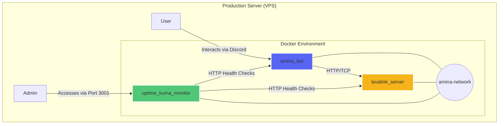
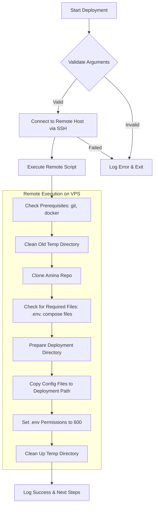
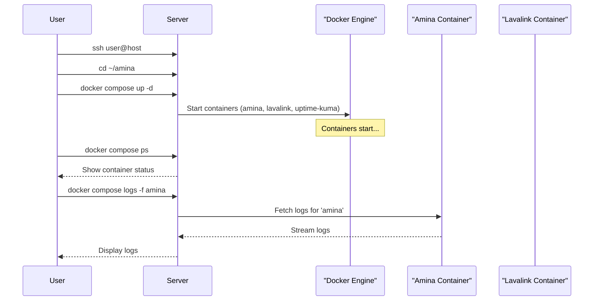

The Amina project is deployed to production using a containerized architecture managed by Docker Compose. This approach ensures consistency and isolation for the bot and its dependent services. The deployment process is automated through shell scripts that prepare a remote or local server by setting up the required configuration files and directory structure.

The production environment consists of three core services: the `amina` Discord bot itself, a `lavalink` server for audio playback, and an `uptime-kuma` instance for service monitoring. These services communicate over a dedicated Docker bridge network. Deployment is handled by the `scripts/local.sh` script, which can be run on any target server (local or VPS).

<details>
<summary><strong>Relevant source files</strong></summary>

- [docker-compose.prod.yml](https://github.com/iamvikshan/amina/blob/main/docker-compose.prod.yml)
- [docker-compose.yml](https://github.com/iamvikshan/amina/blob/main/docker-compose.yml)
- [scripts/local.sh](https://github.com/iamvikshan/amina/blob/main/scripts/local.sh)
- [lavalink/application.yml](https://github.com/iamvikshan/amina/blob/main/lavalink/application.yml)
- [app.json](https://github.com/iamvikshan/amina/blob/main/app.json)
- [package.json](https://github.com/iamvikshan/amina/blob/main/package.json)

</details>

## Architecture overview

The production architecture is defined in `docker-compose.prod.yml`. It orchestrates three separate services that run in their own containers but are connected via a shared network.

_Sources: [docker-compose.prod.yml](https://github.com/iamvikshan/amina/blob/main/docker-compose.prod.yml)_



This diagram illustrates the containerized services and their interactions within the Docker environment on a production VPS.
_Sources: [docker-compose.prod.yml:5-71](https://github.com/iamvikshan/amina/blob/main/docker-compose.prod.yml#L5-L71)_

### Services

The production stack includes the following services:

| Service       | Image                                   | Description                                                    |
| :------------ | :-------------------------------------- | :------------------------------------------------------------- |
| `amina`       | `vikshan/amina:latest`                  | The main Discord bot application.                              |
| `lavalink`    | `ghcr.io/lavalink-devs/lavalink:latest` | The audio server required for music functionality.             |
| `uptime-kuma` | `louislam/uptime-kuma:nightly2`         | A monitoring tool to track the health of the bot and Lavalink. |

_Sources: [docker-compose.prod.yml:5-71](https://github.com/iamvikshan/amina/blob/main/docker-compose.prod.yml#L5-L71)_

## Deployment scripts

The repository provides shell scripts to automate the setup of the production environment on a server. These scripts handle prerequisite checks, cloning the repository, and arranging configuration files.

### Remote vps deployment (`vps.sh`)

The `scripts/vps.sh` script is designed to deploy the application to a remote server over SSH. It takes an SSH connection string (`user@host`) and an optional deployment path as arguments.

The script executes a series of steps on the remote server to ensure a clean and correct setup.



This flowchart shows the process flow of the `vps.sh` deployment script, from local initiation to remote execution.
_Sources: [scripts/vps.sh:130-267](https://github.com/iamvikshan/amina/blob/main/scripts/vps.sh#L130-L267)_

### Local vps deployment (`local.sh`)

For deploying on the machine the script is run from, `scripts/local.sh` is provided. It follows the same logic as the remote script but performs all actions locally. It's useful for setting up the bot on the server you are already connected to.

_Sources: [scripts/local.sh](https://github.com/iamvikshan/amina/blob/main/scripts/local.sh)_

### Deployed file structure

After a successful deployment using either script, the following file structure is created in the deployment directory (e.g., `~/amina`):

```text
~/amina/
  ├── docker-compose.yml
  ├── .env
  ├── lavalink-entrypoint.sh
  └── lavalink/
      └── application.yml
```

This structure contains all necessary files to launch the application stack with `docker compose up -d`.
_Sources: [scripts/vps.sh:242-248](https://github.com/iamvikshan/amina/blob/main/scripts/vps.sh#L242-L248)_

## Configuration

Proper configuration is critical for a successful deployment. This is managed through several key files.

### `docker-compose.prod.yml`

This file is the blueprint for the production environment. It is copied to `docker-compose.yml` in the deployment directory by the deployment scripts.

Key configurations include:

- **Services**: Defines the `amina`, `lavalink`, and `uptime-kuma` containers.
- **Networking**: Creates a bridge network named `amina-network` for inter-service communication.
- **Volumes**: Persists data for `uptime-kuma` and `lavalink` plugins using named volumes.
- **Health Checks**: Implements health checks for all services to ensure they are running correctly. The `amina` bot is checked via a `wget` command to its `/health` endpoint on port 3000.

_Sources: [docker-compose.prod.yml](https://github.com/iamvikshan/amina/blob/main/docker-compose.prod.yml), [scripts/vps.sh:213-214](https://github.com/iamvikshan/amina/blob/main/scripts/vps.sh#L213-L214)_

Here is the service definition for the `amina` bot:

```yaml
services:
  amina:
    image: vikshan/amina:latest
    container_name: amina
    restart: unless-stopped
    env_file:
      - .env
    environment:
      # Override lavalink connection to use docker network
      LAVALINK_HOST_1: lavalink
      LAVALINK_PORT_1: 2333
      LAVALINK_SECURE_1: 'false'
      HEALTH_PORT: 3000
    networks:
      - amina-network
    ports:
      - '3000:3000'
    healthcheck:
      test:
        [
          'CMD',
          'wget',
          '--no-verbose',
          '--tries=1',
          '--spider',
          'http://localhost:3000/health',
        ]
      interval: 30s
      timeout: 10s
      retries: 3
      start_period: 40s
```

_Sources: [docker-compose.prod.yml:2-31](https://github.com/iamvikshan/amina/blob/main/docker-compose.prod.yml#L2-L31)_

### Environment variables (`.env`)

The `.env` file is central to configuring the bot. The deployment scripts will copy `.env.example` from the repository to `.env` if an existing `.env` file is not found in the deployment directory. This file must be populated with secrets and other configuration values.

The following table lists key environment variables required for the bot to function, as defined in `app.json` (for Heroku, but indicative of general needs) and referenced in compose files.

| Variable                | Description                                                                                       | Required |
| :---------------------- | :------------------------------------------------------------------------------------------------ | :------- |
| `BOT_TOKEN`             | The Discord bot token.                                                                            | Yes      |
| `MONGO_CONNECTION`      | The connection string for the MongoDB database.                                                   | Yes      |
| `LOGS_WEBHOOK`          | A Discord webhook URL for error logging.                                                          | Yes      |
| `LAVALINK_PASSWORD_1`   | The password for the Lavalink server. Must match `lavalink.server.password` in `application.yml`. | Yes      |
| `SPOTIFY_CLIENT_ID`     | Spotify API client ID for music commands.                                                         | No       |
| `SPOTIFY_CLIENT_SECRET` | Spotify API client secret for music commands.                                                     | No       |
| `OPENAI`                | API key for OpenAI for AI commands.                                                               | No       |
| `GH_TOKEN`              | GitHub token for GitHub-related commands.                                                         | No       |

_Sources: [app.json:4-46](https://github.com/iamvikshan/amina/blob/main/app.json#L4-L46), [docker-compose.prod.yml:40](https://github.com/iamvikshan/amina/blob/main/docker-compose.prod.yml#L40), [lavalink/application.yml:32](https://github.com/iamvikshan/amina/blob/main/lavalink/application.yml#L32)_

### Lavalink configuration (`application.yml`)

The `lavalink/application.yml` file configures the Lavalink server. It is mounted as a read-only volume into the `lavalink` container.

Key settings include:

- **Server Password**: The `lavalink.server.password` must be set to a secure value and must match the `LAVALINK_PASSWORD_1` environment variable used by the `amina` bot.
- **Plugins**: A list of plugins to be automatically downloaded, such as `youtube-plugin`, `lavasrc-plugin` for Spotify/Apple Music, and `sponsorblock-plugin`.
- **Sources**: Enables or disables various audio sources like Bandcamp, SoundCloud, and Twitch.

_Sources: [lavalink/application.yml](https://github.com/iamvikshan/amina/blob/main/lavalink/application.yml), [docker-compose.prod.yml:42-43](https://github.com/iamvikshan/amina/blob/main/docker-compose.prod.yml#L42-L43)_

## Post-deployment steps

After the deployment script completes, several manual steps are required to start and verify the application.



This diagram shows the typical user interaction with the server after the initial file deployment is complete.
_Sources: [scripts/vps.sh:255-267](https://github.com/iamvikshan/amina/blob/main/scripts/vps.sh#L255-L267)_

1.  **Connect to the Server**: SSH into the VPS.
2.  **Navigate to Directory**: `cd` into the deployment path (e.g., `~/amina`).
3.  **Review Configuration**: Manually verify the contents of `.env`, `docker-compose.yml`, and `lavalink/application.yml`.
4.  **Start Services**: Run `docker compose up -d` to start all services in detached mode.
5.  **Check Status**: Use `docker compose ps` to verify that all containers are running and healthy.
6.  **View Logs**: Monitor logs with `docker compose logs -f` to check for any startup errors.

_Sources: [scripts/vps.sh:255-267](https://github.com/iamvikshan/amina/blob/main/scripts/vps.sh#L255-L267)_
