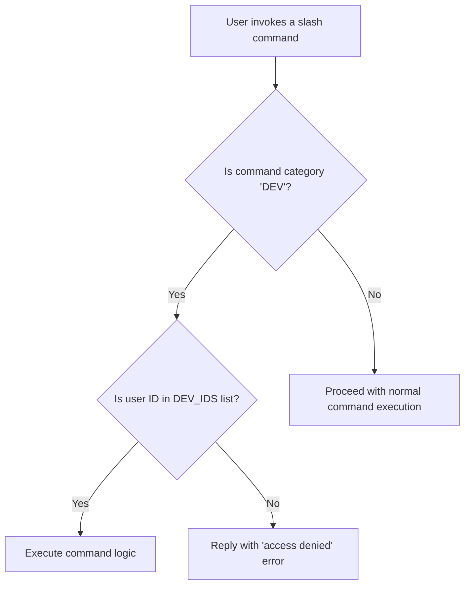
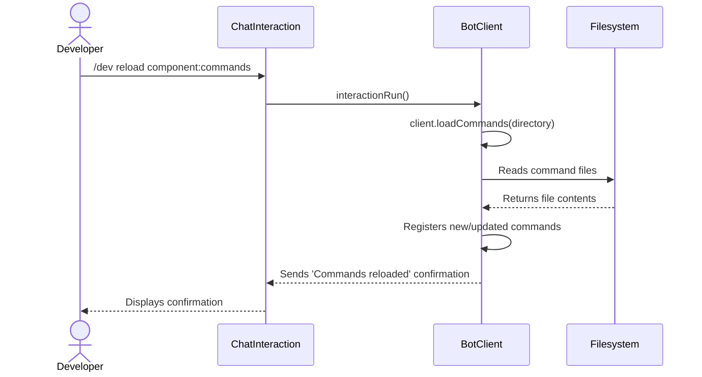
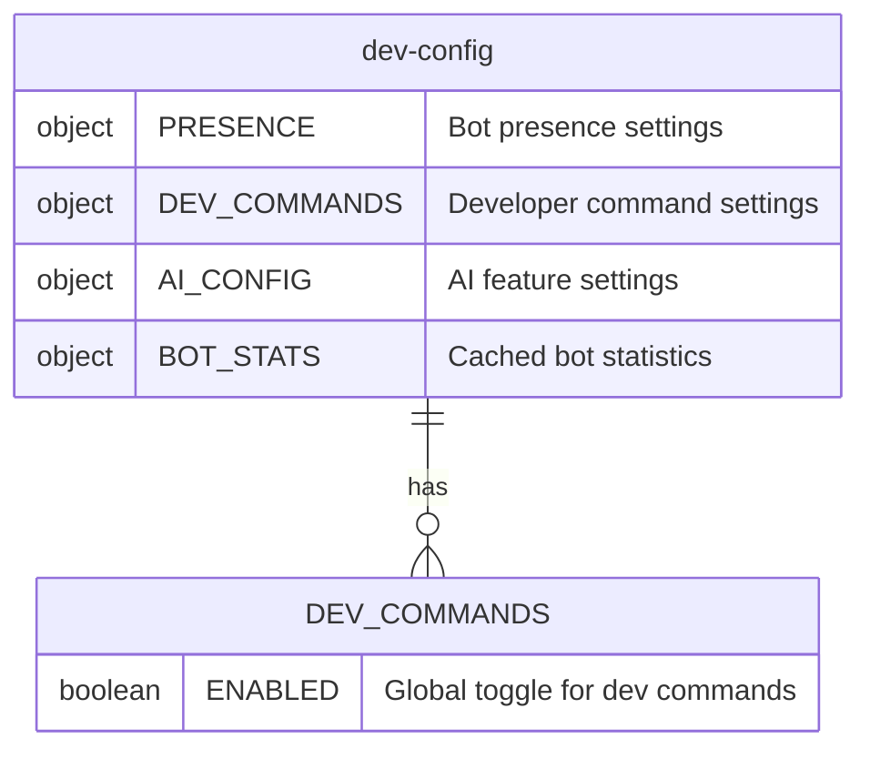
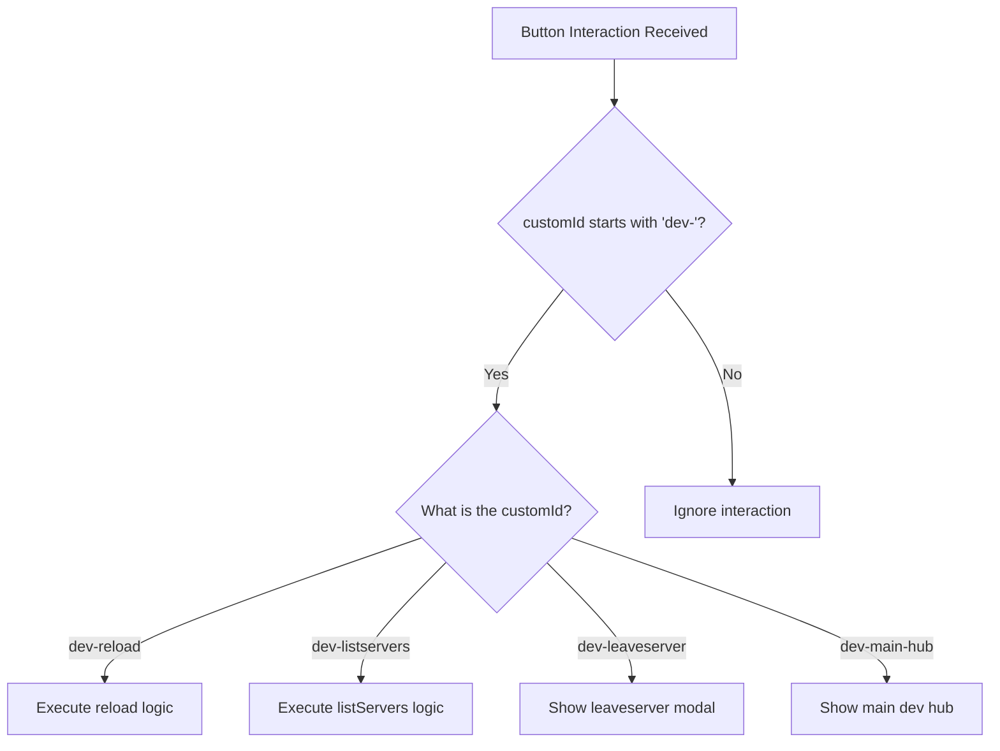

<details>
<summary><strong>Relevant source files</strong></summary>

- [src/commands/dev/dev.ts](https://github.com/iamvikshan/amina/blob/main/src/commands/dev/dev.ts)
- [src/commands/dev/sub/reload.ts](https://github.com/iamvikshan/amina/blob/main/src/commands/dev/sub/reload.ts)
- [src/commands/dev/sub/listServers.ts](https://github.com/iamvikshan/amina/blob/main/src/commands/dev/sub/listServers.ts)
- [src/handlers/dev/index.ts](https://github.com/iamvikshan/amina/blob/main/src/handlers/dev/index.ts)
- [src/database/schemas/Dev.ts](https://github.com/iamvikshan/amina/blob/main/src/database/schemas/Dev.ts)
- [src/handlers/command.ts](https://github.com/iamvikshan/amina/blob/main/src/handlers/command.ts)
- [types/commands.d.ts](https://github.com/iamvikshan/amina/blob/main/types/commands.d.ts)
</details>

Developer Commands are a special set of slash commands designed exclusively for bot administrators and developers. These commands provide powerful tools for bot maintenance, debugging, real-time configuration changes, and direct server management. They are categorized under the `DEV` category and are strictly access-controlled to prevent unauthorized use.

Access to these commands is restricted to user IDs specified in the `config.BOT.DEV_IDS` array. The command handler explicitly checks if a command belongs to the `DEV` category and verifies the user's ID against this allowlist before execution. This ensures that only trusted developers can perform sensitive operations like reloading bot components or forcing the bot to leave a server.

Sources: [`src/handlers/command.ts:47-54`](https://github.com/iamvikshan/amina/blob/main/src/handlers/command.ts:47-54), [`types/commands.d.ts:18`](https://github.com/iamvikshan/amina/blob/main/types/commands.d.ts:18)

## Access control

The system ensures that only authorized developers can execute `DEV` commands. This logic is centralized in the main command handler.

The following diagram illustrates the access control flow when a developer command is invoked.



This diagram shows the initial checks performed by the command handler to secure developer-only commands.
Sources: [`src/handlers/command.ts:47-54`](https://github.com/iamvikshan/amina/blob/main/src/handlers/command.ts:47-54)

## Core `dev` command

The primary entry point for most developer functionalities is the `/dev` slash command. It acts as a router, delegating tasks to various subcommands.

Sources: [`src/commands/dev/dev.ts:17-64`](https://github.com/iamvikshan/amina/blob/main/src/commands/dev/dev.ts:17-64)

### Subcommands

The `/dev` command exposes several subcommands, each performing a specific administrative task.

| Subcommand    | Description                                                  |
| :------------ | :----------------------------------------------------------- |
| `reload`      | Reloads bot components like commands, events, and contexts.  |
| `listservers` | Lists all servers (guilds) the bot is currently in.          |
| `leaveserver` | Forces the bot to leave a specified server.                  |
| `devcommands` | Enables or disables the developer commands feature globally. |
| `onboarding`  | Triggers the onboarding process for one or all guilds.       |

Sources: [`src/commands/dev/dev.ts:19-63`](https://github.com/iamvikshan/amina/blob/main/src/commands/dev/dev.ts:19-63), [`CHANGELOG.md:123`](https://github.com/iamvikshan/amina/blob/main/CHANGELOG.md:123)

## Subcommand functionality

### `reload`

The `reload` subcommand provides a hot-reloading mechanism for the bot's core components without requiring a full restart. This is crucial for development and rapid iteration.

When executed, it gives the developer a choice of which components to reload:

- Commands
- Events
- Contexts

The underlying `reload` function calls the `BotClient`'s loader methods (`loadCommands`, `loadEvents`, `loadContexts`) to re-read the respective files from the filesystem and register them.

The sequence diagram below shows the process for reloading commands.



This diagram illustrates the hot-reload process initiated by a developer.
Sources: [`src/commands/dev/sub/reload.ts:10-44`](https://github.com/iamvikshan/amina/blob/main/src/commands/dev/sub/reload.ts:10-44), [`src/structures/BotClient.ts:223-242`](https://github.com/iamvikshan/amina/blob/main/src/structures/BotClient.ts:223-242)

### `listservers`

This subcommand generates a paginated list of all guilds the bot is a member of. Each entry includes the guild's name, ID, and member count. This is useful for monitoring the bot's reach and for obtaining guild IDs for other commands like `leaveserver`.

Sources: [`src/commands/dev/sub/listServers.ts`](https://github.com/iamvikshan/amina/blob/main/src/commands/dev/sub/listServers.ts)

### `leaveserver`

This allows a developer to force the bot to leave a guild by providing its ID. The command retrieves the guild from the client's cache and calls the `.leave()` method.

```typescript
// src/commands/dev/dev.ts:80-86
const guildId = interaction.options.getString('guildid', true);
const guild = client.guilds.cache.get(guildId);

if (!guild) {
  return interaction.followUp(`No guild found with ID ${guildId}`);
}
await guild.leave();
```

Sources: [`src/commands/dev/dev.ts:80-86`](https://github.com/iamvikshan/amina/blob/main/src/commands/dev/dev.ts:80-86)

### `devcommands`

This subcommand toggles the global availability of developer commands by updating a flag in the database. It uses the `setDevCommands` function to modify the `DEV_COMMANDS.ENABLED` property in the `dev-config` collection.

Sources: [`src/commands/dev/dev.ts:88-96`](https://github.com/iamvikshan/amina/blob/main/src/commands/dev/dev.ts:88-96), [`src/database/schemas/Dev.ts:133-144`](https://github.com/iamvikshan/amina/blob/main/src/database/schemas/Dev.ts:133-144)

## Developer configuration schema

Developer-specific settings, including the state of developer commands, are stored in a dedicated MongoDB collection named `dev-config`. The structure is defined in `src/database/schemas/Dev.ts`.

### Schema structure

The `dev-config` schema contains several objects for different configuration areas. The `DEV_COMMANDS` object is directly relevant to this feature.



This diagram shows the structure of the `dev-config` document with a focus on the `DEV_COMMANDS` property.
Sources: [`src/database/schemas/Dev.ts:46-51`](https://github.com/iamvikshan/amina/blob/main/src/database/schemas/Dev.ts:46-51)

### Database helper functions

Two key functions are provided to interact with this configuration:

- `getDevCommandsConfig()`: Retrieves the `DEV_COMMANDS` object from the database.
- `setDevCommands(enabled: boolean)`: Updates the `DEV_COMMANDS.ENABLED` boolean value.

These functions abstract the database logic, providing a clean interface for commands to read and write the configuration.

Sources: [`src/database/schemas/Dev.ts:127-144`](https://github.com/iamvikshan/amina/blob/main/src/database/schemas/Dev.ts:127-144)

## Developer interaction handler

In addition to slash commands, a dedicated interaction handler exists for developer-related button components, likely part of a developer dashboard or control panel. The `handleDevInteraction` function in `src/handlers/dev/index.ts` routes button interactions based on their `customId`.



This flow demonstrates how button clicks from a potential developer UI are handled and dispatched to the correct function.
Sources: [`src/handlers/dev/index.ts:14-41`](https://github.com/iamvikshan/amina/blob/main/src/handlers/dev/index.ts:14-41)

## Summary

The Developer Commands system is a vital, access-controlled feature for bot administration. It leverages a dedicated command category (`DEV`), a specific database configuration (`dev-config`), and a set of powerful subcommands (`/dev reload`, `/dev leaveserver`, etc.) to provide developers with the tools needed for maintenance, debugging, and real-time management of the bot. Access is strictly limited to pre-configured developer IDs, ensuring these powerful tools remain secure.
