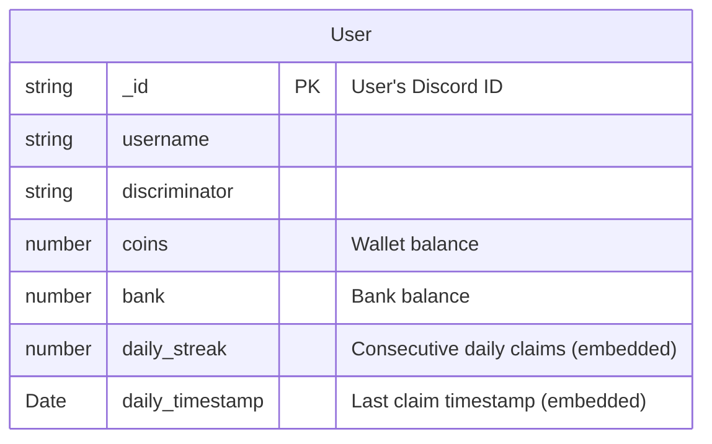
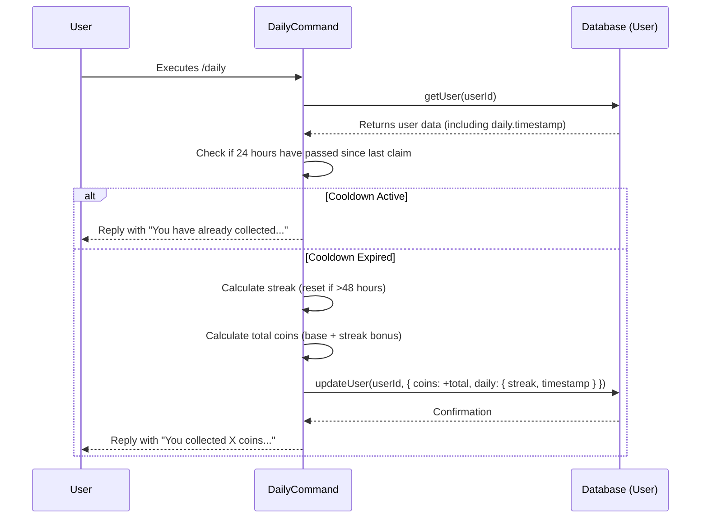

<strong>Relevant source files</strong>

- [src/commands/economy/bank.ts](https://github.com/iamvikshan/amina/blob/main/src/commands/economy/bank.ts)
- [src/commands/economy/daily.ts](https://github.com/iamvikshan/amina/blob/main/src/commands/economy/daily.ts)
- [src/commands/economy/gamble.ts](https://github.com/iamvikshan/amina/blob/main/src/commands/economy/gamble.ts)
- [src/database/schemas/User.ts](https://github.com/iamvikshan/amina/blob/main/src/database/schemas/User.ts)
- [src/config/config.ts](https://github.com/iamvikshan/amina/blob/main/src/config/config.ts)
- [types/schemas.d.ts](https://github.com/iamvikshan/amina/blob/main/types/schemas.d.ts)

The Economy System in Amina is a feature designed to enhance user engagement by introducing a virtual currency. Users can earn, save, transfer, and gamble coins through a series of interactive commands. The entire system is built around the `User` schema in the database, which tracks each user's financial status.

The system is modular and can be enabled or disabled globally. Key parameters such as the currency symbol and daily reward amounts are configurable, allowing for easy customization. The core functionalities include a banking system for managing funds, a daily reward mechanism to encourage regular interaction, and a simple gambling game.

_Sources: [README.md](https://github.com/iamvikshan/amina/blob/main/README.md), [src/config/config.ts:70-76](https://github.com/iamvikshan/amina/blob/main/src/config/config.ts#L70-L76), [CHANGELOG.md](https://github.com/iamvikshan/amina/blob/main/CHANGELOG.md)_

## Data schema

The foundation of the economy system is the `User` schema, which stores all economy-related data for each user. The relevant fields are defined within the `IUser` interface.

_Sources: [src/database/schemas/User.ts](https://github.com/iamvikshan/amina/blob/main/src/database/schemas/User.ts), [types/schemas.d.ts:85-164](https://github.com/iamvikshan/amina/blob/main/types/schemas.d.ts#L85-L164)_

### ER diagram

The following diagram illustrates the economy-related fields within the `User` entity.

### Schema fields

The user-specific economy data is stored in the `users` collection in MongoDB.

| Field             | Type     | Description                                                                              |
| ----------------- | -------- | ---------------------------------------------------------------------------------------- |
| `coins`           | `number` | The amount of currency the user has in their wallet. Defaults to `0`.                    |
| `bank`            | `number` | The amount of currency the user has deposited in their bank. Defaults to `0`.            |
| `daily.streak`    | `number` | The number of consecutive days the user has claimed their daily reward. Defaults to `0`. |
| `daily.timestamp` | `Date`   | The timestamp of the user's last daily reward claim.                                     |

_Sources: [src/database/schemas/User.ts:13-14, 23-26](https://github.com/iamvikshan/amina/blob/main/src/database/schemas/User.ts#L13-L14), [types/schemas.d.ts:88-89, 97-100](https://github.com/iamvikshan/amina/blob/main/types/schemas.d.ts#L88-L89)_

## Configuration

The economy system's behavior is controlled by the `ECONOMY` object in the main configuration file. This allows administrators to enable or disable the feature and adjust key values without changing the code.

_Sources: [src/config/config.ts:70-76](https://github.com/iamvikshan/amina/blob/main/src/config/config.ts#L70-L76)_

| Parameter        | Type      | Default Value | Description                                                    |
| ---------------- | --------- | ------------- | -------------------------------------------------------------- |
| `ENABLED`        | `boolean` | `true`        | Toggles the entire economy system on or off.                   |
| `CURRENCY`       | `string`  | `₪`           | The symbol used to represent the currency.                     |
| `DAILY_COINS`    | `number`  | `100`         | The base number of coins awarded by the `/daily` command.      |
| `MIN_BEG_AMOUNT` | `number`  | `100`         | The minimum coins that can be received from the `beg` command. |
| `MAX_BEG_AMOUNT` | `number`  | `2500`        | The maximum coins that can be received from the `beg` command. |

_Sources: [src/config/config.ts:70-76](https://github.com/iamvikshan/amina/blob/main/src/config/config.ts#L70-L76)_

## Commands

The economy system is exposed to users through a set of slash commands.

### Bank command

The `/bank` command serves as a hub for all banking operations. It uses subcommands to perform specific actions like checking a balance, depositing, withdrawing, and transferring funds.

_Sources: [src/commands/economy/bank.ts](https://github.com/iamvikshan/amina/blob/main/src/commands/economy/bank.ts)_

#### Subcommand flow

The main `interactionRun` function acts as a router, directing the interaction to the appropriate handler based on the chosen subcommand.

#### Subcommands

| Subcommand | Description                                      | Parameters                                                                                            |
| ---------- | ------------------------------------------------ | ----------------------------------------------------------------------------------------------------- |
| `balance`  | Check your or another user's coin balance.       | `user` (Optional, `User`): The user whose balance to check.                                           |
| `deposit`  | Deposit coins from your wallet to your bank.     | `coins` (Required, `Integer`): The number of coins to deposit.                                        |
| `withdraw` | Withdraw coins from your bank to your wallet.    | `coins` (Required, `Integer`): The number of coins to withdraw.                                       |
| `transfer` | Transfer coins from your wallet to another user. | `user` (Required, `User`): The recipient.   `coins` (Required, `Integer`): The amount to transfer. |

_Sources: [src/commands/economy/bank.ts:16-99](https://github.com/iamvikshan/amina/blob/main/src/commands/economy/bank.ts#L16-L99)_

### Daily command

The `/daily` command allows users to claim a free set of coins once every 24 hours. It also tracks consecutive claims (streaks) to provide bonus rewards.

_Sources: [src/commands/economy/daily.ts](https://github.com/iamvikshan/amina/blob/main/src/commands/economy/daily.ts)_

#### Execution flow

The command logic ensures that a user can only claim their reward once per day and correctly calculates streak bonuses.

_This diagram shows the sequence of events when a user claims their daily reward._

_Sources: [src/commands/economy/daily.ts:24-64](https://github.com/iamvikshan/amina/blob/main/src/commands/economy/daily.ts#L24-L64)_

#### Logic details

- **Cooldown**: A user must wait 24 hours after their last claim. The remaining time is calculated and displayed if the command is used early.
- **Streak**: If a user claims their daily reward between 24 and 48 hours after the last claim, their streak increases. If they claim after 48 hours, the streak is reset to 1.
- **Reward**: The total reward is the `DAILY_COINS` value from the configuration plus a bonus calculated as `streak * 10`.

_Sources: [src/commands/economy/daily.ts:30-52](https://github.com/iamvikshan/amina/blob/main/src/commands/economy/daily.ts#L30-L52)_

### Gamble command

The `/gamble` command allows users to bet a specified amount of their wallet coins for a chance to double it.

_Sources: [src/commands/economy/gamble.ts](https://github.com/iamvikshan/amina/blob/main/src/commands/economy/gamble.ts)_

#### Gambling logic

The command validates the user's input, checks their balance, and then determines a win or loss based on a 50% chance.

#### Key mechanics

- **Betting**: Users can bet any amount of coins greater than zero, up to the total they have in their wallet.
- **Outcome**: There is a 50% chance of winning and a 50% chance of losing.
- **Payout**: A win doubles the bet amount and adds it to the user's wallet. A loss removes the bet amount from the user's wallet.
- **All-In**: The command supports an "all" argument to bet all coins in the user's wallet.

_Sources: [src/commands/economy/gamble.ts:29-51](https://github.com/iamvikshan/amina/blob/main/src/commands/economy/gamble.ts#L29-L51)_
