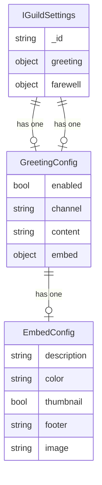
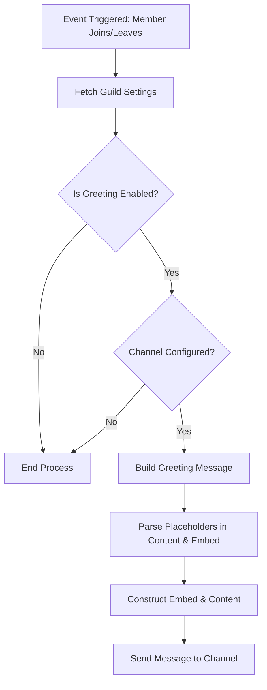
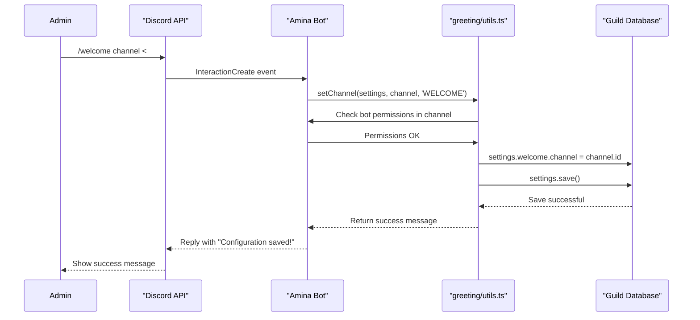

The Greeting System is a feature within Amina designed to automatically post customized messages when a member joins or leaves a guild. This system enhances the onboarding and offboarding experience by allowing server administrators to configure unique welcome and farewell messages, including dynamic content, embeds, and images. The configuration is managed through the `/welcome` and `/farewell` slash commands.

The system is composed of event listeners that trigger on member joins/leaves, a core handler for message construction, and a set of admin commands for configuration. The settings for both welcome and farewell messages are stored within the guild's document in the database.

<strong>Relevant source files</strong>

- `src/commands/admin/greeting/welcome.ts`
- `src/commands/admin/greeting/farewell.ts`
- `src/handlers/greeting.ts`
- `src/commands/admin/greeting/utils.ts`
- `types/schemas.d.ts`
- `src/commands/admin/settings/status.ts`

## Configuration schema

The settings for the greeting system are stored in the `IGuildSettings` schema. Each guild has separate objects for `greeting` (welcome) and `farewell`, which share an identical structure.

Sources: [`types/schemas.d.ts:74-83`](https://github.com/iamvikshan/amina/blob/main/types/schemas.d.ts#L74-L83)

### Schema diagram

This diagram illustrates the structure of the `greeting` and `farewell` objects within the main guild settings document.

Sources: [`types/schemas.d.ts:74-83`](https://github.com/iamvikshan/amina/blob/main/types/schemas.d.ts#L74-L83), [`src/handlers/greeting.ts:19-28`](https://github.com/iamvikshan/amina/blob/main/src/handlers/greeting.ts#L19-L28)

### Schema fields

The table below details the configuration options available for both welcome and farewell messages.

| Field               | Type    | Description                                                    |
| :------------------ | :------ | :------------------------------------------------------------- |
| `enabled`           | boolean | Toggles the greeting message on or off.                        |
| `channel`           | string  | The ID of the text channel where messages will be sent.        |
| `content`           | string  | The raw text content of the message. Can contain placeholders. |
| `embed`             | object  | An object containing settings for the message's embed.         |
| `embed.description` | string  | The main text within the embed. Can contain placeholders.      |
| `embed.color`       | string  | The hex color code for the embed's side border.                |
| `embed.thumbnail`   | boolean | If true, the member's avatar is used as the embed thumbnail.   |
| `embed.footer`      | string  | The footer text of the embed. Can contain placeholders.        |
| `embed.image`       | string  | A URL for a large image to display at the bottom of the embed. |

Sources: [`types/schemas.d.ts:74-83`](https://github.com/iamvikshan/amina/blob/main/types/schemas.d.ts#L74-L83), [`src/handlers/greeting.ts:19-28`](https://github.com/iamvikshan/amina/blob/main/src/handlers/greeting.ts#L19-L28)

## Core logic

The core logic for the greeting system resides in `src/handlers/greeting.ts`. This handler is responsible for fetching settings, parsing placeholders, building the final message, and sending it to the configured channel.

### Message generation flow

When a member joins or leaves, the system follows this flow to generate and send the appropriate message.

This flow is managed by the `sendWelcome` and `sendFarewell` functions.

Sources: [`src/handlers/greeting.ts:117-154`](https://github.com/iamvikshan/amina/blob/main/src/handlers/greeting.ts#L117-L154)

### Key functions

- **`buildGreeting(member, type, config, inviterData)`**: This is the main function for constructing the message. It takes the guild member, the type of greeting ('WELCOME' or 'FAREWELL'), the configuration object, and optional inviter data. It orchestrates the parsing of content and the building of the embed. If no custom content or embed description is set, it provides a default message.
  Sources: [`src/handlers/greeting.ts:83-115`](https://github.com/iamvikshan/amina/blob/main/src/handlers/greeting.ts#L83-L115)

- **`parse(content, member, inviterData)`**: This asynchronous function replaces placeholders in a given string with dynamic values related to the member, the guild, and the inviter (if available).
  Sources: [`src/handlers/greeting.ts:33-81`](https://github.com/iamvikshan/amina/blob/main/src/handlers/greeting.ts#L33-L81)

- **`sendWelcome(member, inviterData)` / `sendFarewell(member, inviterData)`**: These functions act as the entry points for the handler. They fetch the guild's settings, check if the respective greeting is enabled and if a channel is set, then call `buildGreeting` to get the message payload, and finally send it to the configured channel.
  Sources: [`src/handlers/greeting.ts:117-154`](https://github.com/iamvikshan/amina/blob/main/src/handlers/greeting.ts#L117-L154)

### Message placeholders

The `parse` function supports several placeholders that can be used in the `content`, `embed.description`, `embed.footer`, and `embed.image` fields to create dynamic messages.

| Placeholder        | Description                                        |
| :----------------- | :------------------------------------------------- |
| `{\n}`             | Inserts a new line.                                |
| `{server}`         | The name of the server.                            |
| `{count}`          | The total member count of the server.              |
| `{member:nick}`    | The member's display name (nickname or username).  |
| `{member:name}`    | The member's username (e.g., "vikshan").           |
| `{member:dis}`     | The member's discriminator (e.g., "0001").         |
| `{member:tag}`     | The member's full tag (e.g., "vikshan\#0001").     |
| `{member:mention}` | Mentions the member (e.g., "@vikshan").            |
| `{member:avatar}`  | The URL of the member's avatar.                    |
| `{inviter:name}`   | The username of the person who invited the member. |
| `{inviter:tag}`    | The full tag of the person who invited the member. |
| `{invites}`        | The effective number of invites the inviter has.   |

Sources: [`src/handlers/greeting.ts:68-80`](https://github.com/iamvikshan/amina/blob/main/src/handlers/greeting.ts#L68-L80)

## Administrative commands

The greeting system is configured via the `/welcome` and `/farewell` slash commands. These commands are restricted to users with administrative permissions. They provide a suite of subcommands to manage every aspect of the greeting messages. The underlying logic for these commands is handled by utility functions in `src/commands/admin/greeting/utils.ts`.

Sources: [`src/commands/admin/greeting/utils.ts`](https://github.com/iamvikshan/amina/blob/main/src/commands/admin/greeting/utils.ts)

### Command structure

The `/welcome` and `/farewell` commands are identical in structure, each offering the same set of subcommands to configure their respective message type.

The sequence diagram below shows a typical interaction where an admin configures the welcome channel.

### Subcommand reference

The following table lists the subcommands available under both `/welcome` and `/farewell`.

| Subcommand            | Description                                         | Utility Function |
| :-------------------- | :-------------------------------------------------- | :--------------- |
| `status <on\|off>`    | Enables or disables the greeting message.           | `setStatus`      |
| `channel <#channel>`  | Sets the channel where messages will be sent.       | `setChannel`     |
| `preview`             | Sends a test message to the configured channel.     | `sendPreview`    |
| `desc <text>`         | Sets the description for the embed.                 | `setDescription` |
| `thumbnail <on\|off>` | Toggles the member's avatar as the embed thumbnail. | `setThumbnail`   |
| `color <#hex>`        | Sets the color of the embed.                        | `setColor`       |
| `footer <text>`       | Sets the footer text for the embed.                 | `setFooter`      |
| `image <url>`         | Sets the image for the embed.                       | `setImage`       |

Sources: [`src/commands/admin/greeting/utils.ts:6-91`](https://github.com/iamvikshan/amina/blob/main/src/commands/admin/greeting/utils.ts#L6-L91)

The status of the welcome and farewell channels is also visible in the `/settings status` command, providing a comprehensive overview of the guild's configuration.

Sources: [`src/commands/admin/settings/status.ts:40-47`](https://github.com/iamvikshan/amina/blob/main/src/commands/admin/settings/status.ts#L40-L47)
