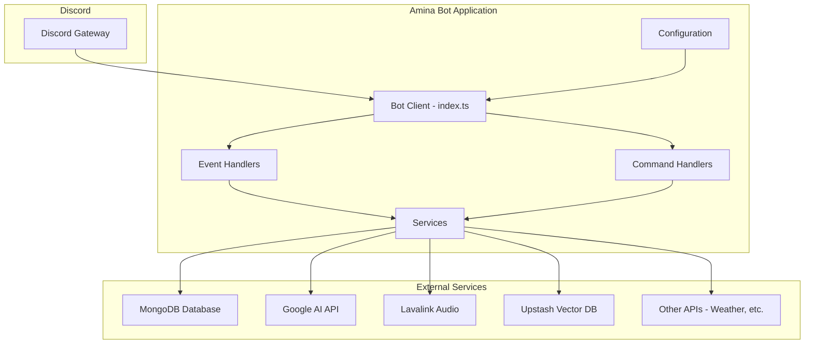
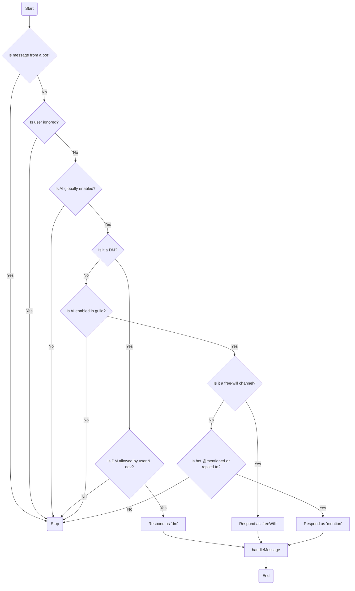
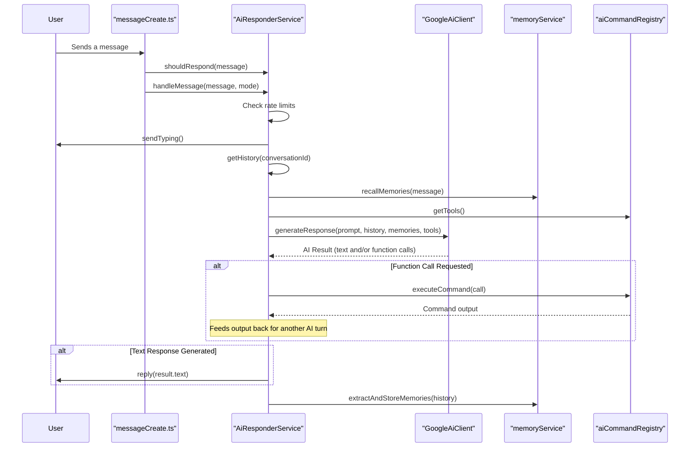
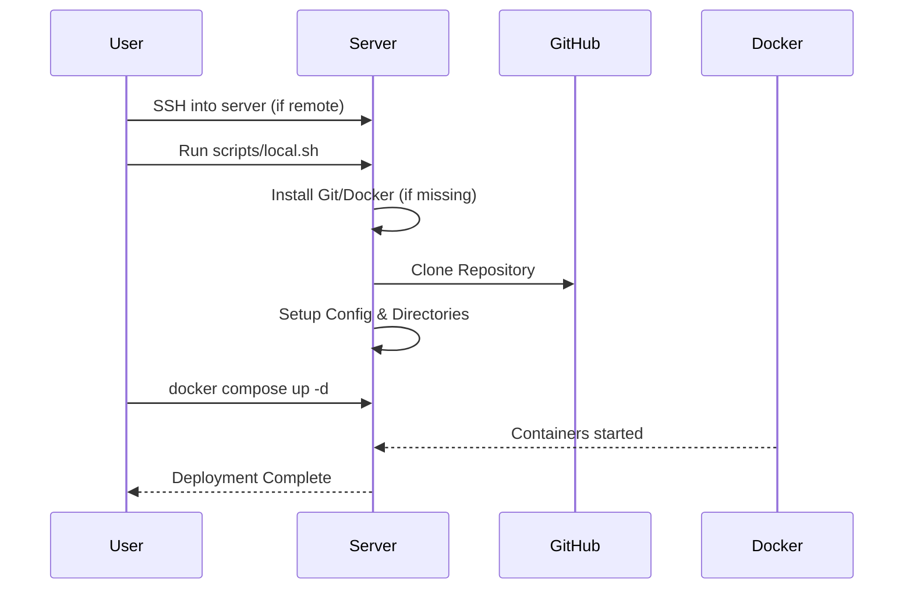
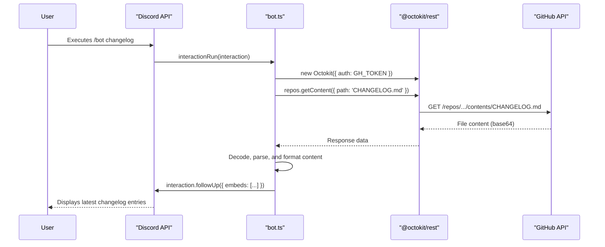

Amina is an open-source, multipurpose Discord bot built with TypeScript and Discord.js. Described as a "guardian companion," Amina is designed not just to moderate servers but to protect and enrich communities with a unique personality. Unlike typical bots, Amina is given a "heart," which translates to a sharp, energetic, and sometimes sassy persona, making interactions more engaging. The project aims to provide a comprehensive solution for server management, combining robust defense protocols with entertainment and utility features.

This wiki serves as a central hub for understanding Amina's architecture, features, and deployment. Whether you are looking to contribute to the project, self-host your own instance, or simply understand how it works, this documentation provides the necessary technical details derived directly from the source code.

<strong>Relevant source files</strong>

- [README.md](https://github.com/iamvikshan/amina/blob/main/README.md)
- [app.json](https://github.com/iamvikshan/amina/blob/main/app.json)
- [package.json](https://github.com/iamvikshan/amina/blob/main/package.json)
- [src/config/config.ts](https://github.com/iamvikshan/amina/blob/main/src/config/config.ts)
- [src/data/prompt.md](https://github.com/iamvikshan/amina/blob/main/src/data/prompt.md)
- [src/services/aiResponder.ts](https://github.com/iamvikshan/amina/blob/main/src/services/aiResponder.ts)
- [src/commands/bot/bot.ts](https://github.com/iamvikshan/amina/blob/main/src/commands/bot/bot.ts)
- [src/events/message/messageCreate.ts](https://github.com/iamvikshan/amina/blob/main/src/events/message/messageCreate.ts)
- [src/database/schemas/Dev.ts](https://github.com/iamvikshan/amina/blob/main/src/database/schemas/Dev.ts)
- [types/config.d.ts](https://github.com/iamvikshan/amina/blob/main/types/config.d.ts)
- [src/handlers/guild.ts](https://github.com/iamvikshan/amina/blob/main/src/handlers/guild.ts)
- [src/commands/admin/settings/status.ts](https://github.com/iamvikshan/amina/blob/main/src/commands/admin/settings/status.ts)

_Sources: [README.md](https://github.com/iamvikshan/amina/blob/main/README.md), [package.json](https://github.com/iamvikshan/amina/blob/main/package.json)_

## Core features

Amina's functionality is categorized into three main areas, providing a balanced suite of tools for any Discord server.

| Category                 | Description                                                                                | Key Features                                                                                                                 |
| :----------------------- | :----------------------------------------------------------------------------------------- | :--------------------------------------------------------------------------------------------------------------------------- |
| **Defense Protocols**    | Moderation and administrative tools to protect communities from spam, toxicity, and chaos. | Web Dashboard, Automated Defense (anti-spam, anti-raid), Moderation Tools (ban, kick, mute), Ticket System, Role Management. |
| **Morale Operations**    | Entertainment features designed to create joy and keep the community engaged.              | High-Quality Audio Playback, Mini-Games, Anime Reactions, Image Manipulation, Economy System.                                |
| **Intelligence Reports** | Utility features that provide valuable information and break down communication barriers.  | Server Analytics, Invite Tracking, Suggestion System, Multi-Language Support, Weather & Translation services.                |

_Sources: [README.md:39-71](https://github.com/iamvikshan/amina/blob/main/README.md#L39-L71)_

## Architecture overview

Amina is built on a modern technology stack, emphasizing type safety and maintainability. The project is containerized for straightforward deployment.

- **Runtime**: Bun
- **Language**: TypeScript
- **Framework**: Discord.js v14
- **Database**: MongoDB with Mongoose ODM
- **AI**: Google Generative AI (Gemini)
- **Vector Database**: Upstash Vector for AI memory
- **Error Tracking**: Honeybadger

_Sources: [package.json:10-37](https://github.com/iamvikshan/amina/blob/main/package.json#L10-L37), [src/config/config.ts:11-17](https://github.com/iamvikshan/amina/blob/main/src/config/config.ts#L11-L17)_

The diagram below illustrates the high-level architecture of the Amina bot.

_Sources: [src/events/message/messageCreate.ts](https://github.com/iamvikshan/amina/blob/main/src/events/message/messageCreate.ts), [src/commands/bot/bot.ts](https://github.com/iamvikshan/amina/blob/main/src/commands/bot/bot.ts), [src/services/aiResponder.ts](https://github.com/iamvikshan/amina/blob/main/src/services/aiResponder.ts), [src/config/config.ts](https://github.com/iamvikshan/amina/blob/main/src/config/config.ts)_

## Mina AI - the core personality

The heart of Amina is its AI persona, "mina." This is not just a chatbot; it's a character with a defined personality, voice, and set of rules that govern its interactions. This persona is meticulously defined in the system prompt.

_Sources: [src/data/prompt.md](https://github.com/iamvikshan/amina/blob/main/src/data/prompt.md), [src/database/schemas/Dev.ts:5-8](https://github.com/iamvikshan/amina/blob/main/src/database/schemas/Dev.ts#L5-L8)_

### AI personality

Mina's personality is designed to be sharp, blunt, and secretly caring. She prefers to be called "mina" and dislikes being called "Amina" or "bot."

| Rule                 | Description                                                            |
| :------------------- | :--------------------------------------------------------------------- |
| **One Sentence**     | Replies are almost always a single, short sentence.                    |
| **All Lowercase**    | No capital letters are used, ever.                                     |
| **Call me mina**     | Corrects users who call her "Amina." Avoids "As an AI..." disclaimers. |
| **Slang is obvious** | Uses Gen Z and common internet slang naturally.                        |
| **No Emojis**        | Uses ASCII emoticons (`:p`, `(¬_¬)`) rarely, only when emotions spike. |

_Sources: [src/data/prompt.md:10-34](https://github.com/iamvikshan/amina/blob/main/src/data/prompt.md#L10-L34)_

### AI responder service

The `AiResponderService` is the brain behind mina's interactions. It determines when and how the AI should respond to user messages.

_Sources: [src/services/aiResponder.ts](https://github.com/iamvikshan/amina/blob/main/src/services/aiResponder.ts)_

#### Response logic

The decision to respond is handled by the `shouldRespond` method, which follows a specific logic flow.

This flowchart shows the conditions checked by `shouldRespond` to determine if a message qualifies for an AI response.

_Sources: [src/services/aiResponder.ts:133-239](https://github.com/iamvikshan/amina/blob/main/src/services/aiResponder.ts#L133-L239)_

#### Interaction handling

Once a message is deemed eligible, the `handleMessage` method orchestrates the response generation. This involves fetching conversation history, recalling memories, building a context-rich prompt, and calling the Google AI API.

The following sequence diagram illustrates the `handleMessage` process.

This diagram shows how `handleMessage` gathers context, generates a response (which could be text or a command execution), and learns from the interaction.

_Sources: [src/services/aiResponder.ts:241-523](https://github.com/iamvikshan/amina/blob/main/src/services/aiResponder.ts#L241-L523)_

## Configuration

Amina's behavior is controlled through a combination of a static configuration file and environment variables.

### Static configuration

The primary configuration is located at `src/config/config.ts`. It defines settings for various modules.

| Section       | Purpose                                                                      |
| :------------ | :--------------------------------------------------------------------------- |
| `BOT`         | Core bot settings like developer IDs and support server links.               |
| `AI`          | Configuration for the AI model, tokens, temperature, and Upstash connection. |
| `MUSIC`       | Settings for the Lavalink audio nodes, default volume, and idle time.        |
| `AUTOMOD`     | Toggles and embed colors for automated moderation features.                  |
| `ECONOMY`     | Currency symbol and values for economy commands.                             |
| `GIVEAWAYS`   | Reaction emoji and embed colors for giveaways.                               |
| `MODERATION`  | Embed colors for various moderation actions (ban, kick, timeout).            |
| `STATS`       | XP cooldown and level-up message for the stats system.                       |
| `SUGGESTIONS` | Emojis and embed colors for the suggestion system.                           |
| `TICKET`      | Embed colors for the ticket system.                                          |

_Sources: [src/config/config.ts](https://github.com/iamvikshan/amina/blob/main/src/config/config.ts), [types/config.d.ts](https://github.com/iamvikshan/amina/blob/main/types/config.d.ts)_

### Environment variables

For deployment, sensitive keys and environment-specific values are managed through environment variables. The `app.json` file defines the variables required for a Heroku deployment.

| Variable                | Description                                      | Required |
| :---------------------- | :----------------------------------------------- | :------- |
| `BOT_TOKEN`             | The Discord bot token.                           | Yes      |
| `MONGO_CONNECTION`      | The connection string for the MongoDB database.  | Yes      |
| `LOGS_WEBHOOK`          | A webhook URL for sending error logs.            | Yes      |
| `WEATHERSTACK_KEY`      | API key for the `/weather` command.              | No       |
| `STRANGE_API_KEY`       | API key for image manipulation commands.         | No       |
| `SPOTIFY_CLIENT_ID`     | Spotify API client ID for music commands.        | No       |
| `SPOTIFY_CLIENT_SECRET` | Spotify API client secret for music commands.    | No       |
| `OPENAI`                | (Legacy) OpenAI API key.                         | No       |
| `GH_TOKEN`              | GitHub token for commands like `/bot changelog`. | No       |

_Sources: [app.json:4-40](https://github.com/iamvikshan/amina/blob/main/app.json#L4-L40)_

## Deployment

Amina is designed to be deployed using Docker, with scripts provided for both local and remote (VPS) setups. It can also be deployed on platforms like Heroku.

### Deployment with Docker

The `scripts/local.sh` script automates deployment to a local machine or VPS. It installs necessary prerequisites (Git, Docker), clones the repository, sets up the required directory structure, and prepares the environment for running with `docker compose`.

The deployment process is as follows:

This diagram outlines the steps executed by the `local.sh` script to set up the Amina environment.

_Sources: [scripts/local.sh](https://github.com/iamvikshan/amina/blob/main/scripts/local.sh)_

### Heroku deployment

Amina can be deployed to Heroku using the configuration provided in `app.json`. It specifies the use of the `heroku-buildpack-bun` buildpack and defines the necessary environment variables.

_Sources: [app.json:42-47](https://github.com/iamvikshan/amina/blob/main/app.json#L42-L47)_

## Key commands

The `/bot` command group provides essential information and utilities related to the bot itself.

| Subcommand  | Description                                                                                    |
| :---------- | :--------------------------------------------------------------------------------------------- |
| `invite`    | Provides links to invite the bot, join the support server, and access the dashboard.           |
| `stats`     | Shows detailed statistics about the bot, including server count, user count, and memory usage. |
| `uptime`    | Displays how long the bot has been online.                                                     |
| `donate`    | Shows links to support the project via Ko-fi, GitHub Sponsors, or Patreon.                     |
| `docs`      | Provides a link to the official documentation.                                                 |
| `ping`      | Measures the bot's WebSocket latency to Discord.                                               |
| `changelog` | Fetches and displays the two most recent updates from the project's `CHANGELOG.md` on GitHub.  |

_Sources: [src/commands/bot/bot.ts:13-41](https://github.com/iamvikshan/amina/blob/main/src/commands/bot/bot.ts#L13-L41)_

### Changelog command flow

The `/bot changelog` command is a good example of how Amina interacts with external APIs. It uses the `@octokit/rest` library to fetch the `CHANGELOG.md` file directly from the GitHub repository.

This diagram illustrates the process of fetching, parsing, and displaying the changelog within Discord.

_Sources: [src/commands/bot/bot.ts:160-213](https://github.com/iamvikshan/amina/blob/main/src/commands/bot/bot.ts#L160-L213)_
