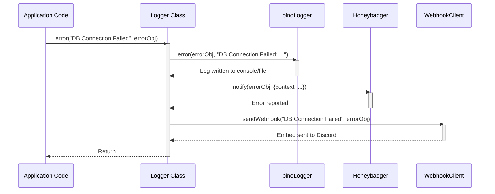
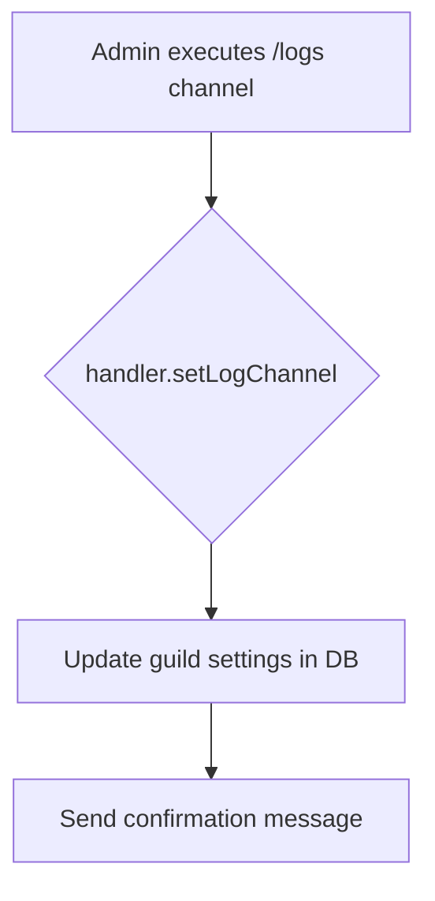
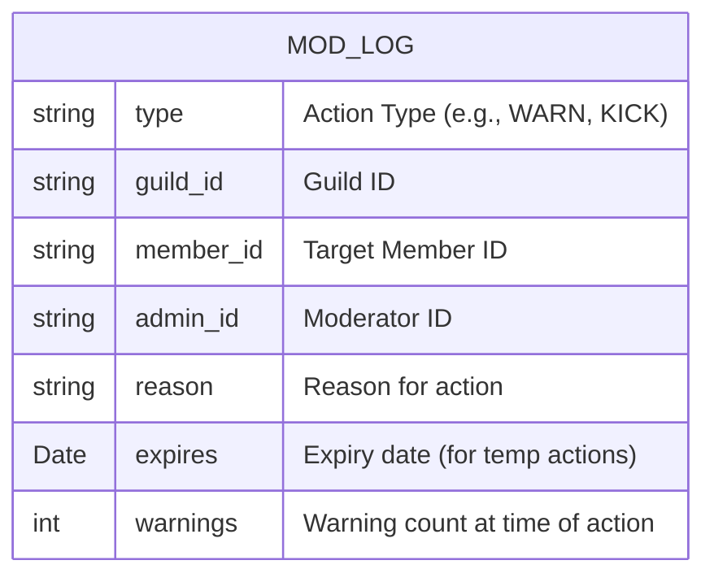
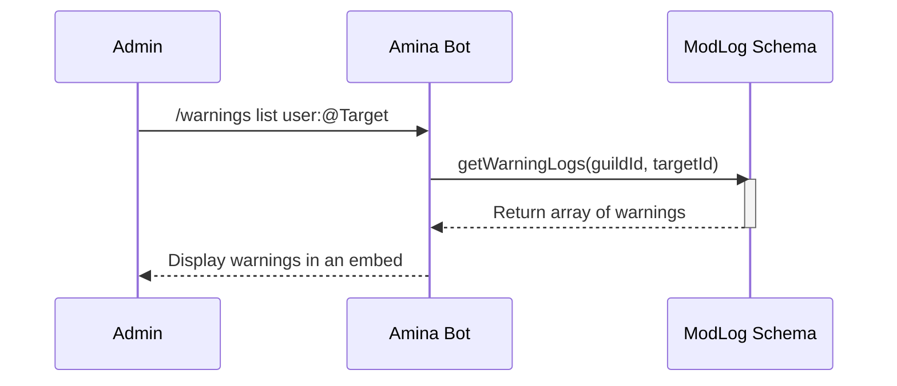

<strong>Relevant source files</strong>

- [src/commands/admin/logs.ts](https://github.com/iamvikshan/amina/blob/main/src/commands/admin/logs.ts)
- [src/database/schemas/ModLog.ts](https://github.com/iamvikshan/amina/blob/main/src/database/schemas/ModLog.ts)
- [src/handlers/admin/logging/index.ts](https://github.com/iamvikshan/amina/blob/main/src/handlers/admin/logging/index.ts)
- [src/helpers/Logger.ts](https://github.com/iamvikshan/amina/blob/main/src/helpers/Logger.ts)
- [types/schemas.d.ts](https://github.com/iamvikshan/amina/blob/main/types/schemas.d.ts)
- [src/commands/moderation/warnings.ts](https://github.com/iamvikshan/amina/blob/main/src/commands/moderation/warnings.ts)
- [src/handlers/automod.ts](https://github.com/iamvikshan/amina/blob/main/src/handlers/automod.ts)

The logging system in Amina is a dual-purpose architecture designed to serve two distinct needs: internal application monitoring for developers and external, guild-specific event logging for server administrators. The application logger provides detailed operational insights, error tracking, and debugging information, while the guild-facing system offers a configurable way to track moderation actions and significant server events within a designated Discord channel.

This documentation outlines both facets of the logging system, their components, configuration, and data flow.

## Application logging

The application-level logging is handled by a centralized `Logger` class, which provides a standardized interface for recording application events, warnings, and errors. It is designed for developers to monitor the bot's health and diagnose issues.

_Sources: [src/helpers/Logger.ts](https://github.com/iamvikshan/amina/blob/main/src/helpers/Logger.ts)_

### Architecture

The core of the application logger is built on the `pino` library, configured to use multiple streams for different outputs. This ensures that logs are delivered to the appropriate destinations based on their severity.

The diagram below illustrates the flow of a log message through the `Logger` class.

_This diagram shows the sequence of events for error logging, including internal logging, external error reporting, and webhook notification._

_Sources: [src/helpers/Logger.ts:28-97](https://github.com/iamvikshan/amina/blob/main/src/helpers/Logger.ts#L28-L97)_

### Components

#### Logger class

The static `Logger` class provides a simple API for logging.

| Method      | Description                                                                                                                              |
| ----------- | ---------------------------------------------------------------------------------------------------------------------------------------- |
| `success()` | Logs an informational message, typically for successful operations.                                                                      |
| `log()`     | Standard informational logging.                                                                                                          |
| `warn()`    | Logs a warning message for non-critical issues.                                                                                          |
| `error()`   | Logs a critical error. This method also triggers notifications to Honeybadger and a configured Discord webhook for immediate visibility. |
| `debug()`   | Logs detailed information useful for debugging, which is not typically shown in production console logs.                                 |

_Sources: [src/helpers/Logger.ts:77-97](https://github.com/iamvikshan/amina/blob/main/src/helpers/Logger.ts#L77-L97)_

#### Log streams

The logger is configured with four primary destinations:

1. **Console Output**: Uses `pino-pretty` to display color-coded, human-readable logs in the console for real-time monitoring during development.
2. **File Output**: Saves all logs of level `debug` and higher to a daily log file (e.g., `logs/combined-2023.10.26.log`). This provides a persistent record for historical analysis.
3. **Discord Webhook**: For `error` level logs, a formatted embed is sent to a Discord channel via a webhook URL defined in `secret.LOGS_WEBHOOK`. This allows for real-time alerting of critical failures.
4. **Honeybadger**: The `error` method also reports exceptions to the Honeybadger error tracking service, providing context-rich error reports and analytics.
   _Sources: [src/helpers/Logger.ts:13-75](https://github.com/iamvikshan/amina/blob/main/src/helpers/Logger.ts#L13-L75)_

### Error reporting flow

The following sequence diagram details the process when `Logger.error()` is called.

_Sources: [src/helpers/Logger.ts:89-96](https://github.com/iamvikshan/amina/blob/main/src/helpers/Logger.ts#L89-L96)_

## Guild-specific event logging

This system allows server administrators to monitor moderation actions and other significant events within their guild. Logs are sent as formatted embeds to a channel of their choice.

### Configuration

Admins can configure the logging system using the `/logs` command and its subcommands. The configuration is stored in the `Guild` schema.

_Sources: [src/commands/admin/logs.ts](https://github.com/iamvikshan/amina/blob/main/src/commands/admin/logs.ts), [src/handlers/admin/logging/index.ts](https://github.com/iamvikshan/amina/blob/main/src/handlers/admin/logging/index.ts), [types/schemas.d.ts](https://github.com/iamvikshan/amina/blob/main/types/schemas.d.ts)_

#### `/logs` command

The primary command for managing guild logging settings. The main functionality is to set the output channel.

_This flow shows how an admin sets the log channel._

_Sources: [src/commands/admin/logs.ts:20-23](https://github.com/iamvikshan/amina/blob/main/src/commands/admin/logs.ts#L20-L23), [src/handlers/admin/logging/index.ts:11-23](https://github.com/iamvikshan/amina/blob/main/src/handlers/admin/logging/index.ts#L11-L23)_

#### Toggling log events

The system allows for granular control over which events are logged. An interactive embed with buttons is used to enable or disable specific categories.

The following events can be toggled:

| Category | Event            | Description                     | Schema Path                  |
| -------- | ---------------- | ------------------------------- | ---------------------------- |
| Member   | `message_edit`   | Logs when a message is edited.  | `logs.member.message_edit`   |
| Member   | `message_delete` | Logs when a message is deleted. | `logs.member.message_delete` |
| Channel  | `create`         | Logs when a channel is created. | `logs.channel.create`        |
| Channel  | `edit`           | Logs when a channel is updated. | `logs.channel.edit`          |
| Channel  | `delete`         | Logs when a channel is deleted. | `logs.channel.delete`        |
| Role     | `create`         | Logs when a role is created.    | `logs.role.create`           |
| Role     | `edit`           | Logs when a role is updated.    | `logs.role.edit`             |
| Role     | `delete`         | Logs when a role is deleted.    | `logs.role.delete`           |

_Sources: [src/handlers/admin/logging/index.ts:47-101](https://github.com/iamvikshan/amina/blob/main/src/handlers/admin/logging/index.ts#L47-L101), [types/schemas.d.ts:49-65](https://github.com/iamvikshan/amina/blob/main/types/schemas.d.ts#L49-L65)_

### Moderation log (`modlog`)

A key part of the guild logging system is the `ModLog` database collection, which creates a permanent record of moderation actions performed by moderators or the bot's automod system.

_Sources: [src/database/schemas/ModLog.ts](https://github.com/iamvikshan/amina/blob/main/src/database/schemas/ModLog.ts)_

#### Schema definition

The `mod-logs` collection stores structured data about each moderation event.

_This ER diagram shows the structure of a document in the `mod-logs` collection._

_Sources: [src/database/schemas/ModLog.ts:12-32](https://github.com/iamvikshan/amina/blob/main/src/database/schemas/ModLog.ts#L12-L32)_

#### Usage example: warnings

The `/warnings` command directly interacts with the `ModLog` schema to manage user warnings.

- `/warnings list`: Uses `getWarningLogs` to retrieve all documents of type `WARN` for a specific user.
- `/warnings clear`: Uses `clearWarningLogs` to delete all `WARN` documents for a user.

This flow is illustrated below:

_This sequence shows how the `/warnings list` command retrieves data from the `ModLog` collection._

_Sources: [src/commands/moderation/warnings.ts:74-87](https://github.com/iamvikshan/amina/blob/main/src/commands/moderation/warnings.ts#L74-L87)_

### Automod integration

The automod system is a primary consumer of the guild logging feature. When automod flags a message, it performs two logging actions:

1. **Sends an Embed**: It constructs and sends a detailed embed to the guild's configured log channel (`logs_channel`).
2. **Saves to Database**: It calls `addAutoModLogToDb` to create a persistent record of the infraction, which can be reviewed later.

_Sources: [src/handlers/automod.ts:182-206](https://github.com/iamvikshan/amina/blob/main/src/handlers/automod.ts#L182-L206)_
