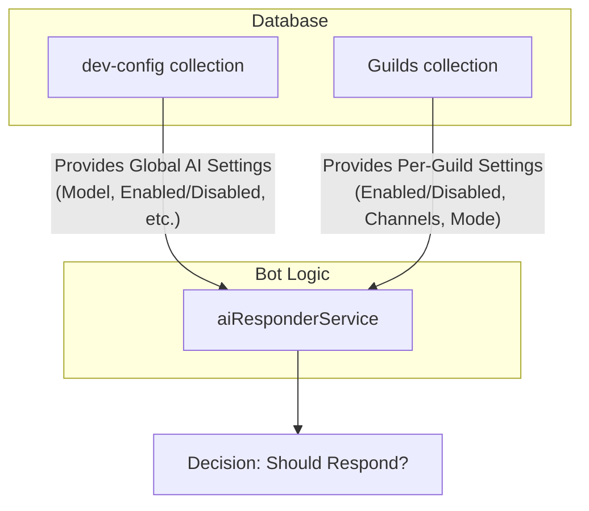
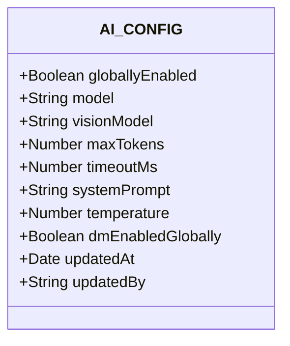
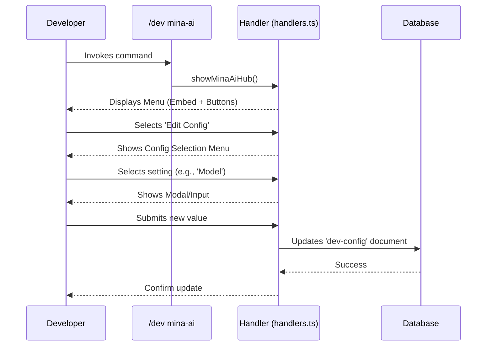
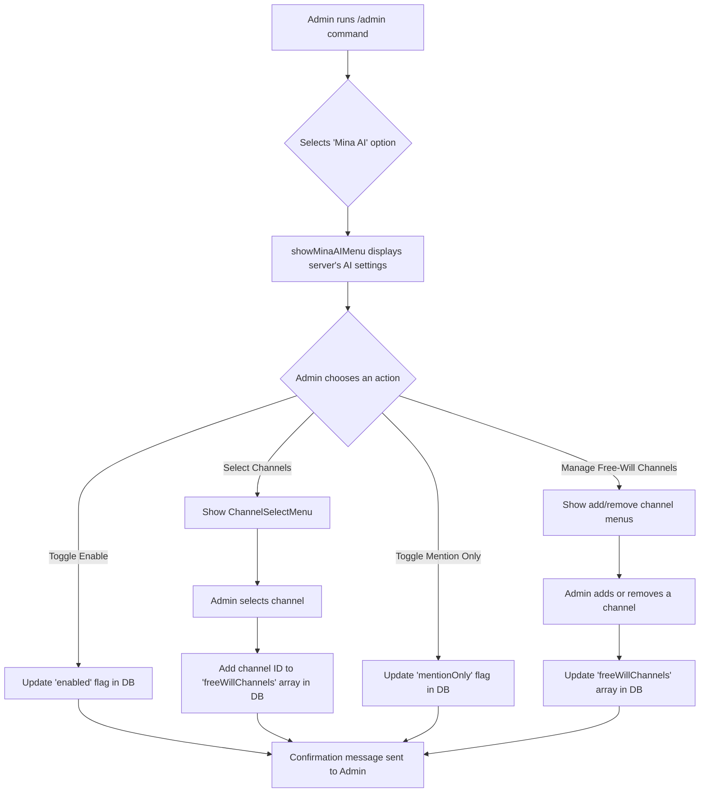
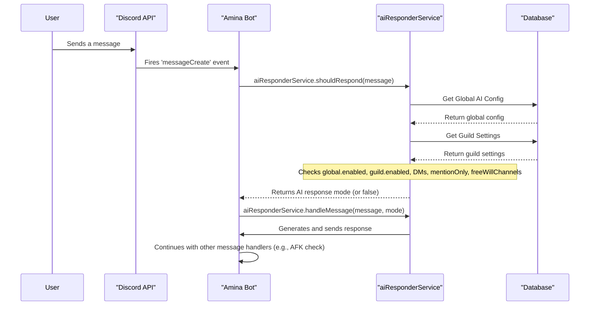

The Mina AI configuration system provides a powerful, two-tiered approach to managing the bot's artificial intelligence capabilities. It separates global, developer-controlled settings from per-server, administrator-controlled settings. This allows for foundational control over the AI's core behavior and resource usage, while giving server admins the flexibility to tailor the AI's presence to their community's needs.

This document outlines the architecture of both configuration layers, the specific settings available at each level, and how these settings are applied during message processing to determine if and how the AI should respond.

<strong>Relevant source files</strong>

- [src/handlers/admin/ai/index.ts](https://github.com/iamvikshan/amina/blob/main/src/handlers/admin/ai/index.ts)
- [src/database/schemas/Dev.ts](https://github.com/iamvikshan/amina/blob/main/src/database/schemas/Dev.ts)
- [src/handlers/dev/minaai/handlers.ts](https://github.com/iamvikshan/amina/blob/main/src/handlers/dev/minaai/handlers.ts)
- [src/commands/dev/sub/minaAi.ts](https://github.com/iamvikshan/amina/blob/main/src/commands/dev/sub/minaAi.ts)
- [src/events/message/messageCreate.ts](https://github.com/iamvikshan/amina/blob/main/src/events/message/messageCreate.ts)
- [src/data/prompt.md](https://github.com/iamvikshan/amina/blob/main/src/data/prompt.md)
- [types/config.d.ts](https://github.com/iamvikshan/amina/blob/main/types/config.d.ts)

## Configuration layers

Mina AI's configuration is split into two distinct layers:

1.  **Global Configuration (Developer Level):** These are the master settings managed by bot developers through the `/dev mina-ai` command interface. They control the fundamental aspects of the AI, such as the underlying model, token limits, and global enable/disable switches. These settings are stored in the `dev-config` collection in the database.
    _Sources: [src/database/schemas/Dev.ts:37-77](https://github.com/iamvikshan/amina/blob/main/src/database/schemas/Dev.ts#L37-L77), [src/handlers/dev/minaai/handlers.ts](https://github.com/iamvikshan/amina/blob/main/src/handlers/dev/minaai/handlers.ts)_

2.  **Guild Configuration (Admin Level):** These are server-specific settings managed by guild administrators via the `/admin mina-ai` command interface. They allow admins to enable or disable the AI within their server, define specific channels for "free-will" interaction, and set the response mode (mention-only vs. free-will). These settings are stored within each guild's document in the database.
    _Sources: [src/handlers/admin/ai/index.ts](https://github.com/iamvikshan/amina/blob/main/src/handlers/admin/ai/index.ts)_

The following diagram illustrates the relationship between the two configuration layers.

This diagram shows that the `aiResponderService` consumes both the global developer configuration and the specific guild's configuration to make a final decision on whether to respond to a message.
_Sources: [src/events/message/messageCreate.ts:102-105](https://github.com/iamvikshan/amina/blob/main/src/events/message/messageCreate.ts#L102-L105)_

## Global AI configuration (developer)

Global settings are managed by bot developers and define the core operational parameters for Mina AI across all servers. These are accessed through a developer-only command hub.

_Sources: [src/handlers/dev/minaai/handlers.ts](https://github.com/iamvikshan/amina/blob/main/src/handlers/dev/minaai/handlers.ts), [src/commands/dev/sub/minaAi.ts](https://github.com/iamvikshan/amina/blob/main/src/commands/dev/sub/minaAi.ts)_

### Schema and data structure

The global AI configuration is defined by the `AI_CONFIG` object within the `dev-config` schema.

This diagram shows the fields available in the global `AI_CONFIG` schema.
_Sources: [src/database/schemas/Dev.ts:37-77](https://github.com/iamvikshan/amina/blob/main/src/database/schemas/Dev.ts#L37-L77)_

### Configuration options

The following table details the global configuration options, their default values, and descriptions.

| Option              | Type    | Default Value           | Description                                                                                      |
| :------------------ | :------ | :---------------------- | :----------------------------------------------------------------------------------------------- |
| `globallyEnabled`   | Boolean | `false`                 | A master switch to enable or disable the AI feature across all guilds.                           |
| `model`             | String  | `gemini-flash-latest`   | The generative AI model to use for text-based responses.                                         |
| `visionModel`       | String  | `gemini-3-pro-preview`  | The generative AI model to use for vision-based tasks (not fully implemented in provided files). |
| `maxTokens`         | Number  | `1024`                  | The maximum number of tokens the AI can generate in a single response.                           |
| `timeoutMs`         | Number  | `20000`                 | The timeout in milliseconds for waiting for a response from the AI API.                          |
| `systemPrompt`      | String  | Contents of `prompt.md` | The core instructions defining the AI's personality, tone, and rules.                            |
| `temperature`       | Number  | `0.7`                   | Controls the randomness of the AI's output. Ranges from 0 to 2.                                  |
| `dmEnabledGlobally` | Boolean | `true`                  | A master switch to enable or disable AI responses in Direct Messages.                            |
| `updatedAt`         | Date    | `Date.now`              | Timestamp of the last configuration update.                                                      |
| `updatedBy`         | String  | `null`                  | The user ID of the developer who last updated the configuration.                                 |

_Sources: [src/database/schemas/Dev.ts:37-77](https://github.com/iamvikshan/amina/blob/main/src/database/schemas/Dev.ts#L37-L77), [src/data/prompt.md](https://github.com/iamvikshan/amina/blob/main/src/data/prompt.md)_

### Management flow

Developers manage these settings through a dedicated UI. The flow for updating a setting is as follows:

This diagram shows the process a developer follows to update a global AI setting, from invoking the command to receiving confirmation.
_Sources: [src/handlers/dev/minaai/handlers.ts:211-399](https://github.com/iamvikshan/amina/blob/main/src/handlers/dev/minaai/handlers.ts#L211-L399), [src/commands/dev/sub/minaAi.ts:80-87](https://github.com/iamvikshan/amina/blob/main/src/commands/dev/sub/minaAi.ts#L80-L87)_

## Guild-level AI configuration (admin)

Server administrators can customize Mina AI's behavior within their own guild using the `/admin` command group, which leads to the AI configuration menu.

_Sources: [src/handlers/admin/ai/index.ts](https://github.com/iamvikshan/amina/blob/main/src/handlers/admin/ai/index.ts)_

### Configuration options

Guild-level settings are stored in the `aiResponder` object within each guild's settings document.

| Option             | Type    | Default Value | Description                                                                                                                      |
| :----------------- | :------ | :------------ | :------------------------------------------------------------------------------------------------------------------------------- |
| `enabled`          | Boolean | `false`       | Enables or disables the AI for this specific server.                                                                             |
| `mentionOnly`      | Boolean | `true`        | If `true`, the AI only responds when @mentioned. If `false` (Free Will mode), it responds to all messages in `freeWillChannels`. |
| `freeWillChannels` | Array   | `[]`          | An array of channel IDs where the AI will respond to all messages (when `mentionOnly` is `false`).                               |
| `allowDMs`         | Boolean | `true`        | (Legacy/User-controlled) This setting is noted as now being controlled by users via `/mina-ai`.                                  |

_Sources: [src/handlers/admin/ai/index.ts:20-27, 166-176, 224-232](https://github.com/iamvikshan/amina/blob/main/src/handlers/admin/ai/index.ts#L20-L27)_

### Management flow

Administrators configure the AI for their server using a series of select menus and channel pickers.

This diagram illustrates the different paths an administrator can take to configure Mina AI for their server.
_Sources: [src/handlers/admin/ai/index.ts:162-298](https://github.com/iamvikshan/amina/blob/main/src/handlers/admin/ai/index.ts#L162-L298)_

## AI response logic

The decision for the AI to respond to a message is handled by the `aiResponderService` during the `messageCreate` event. It aggregates both global and guild-level configurations.

The sequence diagram below shows the logic flow when a new message is created.

This diagram details the step-by-step process from a user sending a message to the bot deciding whether to trigger an AI response based on database configurations.
_Sources: [src/events/message/messageCreate.ts:102-106](https://github.com/iamvikshan/amina/blob/main/src/events/message/messageCreate.ts#L102-L106)_

## System prompt

The AI's personality is defined by a default system prompt stored in `src/data/prompt.md`. This prompt instructs the AI to act as "mina," a sharp, blunt, and energetic guardian companion. It sets strict rules for her voice, including using all lowercase, preferring "mina" over "Amina," and using Gen Z slang.

This default prompt can be overridden at the global level by a developer using the `set-prompt` operation in the developer AI configuration menu.

_Sources: [src/data/prompt.md](https://github.com/iamvikshan/amina/blob/main/src/data/prompt.md), [src/database/schemas/Dev.ts:10, 61-64](https://github.com/iamvikshan/amina/blob/main/src/database/schemas/Dev.ts#L10), [src/handlers/dev/minaai/handlers.ts:153-156](https://github.com/iamvikshan/amina/blob/main/src/handlers/dev/minaai/handlers.ts#L153-L156)_
