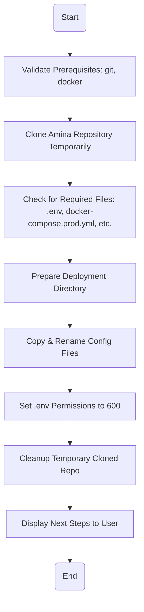

This guide provides instructions for deploying a self-hosted instance of the Amina bot. The primary deployment method uses Docker and Docker Compose to orchestrate the necessary services, including the bot itself, a Lavalink server for music playback, and an Uptime Kuma instance for monitoring.

Self-hosting is intended for users with technical knowledge of Docker, server management, and environment configuration. For most users, the official hosted version is recommended as it is always up-to-date and requires no setup.

<details>
<summary><strong>Relevant source files</strong></summary>

- [scripts/local.sh](https://github.com/iamvikshan/amina/blob/main/scripts/local.sh)
- [README.md](https://github.com/iamvikshan/amina/blob/main/README.md)
- [app.json](https://github.com/iamvikshan/amina/blob/main/app.json)
- [package.json](https://github.com/iamvikshan/amina/blob/main/package.json)
- [src/config/config.ts](https://github.com/iamvikshan/amina/blob/main/src/config/config.ts)

</details>

_Sources: [README.md:82-86](https://github.com/iamvikshan/amina/blob/main/README.md#L82-L86), [scripts/local.sh](https://github.com/iamvikshan/amina/blob/main/scripts/local.sh)_

## Prerequisites

Before starting the deployment, ensure the following tools are installed on your host system. The deployment script (`scripts/local.sh`) can automatically install these on Debian/Ubuntu systems.

- **Git**: For cloning the repository.
- **Docker**: For running the containerized services.
- **Docker Compose**: For managing the multi-container application.

_Sources: [scripts/local.sh:80-97](https://github.com/iamvikshan/amina/blob/main/scripts/local.sh#L80-L97)_

## Deployment methods

The repository provides a shell script to automate the setup process.

### Deployment script (`scripts/local.sh`)

This script is for deploying Amina on the machine where the script is executed (e.g., your local machine or a VPS). It clones the repository, sets up the required configuration files in a specified deployment path, and provides instructions to start the services.

_Sources: [scripts/local.sh:5-15](https://github.com/iamvikshan/amina/blob/main/scripts/local.sh#L5-L15)_

## Deployment process

The deployment script follows a standardized, multi-step process to ensure a consistent and correct setup.

This diagram illustrates the automated workflow executed by the deployment script.



_Sources: [scripts/local.sh](https://github.com/iamvikshan/amina/blob/main/scripts/local.sh)_

### Final directory structure

After a successful deployment, the specified deployment directory (default: `~/amina`) will have the following structure:

```bash
~/amina/
  ├── docker-compose.yml
  ├── .env
  ├── lavalink-entrypoint.sh
  └── lavalink/
      └── application.yml
```

This structure separates the core configuration from the application logic, which is pulled via Docker images.

_Sources: [scripts/local.sh:189-197](https://github.com/iamvikshan/amina/blob/main/scripts/local.sh#L189-L197)_

## Configuration

Proper configuration is critical for the bot to function. The deployment scripts set up the necessary files, but you must populate them with your own secrets and settings.

### Environment variables (`.env`)

The `.env` file contains secrets and essential configuration for the bot. It is created from `.env.example` if it doesn't already exist in the deployment directory. The following variables are required.

| Variable                | Description                                                                        | Required |
| :---------------------- | :--------------------------------------------------------------------------------- | :------: |
| `BOT_TOKEN`             | Your Discord bot token from the developer portal.                                  |   Yes    |
| `MONGO_CONNECTION`      | Connection URL for your MongoDB Atlas or self-hosted database.                     |   Yes    |
| `LOGS_WEBHOOK`          | A Discord webhook URL for receiving error logs.                                    |   Yes    |
| `WEATHERSTACK_KEY`      | API key from [weatherstack.com](https://weatherstack.com) for the weather command. |    No    |
| `STRANGE_API_KEY`       | API key for [strangeapi.xyz](https://strangeapi.xyz).                              |    No    |
| `SPOTIFY_CLIENT_ID`     | Spotify client ID for music commands.                                              |    No    |
| `SPOTIFY_CLIENT_SECRET` | Spotify client secret for music commands.                                          |    No    |
| `OPENAI`                | API key for OpenAI or compatible service for AI commands.                          |    No    |
| `GH_TOKEN`              | GitHub token for GitHub-related commands.                                          |    No    |

_Sources: [app.json:4-40](https://github.com/iamvikshan/amina/blob/main/app.json#L4-L40), [scripts/local.sh:162-168](https://github.com/iamvikshan/amina/blob/main/scripts/local.sh#L162-L168)_

### Lavalink configuration

Lavalink is the music server that powers Amina's audio playback features.

- **`lavalink/application.yml`**: This file configures the Lavalink server. It is crucial to set a secure password under `server.password`. This password must match the `LAVALINK_NODES` configuration in your `.env` file.
- **`lavalink-entrypoint.sh`**: A helper script that ensures the correct permissions are set for the Lavalink server inside its container.

_Sources: [scripts/local.sh:30-31](https://github.com/iamvikshan/amina/blob/main/scripts/local.sh#L30-L31), [scripts/local.sh:172-177](https://github.com/iamvikshan/amina/blob/main/scripts/local.sh#L172-L177), [src/config/config.ts:80-88](https://github.com/iamvikshan/amina/blob/main/src/config/config.ts#L80-L88)_

### Docker compose

The `docker-compose.yml` file is copied from `docker-compose.prod.yml` in the source repository. It defines and orchestrates the three main services:

1.  **Amina**: The main bot application.
2.  **Lavalink**: The music server.
3.  **Uptime Kuma**: A monitoring dashboard.

The following diagram shows the relationship between these containerized services.

```mermaid
graph TD
    subgraph "User's VPS"
        subgraph "Docker Environment"
            A[Amina Bot Container]
            B[Lavalink Container]
            C[Uptime Kuma Container]
        end
        D[External MongoDB]
    end
    E[Developer]

    E -- Manages --> "Docker Environment"
    A -- Connects to --> B
    A -- Connects to --> D
    E -- Accesses --> C
```

_Sources: [scripts/vps.sh:10-16](https://github.com/iamvikshan/amina/blob/main/scripts/vps.sh#L10-L16), [scripts/vps.sh:152-154](https://github.com/iamvikshan/amina/blob/main/scripts/vps.sh#L152-L154), [app.json:9-13](https://github.com/iamvikshan/amina/blob/main/app.json#L9-L13)_

## Post-deployment

Once the deployment script finishes, it will output a list of next steps. You must complete these to get your bot online.

1.  **Review Configurations**:
    - `cat ~/amina/docker-compose.yml`
    - `cat ~/amina/lavalink/application.yml` (Verify `server.password`)
    - `cat ~/amina/.env` (Fill in all required variables)

2.  **Start Services**:
    Navigate to the deployment directory and start the containers in detached mode.

    ```bash
    cd ~/amina
    docker compose up -d
    ```

3.  **Check Status**:
    Verify that all containers are running.

    ```bash
    docker compose ps
    ```

4.  **View Logs**:
    Tail the logs for all services to check for errors.

    ```bash
    docker compose logs -f
    ```

5.  **Access Uptime Kuma**:
    The monitoring dashboard will be available at `http://<your-vps-ip>:3001`.

_Sources: [scripts/local.sh:200-225](https://github.com/iamvikshan/amina/blob/main/scripts/local.sh#L200-L225), [scripts/vps.sh:278-303](https://github.com/iamvikshan/amina/blob/main/scripts/vps.sh#L278-L303)_
