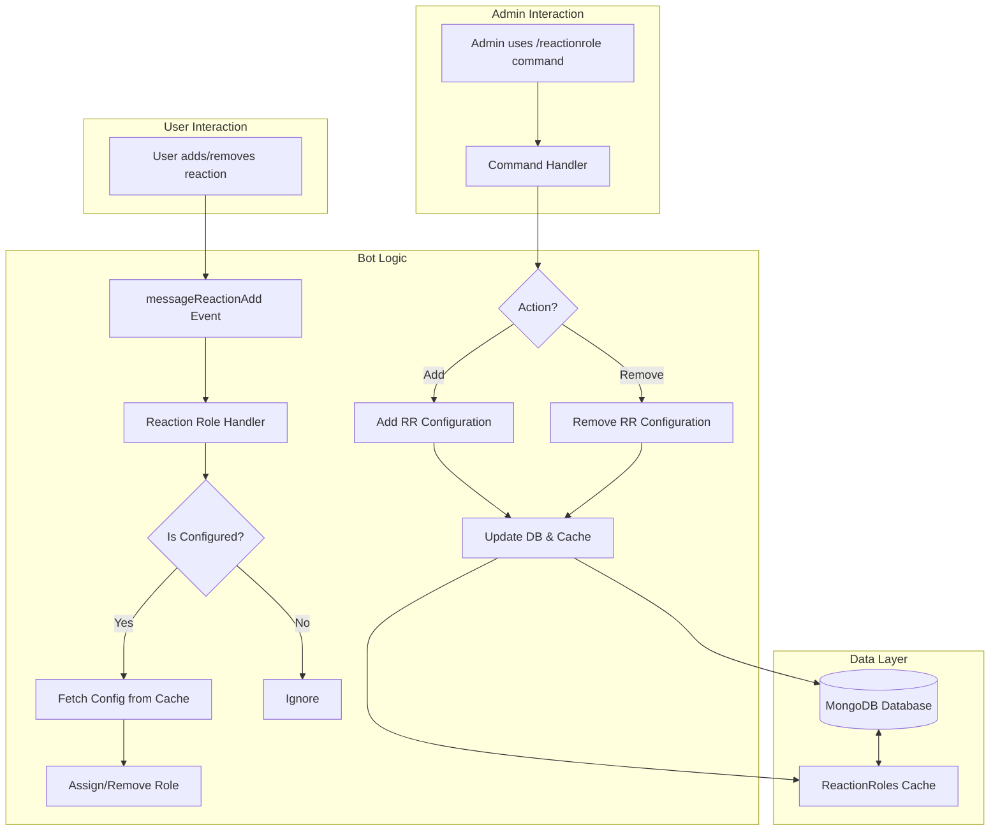
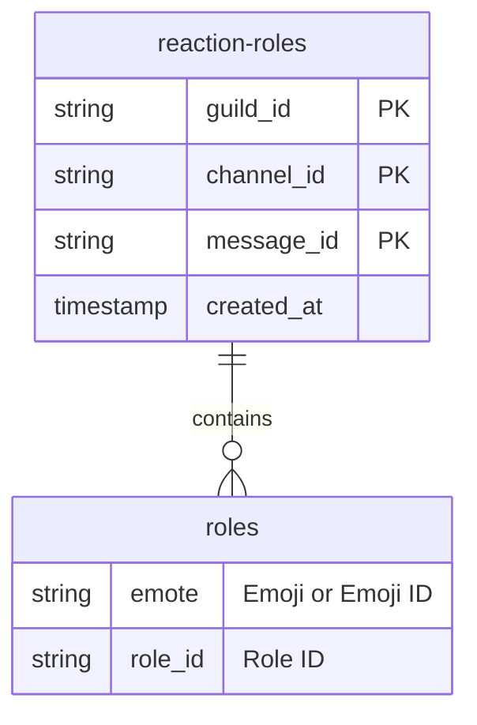
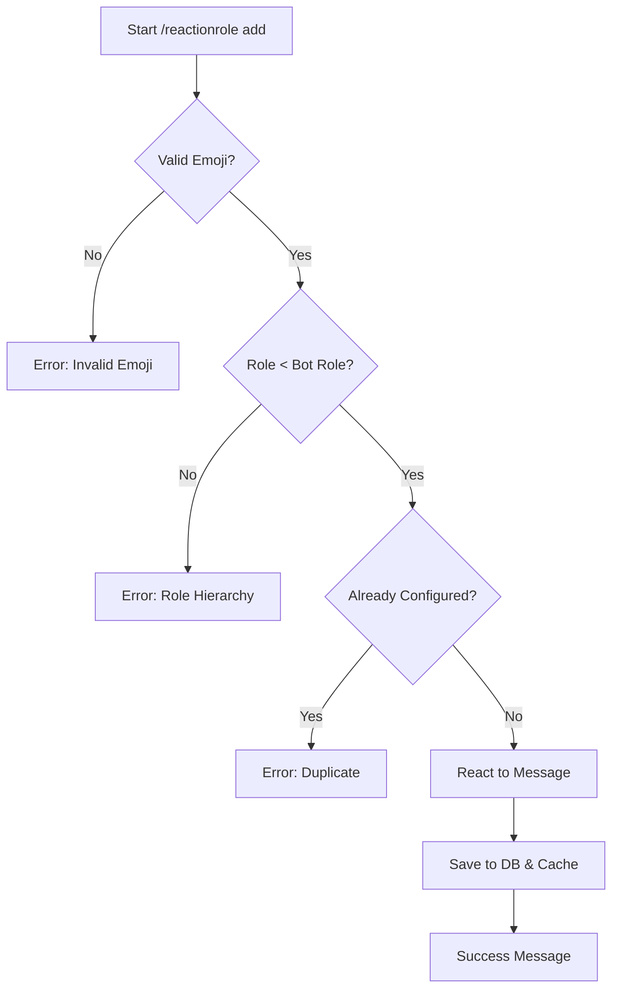
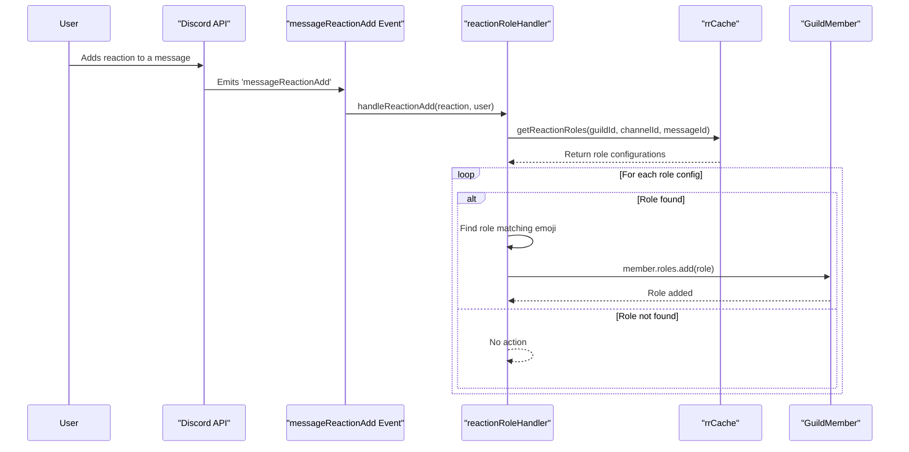

The Reaction Roles feature allows server administrators to set up a system where users can assign themselves roles by reacting to a specific message with a designated emoji. This automates role management for self-assignable roles, such as for color selection, notification preferences, or team assignments.

The system is composed of an admin command for configuration, event listeners for user reactions, and a database schema for persisting the configurations. The entire process is designed to be managed through the `/reactionrole` command, providing a centralized way to add and remove reaction role setups on a per-message basis.

<strong>Relevant source files</strong>

- [src/commands/admin/reactionrole.ts](https://github.com/iamvikshan/amina/blob/main/src/commands/admin/reactionrole.ts)
- [src/handlers/reactionRoles.ts](https://github.com/iamvikshan/amina/blob/main/src/handlers/reactionRoles.ts)
- [src/database/schemas/ReactionRoles.ts](https://github.com/iamvikshan/amina/blob/main/src/database/schemas/ReactionRoles.ts)
- [src/events/reaction/messageReactionAdd.ts](https://github.com/iamvikshan/amina/blob/main/src/events/reaction/messageReactionAdd.ts)
- [src/commands/admin/settings/status.ts](https://github.com/iamvikshan/amina/blob/main/src/commands/admin/settings/status.ts)

## Architecture overview

The Reaction Roles system is built on three main components: a database schema, an administrative command, and event handlers.

1.  **Database Schema (`ReactionRoles.ts`)**: Persists the relationship between a message, an emoji, and a role. It also includes an in-memory cache for fast lookups.
2.  **Admin Command (`/reactionrole`)**: Provides the interface for server managers to create and delete reaction role configurations.
3.  **Event Handlers (`messageReactionAdd.ts`, `reactionRoles.ts`)**: Listen for user reactions on messages and trigger the logic to add or remove roles based on the database configuration.

This diagram illustrates the high-level interaction between the components.

_Sources: [src/commands/admin/reactionrole.ts](https://github.com/iamvikshan/amina/blob/main/src/commands/admin/reactionrole.ts), [src/handlers/reactionRoles.ts](https://github.com/iamvikshan/amina/blob/main/src/handlers/reactionRoles.ts), [src/database/schemas/ReactionRoles.ts](https://github.com/iamvikshan/amina/blob/main/src/database/schemas/ReactionRoles.ts), [src/events/reaction/messageReactionAdd.ts](https://github.com/iamvikshan/amina/blob/main/src/events/reaction/messageReactionAdd.ts)_

## Database schema and caching

The core of the feature is the `reaction-roles` MongoDB collection, which stores all configurations. Each document in this collection represents a single message that has reaction roles configured.

_Sources: [src/database/schemas/ReactionRoles.ts:13-29](https://github.com/iamvikshan/amina/blob/main/src/database/schemas/ReactionRoles.ts#L13-L29)_

### Schema definition

The schema links a guild, channel, and message to an array of role-emoji pairs.

The table below details the fields in the `reaction-roles` collection.

| Field           | Type      | Description                                                  | Required |
| :-------------- | :-------- | :----------------------------------------------------------- | :------- |
| `guild_id`      | String    | The ID of the guild where the message exists.                | Yes      |
| `channel_id`    | String    | The ID of the channel where the message exists.              | Yes      |
| `message_id`    | String    | The ID of the message to which reactions are attached.       | Yes      |
| `roles`         | Array     | An array of objects, each defining an emoji-to-role mapping. | Yes      |
| `roles.emote`   | String    | The emoji (unicode or custom ID) used for the reaction.      | Yes      |
| `roles.role_id` | String    | The ID of the role to be assigned.                           | Yes      |
| `created_at`    | Timestamp | The timestamp when the document was created.                 | Yes      |

_Sources: [src/database/schemas/ReactionRoles.ts:13-29](https://github.com/iamvikshan/amina/blob/main/src/database/schemas/ReactionRoles.ts#L13-L29)_

### Caching mechanism

To improve performance and reduce database queries, an in-memory cache (`rrCache`) is used.

- **Type**: `Map<string, any[]>`
- **Key**: A composite key generated by `getKey(guildId, channelId, messageId)`, formatted as `guildId|channelId|messageId`.
- **Value**: The `roles` array from the database document.

The cache is managed by the following functions:

| Function                               | Description                                                                                                         |
| :------------------------------------- | :------------------------------------------------------------------------------------------------------------------ |
| `cacheReactionRoles(client)`           | Clears the existing cache and populates it with all valid reaction role documents from the database on bot startup. |
| `getReactionRoles(...)`                | Retrieves the roles array for a specific message from the cache.                                                    |
| `addReactionRole(...)`                 | Adds or updates a reaction role configuration in the database and then updates the cache.                           |
| `removeReactionRole(...)`              | Deletes a reaction role configuration from the database and removes it from the cache.                              |
| `clearGuildReactionRoleCache(guildId)` | Removes all cache entries for a specific guild.                                                                     |

_Sources: [src/database/schemas/ReactionRoles.ts:32-137](https://github.com/iamvikshan/amina/blob/main/src/database/schemas/ReactionRoles.ts#L32-L137)_

## Admin command: `/reactionrole`

Administrators with `ManageGuild` permission can use the `/reactionrole` slash command to manage reaction role configurations.

_Sources: [src/commands/admin/reactionrole.ts:22-25](https://github.com/iamvikshan/amina/blob/main/src/commands/admin/reactionrole.ts#L22-L25)_

### Command options

| Option       | Type    | Description                                  | Required       | Choices         |
| :----------- | :------ | :------------------------------------------- | :------------- | :-------------- |
| `action`     | String  | The action to perform.                       | Yes            | `Add`, `Remove` |
| `channel`    | Channel | The text channel where the message exists.   | Yes            | N/A             |
| `message_id` | String  | The ID of the message to manage.             | Yes            | N/A             |
| `emoji`      | String  | The emoji to use for the reaction.           | For `add` only | N/A             |
| `role`       | Role    | The role to be given for the selected emoji. | For `add` only | N/A             |

_Sources: [src/commands/admin/reactionrole.ts:27-66](https://github.com/iamvikshan/amina/blob/main/src/commands/admin/reactionrole.ts#L27-L66)_

### Add action flow

The `add` action, handled by the `addRR` function, sets up a new reaction role. It performs several validation checks before saving the configuration.

### Remove action flow

The `remove` action, handled by the `removeRR` function, deletes all reaction role configurations for a given message and removes all reactions from it.

## Event handling and role assignment

The system becomes active when a user adds or removes a reaction on a message.

### User reaction flow

The `messageReactionAdd` event listener is the entry point. It ensures the reaction and user are not partials and that the user is not a bot before passing control to the handler.

The `handleReactionAdd` and `handleReactionRemove` functions in `src/handlers/reactionRoles.ts` contain the core logic. They retrieve the configuration from the cache, find the matching role, and then add or remove it from the member.

This sequence diagram shows the process when a user adds a reaction.

_Sources: [src/events/reaction/messageReactionAdd.ts](https://github.com/iamvikshan/amina/blob/main/src/events/reaction/messageReactionAdd.ts), [src/handlers/reactionRoles.ts:9-21](https://github.com/iamvikshan/amina/blob/main/src/handlers/reactionRoles.ts#L9-L21)_

The `handleReactionRemove` function follows a nearly identical flow but calls `member.roles.remove(role)` instead.

_Sources: [src/handlers/reactionRoles.ts:27-38](https://github.com/iamvikshan/amina/blob/main/src/handlers/reactionRoles.ts#L27-L38)_

## Configuration display

Configured reaction roles are visible in the server settings overview, which can be accessed via the `/settings status` command. This command fetches all reaction role documents for the guild from the database and formats them for display, providing a quick way for admins to review all active setups.

The display includes a link to the message, the channel it's in, and a list of emoji-role pairs.

_Sources: [src/commands/admin/settings/status.ts:187-212](https://github.com/iamvikshan/amina/blob/main/src/commands/admin/settings/status.ts#L187-L212)_

## Summary

The Reaction Roles feature is a robust system for automated role assignment in a Discord server. It leverages a simple database schema, an efficient in-memory cache, and a clear administrative command (`/reactionrole`) for management. The event-driven architecture ensures that user reactions are processed in real-time to grant or revoke roles, providing a seamless experience for both users and administrators.
