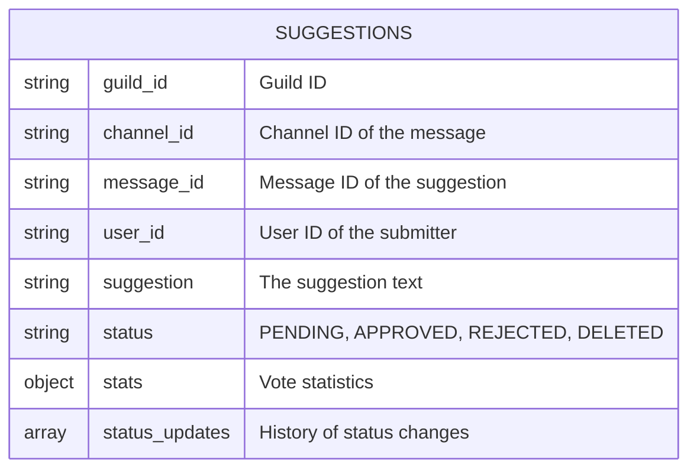
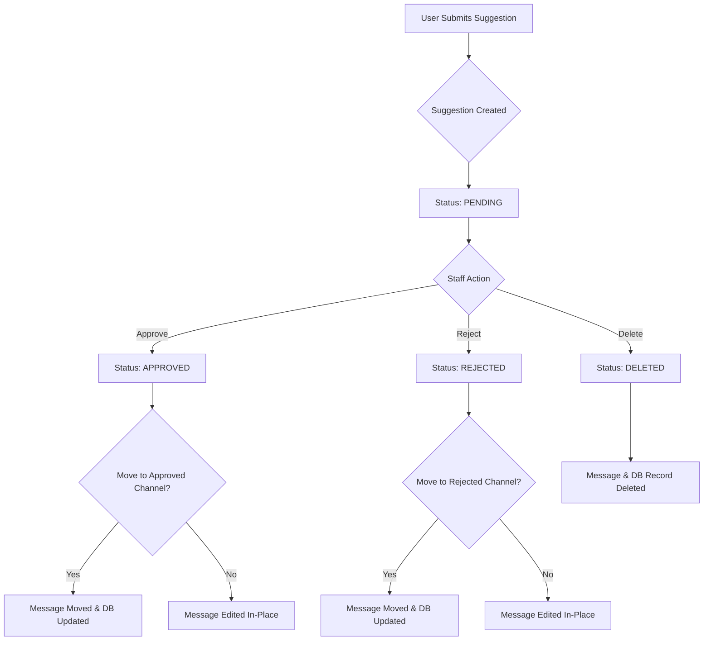
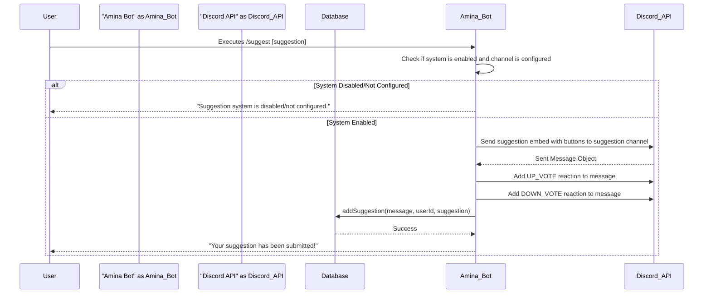
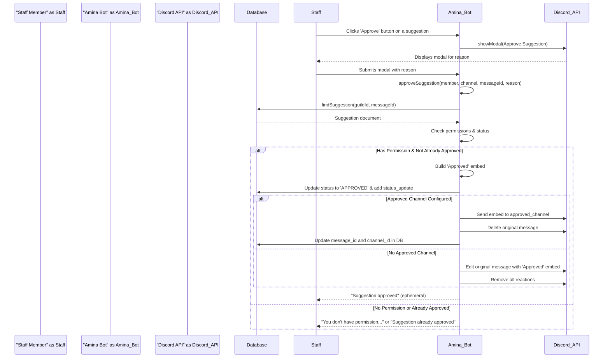

<strong>Relevant source files</strong>

- [src/commands/suggestions/suggestion.ts](https://github.com/iamvikshan/amina/blob/main/src/commands/suggestions/suggestion.ts)
- [src/handlers/suggestion.ts](https://github.com/iamvikshan/amina/blob/main/src/handlers/suggestion.ts)
- [src/database/schemas/Suggestions.ts](https://github.com/iamvikshan/amina/blob/main/src/database/schemas/Suggestions.ts)
- [src/commands/suggestions/suggest.ts](https://github.com/iamvikshan/amina/blob/main/src/commands/suggestions/suggest.ts)
- [src/config/config.ts](https://github.com/iamvikshan/amina/blob/main/src/config/config.ts)
- [src/commands/admin/settings/status.ts](https://github.com/iamvikshan/amina/blob/main/src/commands/admin/settings/status.ts)

The Suggestion System is an integrated feature within Amina that allows server members to submit ideas and feedback in a structured manner. Other members can vote on these suggestions using reactions. Staff members with appropriate permissions can then manage these suggestions by approving, rejecting, or deleting them.

The system is highly configurable, allowing administrators to specify dedicated channels for new, approved, and rejected suggestions, enhancing organization and transparency. All suggestion data and status changes are persisted in the database for tracking and moderation history.

## Database schema

The core of the suggestion system is the `suggestions` collection in the database, which stores all information related to a single suggestion.

_Sources: [src/database/schemas/Suggestions.ts](https://github.com/iamvikshan/amina/blob/main/src/database/schemas/Suggestions.ts)_

### ER diagram

This diagram illustrates the entity relationship for the `suggestions` collection.

_This ER diagram shows the structure of a document in the `suggestions` collection._

_Sources: [src/database/schemas/Suggestions.ts:4-33](https://github.com/iamvikshan/amina/blob/main/src/database/schemas/Suggestions.ts#L4-L33)_

### Schema fields

| Field                        | Type   | Description                                                                                                                                      |
| ---------------------------- | ------ | ------------------------------------------------------------------------------------------------------------------------------------------------ |
| `guild_id`                   | String | The ID of the guild where the suggestion was made.                                                                                               |
| `channel_id`                 | String | The ID of the channel where the suggestion message currently exists. This can change if the suggestion is moved to an approved/rejected channel. |
| `message_id`                 | String | The ID of the suggestion message. This can also change if the message is moved.                                                                  |
| `user_id`                    | String | The Discord user ID of the person who submitted the suggestion.                                                                                  |
| `suggestion`                 | String | The content of the suggestion.                                                                                                                   |
| `status`                     | String | The current status of the suggestion. Enum: `PENDING`, `APPROVED`, `REJECTED`, `DELETED`. Defaults to `PENDING`.                                 |
| `stats.upvotes`              | Number | The number of upvotes. Defaults to `0`.                                                                                                          |
| `stats.downvotes`            | Number | The number of downvotes. Defaults to `0`.                                                                                                        |
| `status_updates`             | Array  | An array of objects tracking each status change.                                                                                                 |
| `status_updates[].user_id`   | String | The ID of the staff member who updated the status.                                                                                               |
| `status_updates[].status`    | String | The new status. Enum: `APPROVED`, `REJECTED`, `DELETED`.                                                                                         |
| `status_updates[].reason`    | String | The reason provided for the status update.                                                                                                       |
| `status_updates[].timestamp` | Date   | The timestamp of the status update.                                                                                                              |
| `created_at`                 | Date   | Timestamp of when the document was created.                                                                                                      |
| `updated_at`                 | Date   | Timestamp of when the document was last updated.                                                                                                 |

_Sources: [src/database/schemas/Suggestions.ts:4-33](https://github.com/iamvikshan/amina/blob/main/src/database/schemas/Suggestions.ts#L4-L33)_

## Suggestion lifecycle

A suggestion progresses through several states, managed by staff. The initial state is always `PENDING`.

_This flowchart shows the possible paths a suggestion can take from creation to final resolution._

_Sources: [src/handlers/suggestion.ts:68-292](https://github.com/iamvikshan/amina/blob/main/src/handlers/suggestion.ts#L68-L292), [src/database/schemas/Suggestions.ts:11-15](https://github.com/iamvikshan/amina/blob/main/src/database/schemas/Suggestions.ts#L11-L15)_

## Commands

The system is operated through two primary slash commands: `/suggest` for users and `/suggestion` for administrators.

### User command: `/suggest`

This command allows any user to submit a new suggestion.

_Sources: [src/commands/suggestions/suggest.ts](https://github.com/iamvikshan/amina/blob/main/src/commands/suggestions/suggest.ts)_

**Options:**

| Option       | Type   | Required | Description                 |
| ------------ | ------ | -------- | --------------------------- |
| `suggestion` | String | True     | The text of the suggestion. |

_Sources: [src/commands/suggestions/suggest.ts:16-21](https://github.com/iamvikshan/amina/blob/main/src/commands/suggestions/suggest.ts#L16-L21)_

**Workflow:**

When a user executes the `/suggest` command, the following sequence occurs:

_Sources: [src/commands/suggestions/suggest.ts:47-96](https://github.com/iamvikshan/amina/blob/main/src/commands/suggestions/suggest.ts#L47-L96)_

### Admin command: `/suggestion`

This command provides administrators with tools to configure and manage the suggestion system.

_Sources: [src/commands/suggestions/suggestion.ts](https://github.com/iamvikshan/amina/blob/main/src/commands/suggestions/suggestion.ts)_

**Subcommands:**

| Subcommand | Description                                          | User Permissions            |
| ---------- | ---------------------------------------------------- | --------------------------- |
| `status`   | Enable or disable the suggestion system.             | `ManageGuild`               |
| `channel`  | Set the channel where new suggestions are sent.      | `ManageGuild`               |
| `appch`    | Set the channel where approved suggestions are sent. | `ManageGuild`               |
| `rejch`    | Set the channel where rejected suggestions are sent. | `ManageGuild`               |
| `approve`  | Approve a suggestion by its message ID.              | `ManageGuild` or Staff Role |
| `reject`   | Reject a suggestion by its message ID.               | `ManageGuild` or Staff Role |

_Sources: [src/commands/suggestions/suggestion.ts:25-139](https://github.com/iamvikshan/amina/blob/main/src/commands/suggestions/suggestion.ts#L25-L139)_

## Moderation flow

Staff members can approve, reject, or delete suggestions either through the `/suggestion` command or by using the buttons attached to a suggestion message.

_Sources: [src/handlers/suggestion.ts](https://github.com/iamvikshan/amina/blob/main/src/handlers/suggestion.ts)_

### Permission check

Before any moderation action (approve, reject, delete) is performed, the system checks if the member has the required permissions. A member is considered authorized if they have the `ManageGuild` permission or a role included in the guild's configured `staff_roles`.

_Sources: [src/handlers/suggestion.ts:50-55](https://github.com/iamvikshan/amina/blob/main/src/handlers/suggestion.ts#L50-L55)_

### Approval workflow

The following diagram illustrates the process of approving a suggestion using the 'Approve' button.

_Sources: [src/handlers/suggestion.ts:68-154](https://github.com/iamvikshan/amina/blob/main/src/handlers/suggestion.ts#L68-L154), [src/handlers/suggestion.ts:301-314](https://github.com/iamvikshan/amina/blob/main/src/handlers/suggestion.ts#L301-L314)_

The flows for rejecting and deleting suggestions are similar, using `rejectSuggestion` and `deleteSuggestion` handlers respectively.

_Sources: [src/handlers/suggestion.ts:156-292](https://github.com/iamvikshan/amina/blob/main/src/handlers/suggestion.ts#L156-L292)_

## Configuration

The suggestion system's behavior is defined by constants in `config.ts` and guild-specific settings stored in the database.

### Static configuration

These values are hard-coded and apply globally.

| Key                           | Value     | Description                                                |
| ----------------------------- | --------- | ---------------------------------------------------------- |
| `SUGGESTIONS.ENABLED`         | `true`    | A boolean to enable/disable the feature at a global level. |
| `SUGGESTIONS.EMOJI.UP_VOTE`   | ⬆️        | The emoji used for up-voting.                              |
| `SUGGESTIONS.EMOJI.DOWN_VOTE` | ⬇️        | The emoji used for down-voting.                            |
| `SUGGESTIONS.DEFAULT_EMBED`   | `#FFB8DE` | Embed color for new suggestions.                           |
| `SUGGESTIONS.APPROVED_EMBED`  | `#47E0A0` | Embed color for approved suggestions.                      |
| `SUGGESTIONS.DENIED_EMBED`    | `#FF8BA7` | Embed color for rejected suggestions.                      |

_Sources: [src/config/config.ts:155-165](https://github.com/iamvikshan/amina/blob/main/src/config/config.ts#L155-L165)_

### Guild-specific settings

These settings are managed via the `/suggestion` subcommands and are visible in the `/settings status` command.

| Setting                        | Managed By            | Description                                     |
| ------------------------------ | --------------------- | ----------------------------------------------- |
| `suggestions.enabled`          | `/suggestion status`  | Toggles the suggestion system for the guild.    |
| `suggestions.channel_id`       | `/suggestion channel` | The channel ID for new suggestions.             |
| `suggestions.approved_channel` | `/suggestion appch`   | The channel ID to move approved suggestions to. |
| `suggestions.rejected_channel` | `/suggestion rejch`   | The channel ID to move rejected suggestions to. |

_Sources: [src/commands/suggestions/suggestion.ts:187-293](https://github.com/iamvikshan/amina/blob/main/src/commands/suggestions/suggestion.ts#L187-L293), [src/commands/admin/settings/status.ts:117-123](https://github.com/iamvikshan/amina/blob/main/src/commands/admin/settings/status.ts#L117-L123)_
