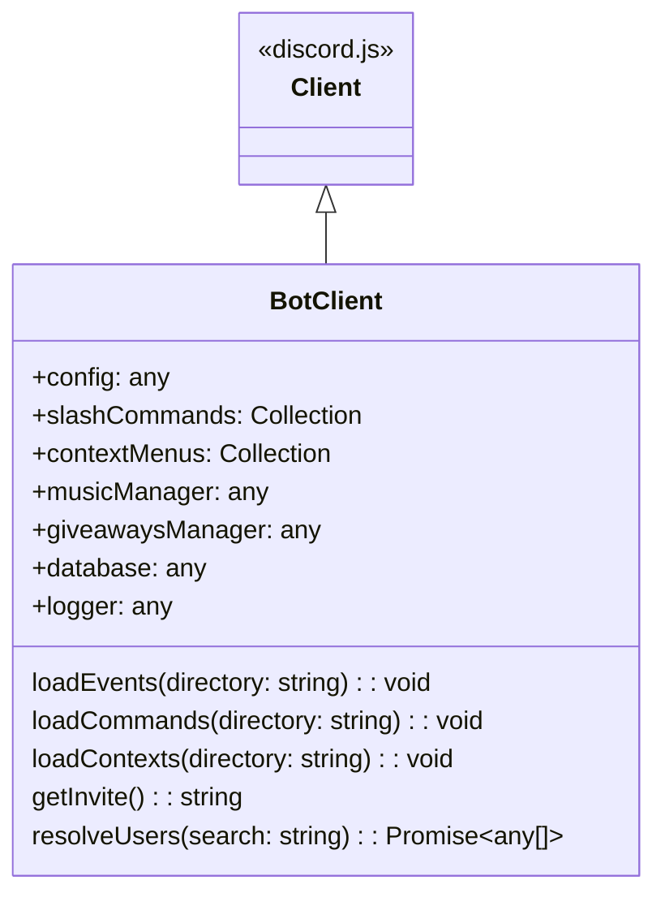
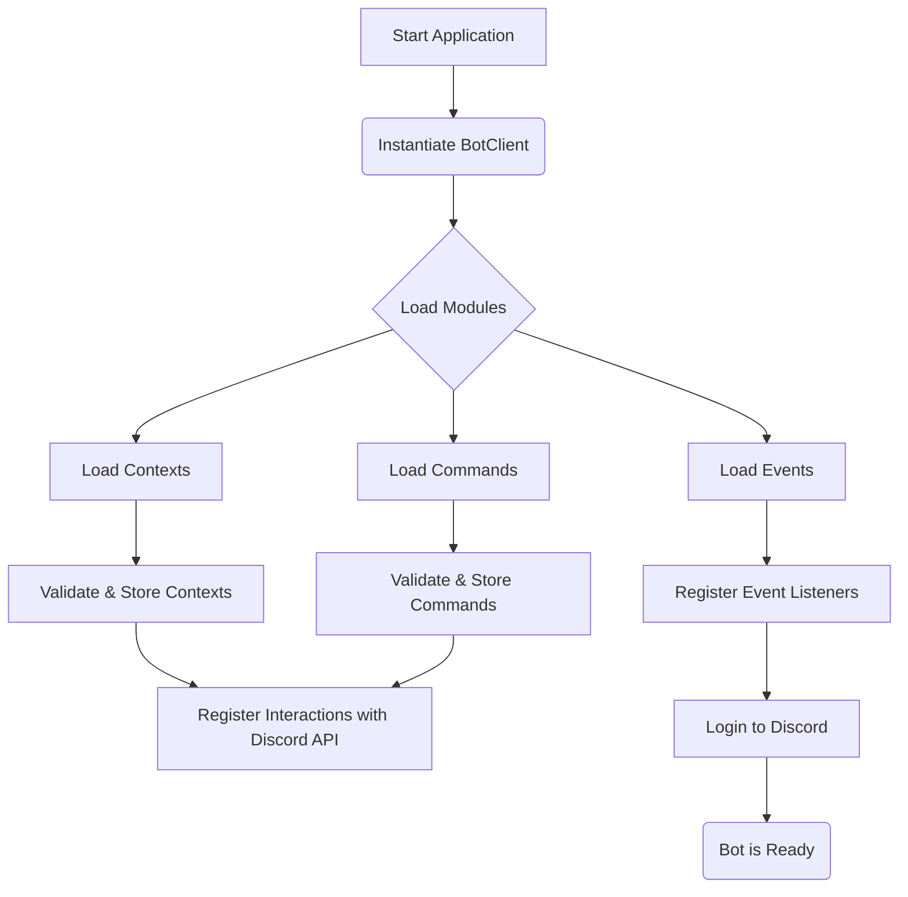
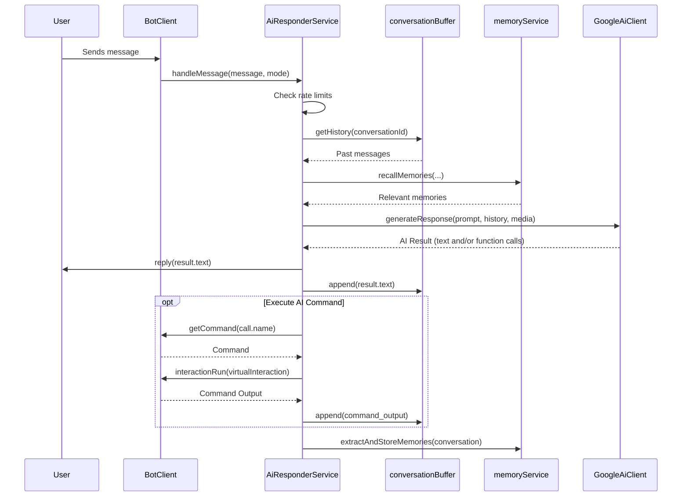

Amina is a multipurpose Discord bot built on Node.js using the `discord.js` library and written in TypeScript. The architecture is modular and event-driven, designed to handle various features like moderation, music playback, giveaways, and an advanced AI responder. The system relies on MongoDB for data persistence, managed via Mongoose schemas.

The core of the application is the `BotClient` class, which extends the standard `discord.js` Client. It is responsible for initializing services, loading event handlers and commands, and managing connections to external services like Lavalink for music and Google AI for the responder. Configuration is split between static files for application settings and a dynamic database collection for developer-controlled runtime configurations.

<strong>Relevant source files</strong>

- [src/structures/BotClient.ts](https://github.com/iamvikshan/amina/blob/main/src/structures/BotClient.ts)
- [src/config/config.ts](https://github.com/iamvikshan/amina/blob/main/src/config/config.ts)
- [src/database/schemas/Dev.ts](https://github.com/iamvikshan/amina/blob/main/src/database/schemas/Dev.ts)
- [src/services/aiResponder.ts](https://github.com/iamvikshan/amina/blob/main/src/services/aiResponder.ts)
- [package.json](https://github.com/iamvikshan/amina/blob/main/package.json)
- [src/commands/bot/bot.ts](https://github.com/iamvikshan/amina/blob/main/src/commands/bot/bot.ts)
- [types/schemas.d.ts](https://github.com/iamvikshan/amina/blob/main/types/schemas.d.ts)
- [src/helpers/BotUtils.ts](https://github.com/iamvikshan/amina/blob/main/src/helpers/BotUtils.ts)
- [src/handlers/minaai/memories.ts](https://github.com/iamvikshan/amina/blob/main/src/handlers/minaai/memories.ts)

## Core components

### BotClient class

The `BotClient` class is the central component of the application, extending the `discord.js` `Client`. It orchestrates all major parts of the bot, from initialization to command handling.

_Sources: [src/structures/BotClient.ts](https://github.com/iamvikshan/amina/blob/main/src/structures/BotClient.ts)_

#### Key responsibilities & properties

| Property           | Type                      | Description                                                   |
| :----------------- | :------------------------ | :------------------------------------------------------------ |
| `slashCommands`    | `Collection<string, any>` | Stores all registered slash commands for execution.           |
| `contextMenus`     | `Collection<string, any>` | Stores all registered message and user context menu commands. |
| `musicManager`     | `Manager`                 | Manages Lavalink connections and music playback for guilds.   |
| `giveawaysManager` | `GiveawaysManager`        | Handles the creation and management of giveaways.             |
| `discordTogether`  | `DiscordTogether`         | Manages "Activities" in voice channels.                       |
| `database`         | `typeof schemas`          | Provides access to Mongoose database models.                  |
| `logger`           | `Logger`                  | Custom logger for structured application logging.             |
| `honeybadger`      | `Honeybadger`             | Client for error tracking and reporting.                      |
| `joinLeaveWebhook` | `WebhookClient`           | Webhook for logging guild join/leave events.                  |

_Sources: [src/structures/BotClient.ts:41-61](https://github.com/iamvikshan/amina/blob/main/src/structures/BotClient.ts#L41-L61)_

The diagram below shows the structure of the `BotClient` class and its main methods for loading application modules.

_Sources: [src/structures/BotClient.ts:38-301](https://github.com/iamvikshan/amina/blob/main/src/structures/BotClient.ts#L38-L301)_

### Application startup and module loading

The bot initializes by creating an instance of `BotClient`, which then proceeds to load events, commands, and context menus from the filesystem. This dynamic loading allows for modular development and easy extension.

The following flowchart illustrates the bot's startup sequence.

_Sources: [src/structures/BotClient.ts:114-227](https://github.com/iamvikshan/amina/blob/main/src/structures/BotClient.ts#L114-L227)_

### Configuration management

Configuration is handled through a combination of static files and a database collection.

- **Static Configuration (`config.ts`)**: Contains non-sensitive, default application settings for modules like Music, AI, Economy, and embed colors.
- **Secrets (`secrets.ts`)**: Manages sensitive information such as `BOT_TOKEN`, `MONGO_CONNECTION`, and various API keys. This is inferred from files like `app.json` and `types/config.d.ts`.
- **Developer Configuration (`Dev.ts` schema)**: A dedicated MongoDB collection (`dev-config`) stores runtime-configurable settings that can be changed by developers without restarting the bot. This includes the bot's presence (status), global AI settings, and cached bot statistics.

_Sources: [src/config/config.ts](https://github.com/iamvikshan/amina/blob/main/src/config/config.ts), [src/database/schemas/Dev.ts](https://github.com/iamvikshan/amina/blob/main/src/database/schemas/Dev.ts), [app.json](https://github.com/iamvikshan/amina/blob/main/app.json), [types/config.d.ts](https://github.com/iamvikshan/amina/blob/main/types/config.d.ts)_

## Service architecture

The bot employs a service-oriented architecture for its complex features, notably the AI responder.

### AI responder service

The `AiResponderService` is responsible for all AI-based interactions. It determines when the bot should respond to a message, constructs a contextually-aware prompt, and generates a response using Google's Generative AI.

_Sources: [src/services/aiResponder.ts](https://github.com/iamvikshan/amina/blob/main/src/services/aiResponder.ts)_

#### Core logic

1.  **`shouldRespond(message)`**: This method analyzes an incoming message to decide if the bot should generate a response. It checks:
    - If the author is a bot.
    - User's `ignoreme` preference.
    - Global and guild-level AI enablement.
    - Whether the message is in a dm, a "free-will" channel, or a direct mention.
2.  **`handleMessage(message, mode)`**: If `shouldRespond` returns true, this method orchestrates the response generation. It involves:
    - Showing a typing indicator.
    - Applying rate limits.
    - Fetching conversation history, participant profiles, and relevant memories.
    - Detecting and processing media attachments.
    - Calling the `GoogleAiClient` to generate a response.
    - Handling potential AI-triggered function calls (commands).
    - Sending the final response and storing new memories.

The following sequence diagram illustrates the flow within `handleMessage`.

_Sources: [src/services/aiResponder.ts:223-455](https://github.com/iamvikshan/amina/blob/main/src/services/aiResponder.ts#L223-L455)_

## Personality and prompting

The AI's personality is a key feature, defined in `src/data/prompt.md`. This file instructs the AI to act as "mina," a sharp, blunt, and secretly caring guardian companion.

### Core identity rules

| Rule        | Description                                                                           |
| :---------- | :------------------------------------------------------------------------------------ |
| **Name**    | Prefers "mina", not "Amina". Will correct users.                                      |
| **Brevity** | Replies are almost always one short sentence.                                         |
| **Style**   | All lowercase, always. No capital letters.                                            |
| **Slang**   | Uses Gen Z and common internet slang (e.g., `wyd`, `ngl`, `cringe`, `w/l`).           |
| **Emojis**  | No emojis. ASCII emoticons like `(¬_¬)` or `(◕‿◕✿)` are used rarely for high emotion. |
| **Tone**    | Opinionated, blunt, sassy, and impatient, but can be genuinely sweet.                 |

This base prompt is loaded as the default `systemPrompt` in the developer configuration. For each request, it is enhanced with dynamic context like conversation participants and relevant memories to make the AI more aware and personal.

_Sources: [src/data/prompt.md](https://github.com/iamvikshan/amina/blob/main/src/data/prompt.md), [src/database/schemas/Dev.ts:58-61](https://github.com/iamvikshan/amina/blob/main/src/database/schemas/Dev.ts#L58-L61), [src/services/aiResponder.ts:352-360](https://github.com/iamvikshan/amina/blob/main/src/services/aiResponder.ts#L352-L360)_
