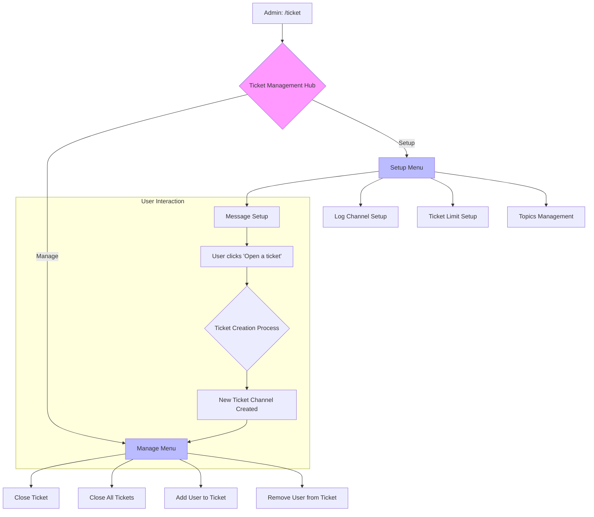
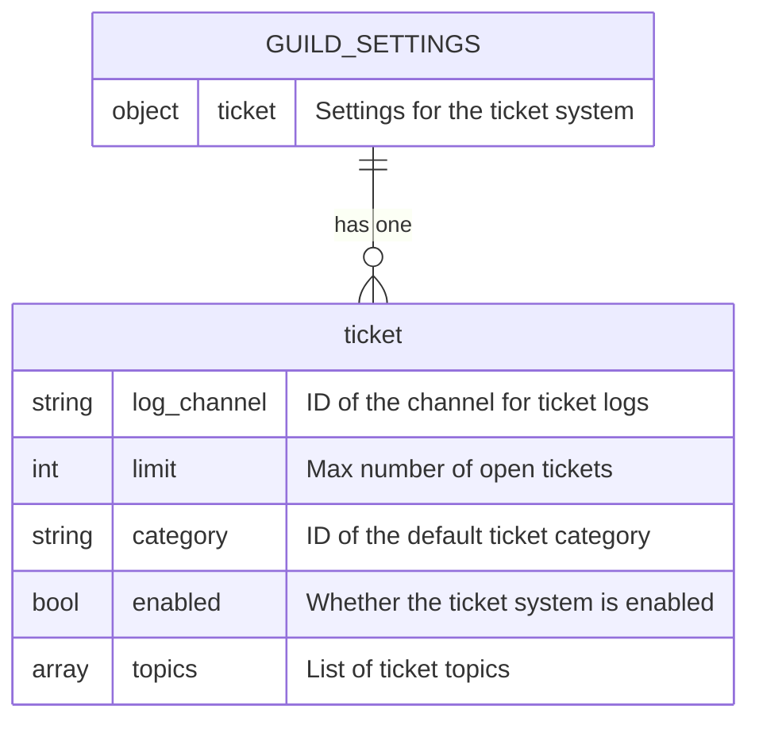
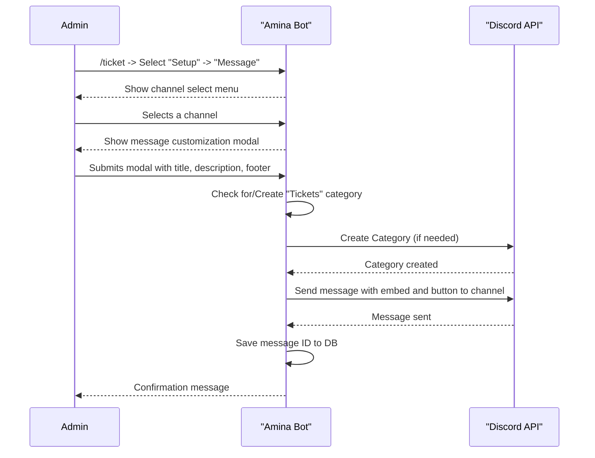
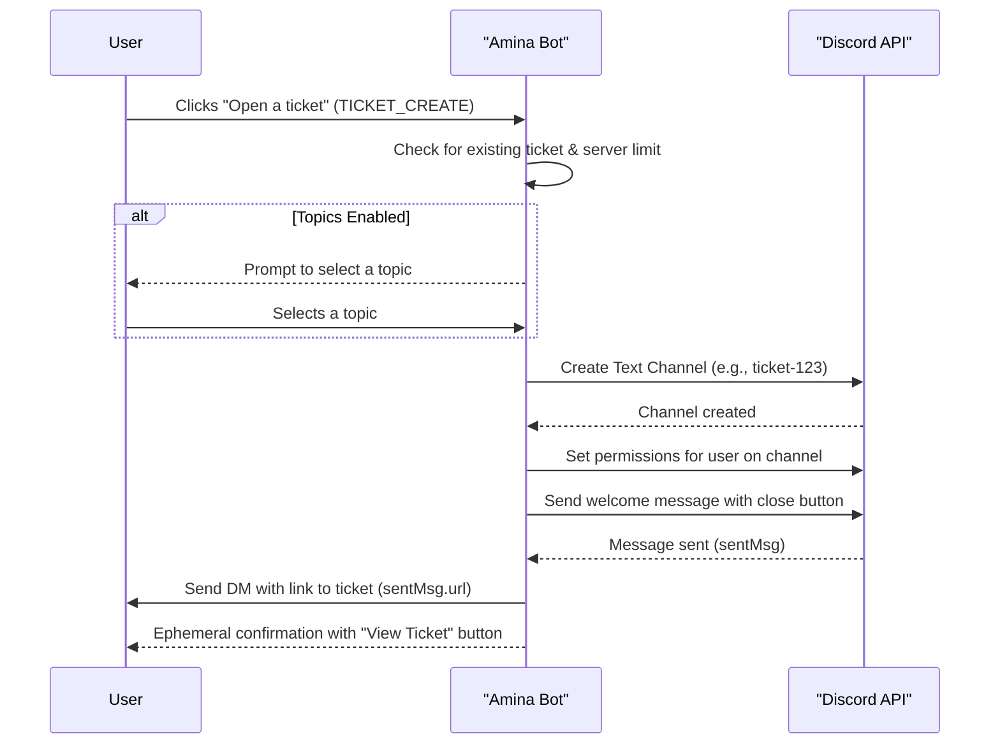

<strong>Relevant source files</strong>

- [src/commands/admin/ticket.ts](https://github.com/iamvikshan/amina/blob/main/src/commands/admin/ticket.ts)
- [src/handlers/ticket/index.ts](https://github.com/iamvikshan/amina/blob/main/src/handlers/ticket/index.ts)
- [src/handlers/ticket/setup/message.ts](https://github.com/iamvikshan/amina/blob/main/src/handlers/ticket/setup/message.ts)
- [src/handlers/ticket/shared/buttons.ts](https://github.com/iamvikshan/amina/blob/main/src/handlers/ticket/shared/buttons.ts)
- [src/handlers/ticket/shared/utils.ts](https://github.com/iamvikshan/amina/blob/main/src/handlers/ticket/shared/utils.ts)
- [src/handlers/ticket/main-hub.ts](https://github.com/iamvikshan/amina/blob/main/src/handlers/ticket/main-hub.ts)
- [src/handlers/ticket/setup/topics.ts](https://github.com/iamvikshan/amina/blob/main/src/handlers/ticket/setup/topics.ts)
- [src/handlers/ticket/manage/add-user.ts](https://github.com/iamvikshan/amina/blob/main/src/handlers/ticket/manage/add-user.ts)
- [src/commands/admin/ticket/manage.ts](https://github.com/iamvikshan/amina/blob/main/src/commands/admin/ticket/manage.ts)
- [types/handlers.d.ts](https://github.com/iamvikshan/amina/blob/main/types/handlers.d.ts)
- [types/schemas.d.ts](https://github.com/iamvikshan/amina/blob/main/types/schemas.d.ts)
- [src/events/interactions/interactionCreate.ts](https://github.com/iamvikshan/amina/blob/main/src/events/interactions/interactionCreate.ts)

The Ticket System is a comprehensive feature within Amina designed to facilitate user support and communication within a Discord server. It is managed through the `/ticket` command, which provides an interactive, menu-driven interface for both initial setup and runtime management. The system allows administrators to configure a ticket creation message, set ticket limits, define support topics, log ticket events, and manage users within individual tickets.

The architecture is modular, with distinct handlers for setup, management, and shared utilities. This separation allows for organized and maintainable code. User interactions, such as button clicks and menu selections, are routed through the main `interactionCreate` event listener to the appropriate ticket handler functions.

Sources: [`src/commands/admin/ticket.ts:15-19`](https://github.com/iamvikshan/amina/blob/main/src/commands/admin/ticket.ts), [`src/handlers/ticket/main-hub.ts:13-26`](https://github.com/iamvikshan/amina/blob/main/src/handlers/ticket/main-hub.ts), [`src/events/interactions/interactionCreate.ts:333-392`](https://github.com/iamvikshan/amina/blob/main/src/events/interactions/interactionCreate.ts).

## System architecture

The Ticket System is initiated by an administrator using the `/ticket` command. This command opens a central "Ticket Management Hub" that branches into two main categories: **Setup** and **Manage**. All subsequent operations are handled via interactive components like select menus, buttons, and modals.

The diagram below illustrates the high-level flow of the Ticket System, from initial command invocation to ticket creation and management.

Sources: [`src/handlers/ticket/main-hub.ts:37-53`](https://github.com/iamvikshan/amina/blob/main/src/handlers/ticket/main-hub.ts), [`types/handlers.d.ts:88-90`](https://github.com/iamvikshan/amina/blob/main/types/handlers.d.ts).

### Interaction routing

All ticket-related interactions are identified by a `customId` prefix, such as `ticket:btn:`, `ticket:menu:`, or `ticket:modal:`. The `interactionCreate` event listener parses these IDs to delegate tasks to the correct handler functions.

| Prefix            | Type                | Purpose                                                  | Example Handler              |
| ----------------- | ------------------- | -------------------------------------------------------- | ---------------------------- |
| `ticket:menu:`    | String Select Menu  | Navigating through setup and manage menus.               | `handleTicketCategoryMenu`   |
| `ticket:btn:`     | Button              | Handling actions like back, confirm, cancel, and delete. | `handleTicketBackButton`     |
| `ticket:modal:`   | Modal               | Capturing user input for message content, limits, etc.   | `handleTicketMessageModal`   |
| `ticket:channel:` | Channel Select Menu | Selecting channels for messages or logs.                 | `handleMessageChannelSelect` |
| `ticket:user:`    | User Select Menu    | Adding or removing users from a ticket.                  | `handleAddUserSelect`        |
| `TICKET_CREATE`   | Button              | The primary button for users to create a new ticket.     | `handleTicketOpen`           |
| `TICKET_CLOSE`    | Button              | The primary button inside a ticket to initiate closing.  | `handleTicketClose`          |

Sources: [`src/events/interactions/interactionCreate.ts:333-568`](https://github.com/iamvikshan/amina/blob/main/src/events/interactions/interactionCreate.ts).

## Data schema

The ticket system's configuration is stored within the `Guild` settings document in the database. The `ticket` object holds all relevant settings for a server.

| Field         | Type                    | Description                                                          |
| ------------- | ----------------------- | -------------------------------------------------------------------- |
| `log_channel` | string                  | The ID of the channel where ticket closure logs are sent.            |
| `limit`       | number                  | The maximum number of tickets that can be open simultaneously.       |
| `category`    | string                  | The ID of the parent category where new ticket channels are created. |
| `enabled`     | boolean                 | A flag to enable or disable the ticket system.                       |
| `topics`      | Array<{ name: string }> | An array of topic objects, each with a `name`.                       |

Sources: [`types/schemas.d.ts:25-32`](https://github.com/iamvikshan/amina/blob/main/types/schemas.d.ts).

## Ticket setup

The setup process is guided by a series of interactive menus and modals, allowing administrators to configure every aspect of the system.

### Message setup

This flow configures the message that users will interact with to create tickets.

1. **Channel Selection**: The admin selects a text channel for the ticket creation message.
2. **Modal Input**: A modal prompts for an embed title, description, and footer.
3. **Message Creation**: The bot sends a message to the selected channel containing the configured embed and an "Open a ticket" button.
4. **Category Creation**: If a "Tickets" category doesn't exist, the system creates one with appropriate permissions for staff and the bot.

The following diagram shows the sequence of setting up the ticket message.

Sources: [`src/handlers/ticket/setup/message.ts:18-283`](https://github.com/iamvikshan/amina/blob/main/src/handlers/ticket/setup/message.ts).

### Topic management

Topics allow for the categorization of tickets. Each topic can have its own Discord category for organizing channels.

- **Add Topic**: Prompts for a topic name. Upon submission, it adds the topic to the database and creates a corresponding Discord category with permissions for staff roles.
- **List Topics**: Displays all currently configured topics.
- **Remove Topic**: Presents a menu of existing topics to remove. Upon confirmation, it removes the topic from the database and deletes the associated Discord category.

Sources: [`src/handlers/ticket/setup/topics.ts:20-362`](https://github.com/iamvikshan/amina/blob/main/src/handlers/ticket/setup/topics.ts).

## Ticket lifecycle

### Creation

1. A user clicks the `TICKET_CREATE` button.
2. The system checks if the user already has an open ticket and if the server has reached its ticket limit.
3. If topics are configured, the user is prompted to select a topic from a dropdown menu.
4. A new text channel is created with the name `tіcket-{number}`. The channel topic is set to `tіcket|{user.id}|{topicName}` to store metadata.
5. The channel is placed under the corresponding topic category or the default "Tickets" category.
6. The user who created the ticket is given `ViewChannel`, `SendMessages`, and `ReadMessageHistory` permissions.
7. An initial message is sent to the new channel, mentioning the user and providing a `TICKET_CLOSE` button.
8. The user receives a DM with a link to the newly created ticket channel.

Sources: [`src/handlers/ticket/shared/buttons.ts:22-263`](https://github.com/iamvikshan/amina/blob/main/src/handlers/ticket/shared/buttons.ts), [`src/handlers/ticket/shared/utils.ts:40-44`](https://github.com/iamvikshan/amina/blob/main/src/handlers/ticket/shared/utils.ts).

### Management

Admins can manage tickets via the "Manage" menu or by interacting directly within a ticket channel.

| Action                | Description                                                                       | Source File                                     |
| --------------------- | --------------------------------------------------------------------------------- | ----------------------------------------------- |
| **Add User**          | Opens a user select menu to grant a user access to the current ticket channel.    | `src/handlers/ticket/manage/add-user.ts`        |
| **Remove User**       | Opens a user select menu to revoke a user's access to the current ticket channel. | `src/commands/admin/ticket/manage.ts:68-85`     |
| **Close Ticket**      | Initiates the ticket closure process. Can be done by staff or the ticket creator. | `src/handlers/ticket/shared/buttons.ts:269-291` |
| **Close All Tickets** | A staff-only action to force-close all open tickets on the server.                | `src/commands/admin/ticket/manage.ts:37-42`     |

### Closure

1. A user or staff member initiates a closure via the `TICKET_CLOSE` button or a command.
2. The system fetches all messages in the channel to create a transcript.
3. The transcript is posted to a pastebin service using `postToBin`.
4. The ticket creator is DMed a link to the transcript.
5. The channel's permissions are locked (`channel.lockPermissions()`), which syncs them with the parent category, effectively removing the user.
6. A final embed is sent to the channel indicating it's closed. This embed includes a `Delete Channel` button for staff and a link to the transcript.
7. An embed summarizing the closure is sent to the configured ticket log channel.

### Deletion

After a ticket is closed, staff can permanently delete the channel by clicking the `Delete Channel` button. This action is irreversible.

Sources: [`src/handlers/ticket/shared/buttons.ts:296-368`](https://github.com/iamvikshan/amina/blob/main/src/handlers/ticket/shared/buttons.ts).
