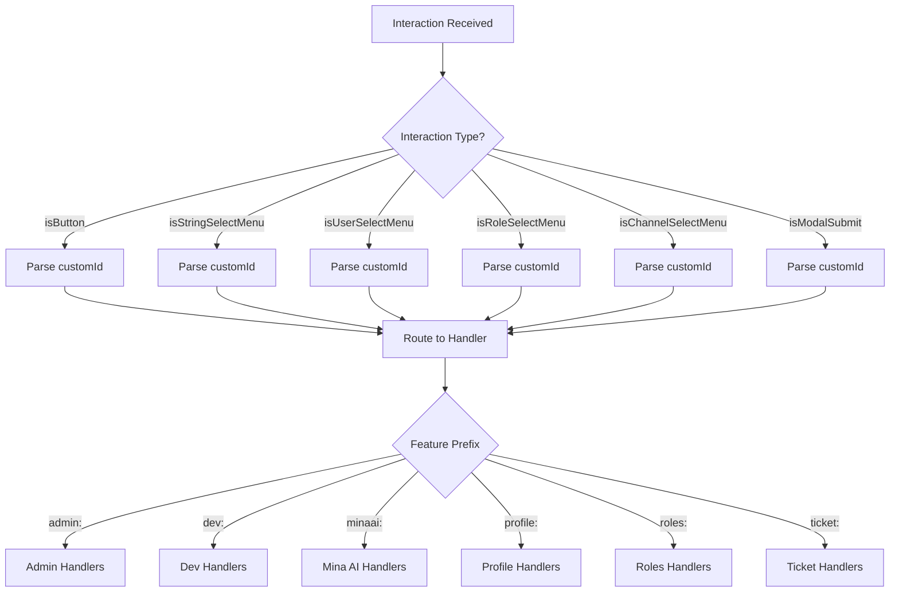
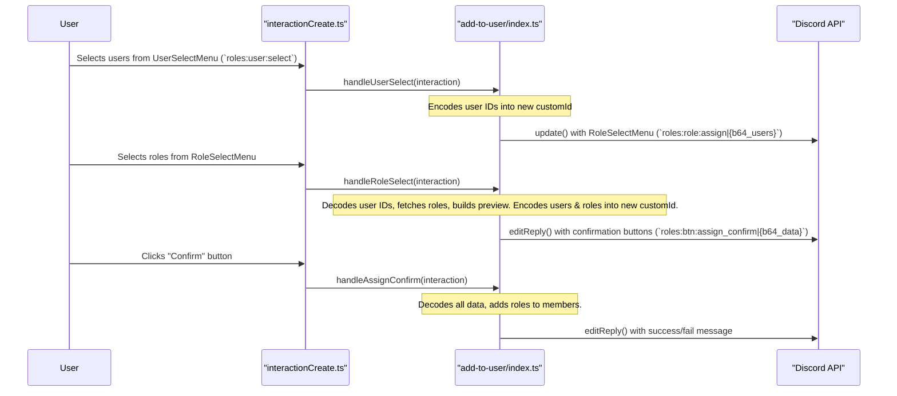

The UI Interaction Handling system is a core component of Amina's architecture, responsible for processing all non-command interactions originating from Discord's UI components, such as buttons, select menus, and modals. This system provides a centralized routing mechanism that directs user actions to the appropriate business logic, enabling complex, multi-step, and interactive features.

The central entry point for this system is the `interactionCreate` event listener. It acts as a primary router, inspecting the `customId` of each incoming interaction to delegate it to a specific handler module. This modular approach keeps the interaction logic organized by feature (e.g., `profile`, `roles`, `admin`) and allows for the creation of sophisticated, stateful user workflows.

<details>
<summary><strong>Relevant source files</strong></summary>

- [src/events/interactions/interactionCreate.ts](https://github.com/iamvikshan/amina/blob/main/src/events/interactions/interactionCreate.ts)
- [src/helpers/componentHelper.ts](https://github.com/iamvikshan/amina/blob/main/src/helpers/componentHelper.ts)
- [src/structures/VirtualInteraction.ts](https://github.com/iamvikshan/amina/blob/main/src/structures/VirtualInteraction.ts)
- [src/handlers/dev/main-hub.ts](https://github.com/iamvikshan/amina/blob/main/src/handlers/dev/main-hub.ts)
- [src/handlers/roles/add-to-user/index.ts](https://github.com/iamvikshan/amina/blob/main/src/handlers/roles/add-to-user/index.ts)
- [src/handlers/minaai/memories.ts](https://github.com/iamvikshan/amina/blob/main/src/handlers/minaai/memories.ts)
- [src/commands/utility/profile.ts](https://github.com/iamvikshan/amina/blob/main/src/commands/utility/profile.ts)
- [types/handlers.d.ts](https://github.com/iamvikshan/amina/blob/main/types/handlers.d.ts)
- [src/handlers/dev/minaai/handlers.ts](https://github.com/iamvikshan/amina/blob/main/src/handlers/dev/minaai/handlers.ts)

</details>

## Architecture overview

The interaction handling architecture is built around a `customId`-based routing system within the `interactionCreate.ts` event handler. When a user interacts with a UI component, Discord sends an interaction object with a unique `customId`. The system parses this ID to determine the feature, component type, and specific action to be performed.

This diagram illustrates the high-level flow from a user interaction to the execution of a specific handler.



_Sources: [src/events/interactions/interactionCreate.ts:14-490](https://github.com/iamvikshan/amina/blob/main/src/events/interactions/interactionCreate.ts#L14-L490)_

### Custom ID naming convention

A strict naming convention for `customId` is used to facilitate routing. The convention follows a `feature:type:action` pattern, often extended with a `|` delimiter to carry state.

- **Simple Routing:** `feature:type:action`
  - `feature`: The name of the module (e.g., `profile`, `admin`, `dev`).
  - `type`: The component type (e.g., `btn`, `menu`, `modal`).
  - `action`: The specific action to perform (e.g., `back`, `confirm`, `edit`).
  - **Example:** `profile:btn:back`

- **Stateful Routing:** `feature:type:action|key1:value1|key2:value2`
  - State is appended after a `|` delimiter. This is used for passing data between interaction steps, such as user ids, page numbers, or selected options.
  - **Example:** `minaai:btn:category|type:fact|mem_type:server|page:1`

_Sources: [src/events/interactions/interactionCreate.ts:87](https://github.com/iamvikshan/amina/blob/main/src/events/interactions/interactionCreate.ts#L87), [src/events/interactions/interactionCreate.ts:120](https://github.com/iamvikshan/amina/blob/main/src/events/interactions/interactionCreate.ts#L120), [src/handlers/minaai/memories.ts:167](https://github.com/iamvikshan/amina/blob/main/src/handlers/minaai/memories.ts#L167)_

### State parsing

For stateful `customId`s, the `parseCustomIdState` helper function is used to separate the base action from the embedded state. This function splits the `customId` by the `|` delimiter, returning an object containing the `base` ID and a `state` object with key-value pairs.

This diagram shows the logic of the `parseCustomIdState` function.

```mermaid
flowchart TD
    A[customId String] --> B{Contains '|' ?}
    B -- No --> C[Return { base: customId, state: {} }]
    B -- Yes --> D[Split by '|']
    D --> E[First part is 'base']
    D --> F[Remaining parts are 'state pairs']
    F --> G[Loop through pairs]
    G --> H[Split pair by ':']
    H --> I[Assign key:value to state object]
    I --> J[Return { base, state }]
```

_Sources: [src/helpers/componentHelper.ts:3-20](https://github.com/iamvikshan/amina/blob/main/src/helpers/componentHelper.ts#L3-L20)_

## Handler implementations

The system is composed of various handler modules, each dedicated to a specific feature. The `interactionCreate.ts` file dynamically imports and calls functions from these modules.

### Handler module prefixes

The following table lists the main prefixes used to route interactions to their respective handler modules.

| Prefix          | Handler Module      | Description                                                   |
| :-------------- | :------------------ | :------------------------------------------------------------ |
| `profile:`      | `@handlers/profile` | Manages user profile creation, viewing, and editing.          |
| `admin:`        | `@handlers/admin`   | Handles server administration settings.                       |
| `minaai:`       | `@handlers/minaai`  | Manages user-facing Mina AI settings and memory viewing.      |
| `roles:`        | `@handlers/roles`   | Handles role management features like cleanup and assignment. |
| `purge:`        | `@handlers/purge`   | Manages the interactive message purge workflow.               |
| `dev:`          | `@handlers/dev`     | Provides access to developer-only tools and settings.         |
| `ticket:`       | `@handlers/ticket`  | Manages the ticket system UI for setup and management.        |
| `report_modal_` | `@handlers/report`  | Handles submission of bug, user, or server reports.           |

_Sources: [src/events/interactions/interactionCreate.ts](https://github.com/iamvikshan/amina/blob/main/src/events/interactions/interactionCreate.ts)_

### Example workflow: add roles to a user

The "Add Roles to User" feature is a prime example of a multi-step workflow that passes state through the `customId`.

1.  A user selects users from a `userselectmenu`.
2.  The selected user ids are base64-encoded and embedded into the `customid` of the next component, a `roleselectmenu`.
3.  The user selects roles.
4.  The role IDs and the user IDs (from the `customId`) are used to generate a confirmation view with "confirm" and "cancel" buttons. The `customId` of the confirm button contains all necessary data.
5.  Clicking "confirm" triggers the final `handleAssignConfirm` function, which decodes the data and performs the role assignments.

The sequence diagram below details this flow.



_Sources: [src/handlers/roles/add-to-user/index.ts](https://github.com/iamvikshan/amina/blob/main/src/handlers/roles/add-to-user/index.ts), [src/events/interactions/interactionCreate.ts:223](https://github.com/iamvikshan/amina/blob/main/src/events/interactions/interactionCreate.ts#L223), [src/events/interactions/interactionCreate.ts:800](https://github.com/iamvikshan/amina/blob/main/src/events/interactions/interactionCreate.ts#L800), [src/events/interactions/interactionCreate.ts:805](https://github.com/iamvikshan/amina/blob/main/src/events/interactions/interactionCreate.ts#L805)_

### Example workflow: developer hub

The Developer Hub (`/dev`) provides a centralized menu for various developer-only functions. It demonstrates how a single command can open up a nested UI.

1.  A developer runs the `/dev hub` command.
2.  `showDevHub` is called, presenting a `StringSelectMenu` with categories like "Presence Management", "Command Reload", and "Mina AI".
3.  The developer selects an option (e.g., "mina ai").
4.  `handleCategoryMenu` in `main-hub.ts` receives the interaction with `customId` `dev:menu:category` and value `minaai`.
5.  It then calls the appropriate sub-handler, `showMinaAiMenu` from the `dev/minaai` module, to display the next level of the UI.

This flow allows for a clean separation of concerns, where `main-hub.ts` acts as a sub-router for all developer-related UI interactions.

_Sources: [src/handlers/dev/main-hub.ts](https://github.com/iamvikshan/amina/blob/main/src/handlers/dev/main-hub.ts), [src/handlers/dev/minaai/handlers.ts](https://github.com/iamvikshan/amina/blob/main/src/handlers/dev/minaai/handlers.ts)_

## Type definitions

The project uses TypeScript declaration files (`.d.ts`) to define the structure and available actions for each handler module. This provides type safety and autocompletion for developers. For example, the `AdminHandlers` module defines the functions and action types available for the `/admin` command's UI.

#### Admin handler types

| Type                     | Definition  | Description                                                                                               |
| :----------------------- | :---------- | :-------------------------------------------------------------------------------------------------------- |
| `AdminHandlers`          | `interface` | Defines the functions available in the admin handler, like `handleAdminCategoryMenu`.                     |
| `AdminMenuAction`        | `type`      | A union of string literals for all possible admin menu values (e.g., `'settings'`, `'minaai'`, `'logs'`). |
| `AdminChannelSelectType` | `type`      | A union of string literals for channel selection actions (e.g., `'updateschannel'`, `'freewill'`).        |
| `AdminRoleSelectType`    | `type`      | A union of string literals for role selection actions (e.g., `'staffadd'`, `'staffremove'`).              |

_Sources: [types/handlers.d.ts:11-33](https://github.com/iamvikshan/amina/blob/main/types/handlers.d.ts#L11-L33)_

## Conclusion

The UI Interaction Handling system is a robust and scalable solution for managing complex user interactions in Amina. By leveraging a `customId`-based routing convention and modular handlers, it separates concerns effectively, making the codebase easier to maintain and extend. The use of stateful `customId`s allows for sophisticated, multi-step workflows without relying on in-memory session management, ensuring that interactions are stateless and resilient. This architecture is fundamental to providing the rich, interactive experience that defines many of the bot's features.
